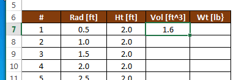

# Cells and Formulas

The most basic feature of Excel is the ability to enter data and then write formulas based on the data. As the data are edited, the formulas are automatically updated. In this chapter we review some of the procedure for entering and using formulas.

## Cell Addresses

An Excel workbook contains a collection of sheets. Each sheet contains a collection of cells organized into rows and columns. The rows are indexed with numbers (1,2,3...) and the columns are indexed with letters (A,B,C...). Each cell can be uniquely identified by a cells address defined by the column-row combination.

| Address | Description        |
|---------|--------------------|
| A5      | Row 1, Column 1    |
| D3      | Row 3, Column 4    |
| AJ234   | Row 234, Column 36 |

Note that after column Z (26), the column numbers are indexed as AA,AB,AC... To reference a group of cells with single address we combine the upper left corner of the region with the lower right corner separated by a semicolon. For example, to reference the following range:

we would use the address **B3:F10**.

## Cell Inputs

There are four primary types of information that can be entered in cells:

1. Text ("Hello world", etc.)
2. Numbers (4, 2382.23, 1e-14, etc.)
3. Dates (Jun-5, 2014, 12/29/2015, etc.)
4. Formulas ("=A4+C5", "=Sum(D4:D14)", etc.)

For the first three types (text, numbers, dates), Excel determines the type of data based on the content as you enter it, and formats it appropriately. You can also customize the formatting if you wish. Entering a formula is described in the next section.

Sometimes it is useful to enter a sequence of data in a cell. Excel provides a simple trick for doing this. For example, suppose you want to create a list of numbers 1, 2, 3, ... to fill in a column in a table. Rather than typing the entire list, you can enter the first three numbers and then select the three numbers. Once you do so, a green rectangle will appear at the lower right corner of the selection as follows:

You can then click on the rectangle handle and drag it all the way down to the bottom of the list, or you can simply double-click on the handle. In either case, the list will automatically be extended as follows:

This process works for other types of data also. For example, you can enter "Mon", "Tues", "Wed" or "Jan", "Feb", "Mar" and when you extend the list, the sequences will be automatically extended.

## Entering a Formula

An Excel formula typically references cells in your worksheet and performs some type of calculation. To enter a formula, you start by typing an equal sign ("=") and then you reference cells using their addresses ("A4", "C27", "D4:E15", etc.). The values of the cells references are then used in the formula and a value is returned and displayed in the cell. As you change the values of the input cells, all of the dependent formulas are automatically updated. Formulas can reference other cells that contain formulas.

When composing a formula, you can also reference a cell by clicking on the cell rather than typing out the cell address. This is particularly useful for multicell ranges ("D4:G23" for example).

## Editing a Formula

Once you have entered a formula and you want to edit it, there are two options: You can select the cell containing the formula and then click in the Formula Bar at the top of the worksheet as follows:

or you can double click on the cell containing the formula and edit it directly in the cell:

## Functions

One of the most powerful features of Excel is built-in functions. A function typically takes one or more arguments as input and returns a value. Functions are extremenly useful in formulas. For example, you can use trig functions:

>sin(a) 
cos(a) 
tan(a) 
etc.

where a = an angle in radians. There are also many functions that operate on a range as input:

>Sum(r) 
Average(r) 
Min(r) 
Max(r) 
etc.

where r = a range of cells. For example, this formula computes the sum of a list of values:

A complete set of the available functions can be found in the Excel Help.

## Copying Formulas

After entering a formula, it is often necessary to copy that formula to other cells. For example, the following spreadsheet is designed to compute the volume and weight of a set of cylinders defined by a radius and a height. The volume can be computed from the radius and height using the following formula:

After entering the formula in cell D7, we wish to copy the formula to cells D8:D22. This can be accomplished by selecting cell D7 after the formula has been entered and copying (Ctrl-C) and pasting (Ctrl-V) the formula to D8:D22 using the clipboard. Another method is to select the cell as follows:

and then drag the green square in the lower right corner of the cell down to the end of the list, or simply double-click on the green square. After doing so, the formula is automatically copied to the end of the list:

## Relative vs. Absolute References

When copying formulas, we need to be careful how were reference other cells in our formulas. For example, to calculate the weight of our cylinders, we take the volume of the cylinder and multiply by the unit wt of the cylinder material as follows:

After copying the formula to the bottom of the table in column E, we notice that the weights are not properly computed:

The reason for this error can be seen by revealing the formulas. This is accomplished by pressing Ctrl-~ on the keyboard (the "~" symbol is called the "tilde" and is on the upper left corner of your keyboard).

Note that when you copy a formula, the cell references are updated with each subsequent cell the formula is copied to. Note that `=B4*D7` is changed to `=B5*D8` in the next cell down. This happens because whenever you reference a cell in a formula, that reference is interpreted to be relative to the cell containing the formula. In other words, when we type "D7" in a formula in cell E7, what we are really referencing is "stay on the same row, but go one column to the left". Therefore, when the formula is copied, it correctly references the proper volume value one cell to the left. However, our error occurs because of a relative reference to the unit wt. value. A reference to B4 from cell E7 literally means "three rows up and three columns to the left". But in this case, we don't want a relative reference. When we copy the formula, we want to ALWAYS reference cell B4. We can accomplish this by changing the B4 reference to make it absolute as follows:

Note the "$" symbols. You make an absolute reference by directly typing the values or by typing B4 and then pressing the F4 key (Command-T on a Mac). Now after copying the formula down, we get correct answers:

And the formulas look like this:

Sometimes it is useful to use a mixed reference. Here is a summary of the ways in which you can reference another cell.

| Type | Description |
|------|-------------|
| D4   | Row and column are both relative |
| $D4  | Row is relative and column is absolute |
| D$4  | Row is absolute and column is relative |
| $D$4 | Row and column are both absolute |

For the example shown above, we could have gotten away with a mixed reference ("B\$4") because we copied the formulas within a single column, but it works fine with a complete absolute reference ("\$B\$4"). To do a mixed reference, you can either directly type the "\$" symbols or you can repeatedly press the F4 key to get the combination you are seeking.

## Sample Workbook

The workbook used in the examples shown above can be downloaded here:

[cylinders.xlsx](files/cylinders.xlsx)

## Exercises

You may wish to complete following exercises to gain practice with and reinforce the topics covered in this chapter:

| Description                                                                                                                   | Difficulty | Start | Solution |
|-------------------------------------------------------------------------------------------------------------------------------|------------|-------|----------|
| **The Basics** - Run through some basic ways to   input formulas into cells.                                               | Easy | [the_basics.xlsm](files/the_basics.xlsm) | [the_basics_key.xlsm](files/the_basics_key.xlsm) |
| **Buoyancy** - Calculate the buoyant force on  different sized objects using formulas and cell references.                     | Medium | [buoyancy.xlsm](files/buoyancy.xlsm) | [buoyancy_key.xlsm](files/buoyancy_key.xlsm) |
| **Name Counter** - Use a formula to count the number  of names found inside a table range.                                     | Medium | [name_counter.xlsx](files/name_counter.xlsx) | [name_counter_key.xlsx](files/name_counter_key.xlsx) |
| **Trigonometry** - Use trigonometric functions inside  of formulas to find the missing angles and/or sides  of a few triangles. | Medium | [trigonometry.xlsm](files/trigonometry.xlsm) | [trigonometry_key.xlsm](files/trigonometry_key.xlsm) |
| **Employee Database** - Use formulas to conduct  statistics on an employee database.                                           | Hard | [employee_database.xlsm](files/employee_database.xlsm) | [employee_database_key.xlsm](files/employee_database_key.xlsm) |
