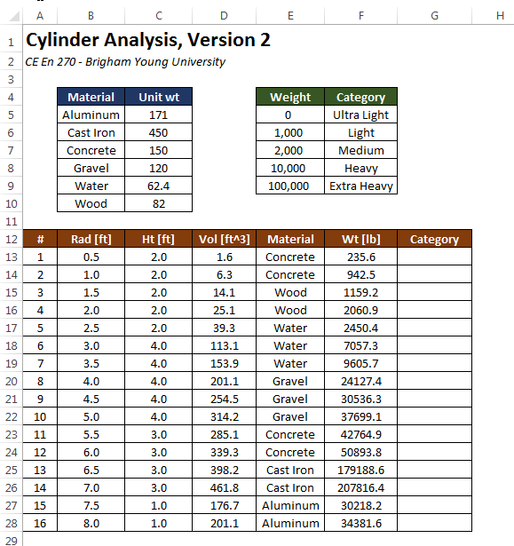

# Indexing a List with VLOOKUP

When writing formulas, we often encounter cases where one or more of the inputs to the function will depend on the value of another input. More specifically, we need to use one of the inputs to lookup the other input from a table. This can be easily accomplished using the VLOOKUP function.

For example, the following workbook computes the volume and weight of a set of cylinders. The weight is computing from the volume and the unit weight. However, the unit weight depends on the material being used. Unit weights for a set of common materials are shown in a table at the top:


The objective of this exercise is to determine the appropriate unit weight for each cylinder and calculate the correct weight by multiplying the selected unit weight by the computed volume. We will do this by automatically selecting the correct unit weight from the list using the VLOOKUP function.

## Data Validation

Before using the VLOOKUP function, we need to enter a set of materials in the Material column. We need to be careful as we do this because due to the way the VLOOKUP function works, we need to ensure that the items in the Materials column are spelled exactly the same way they are spelled in the unit weight table at the top. We can do this with a tool called **Data Validation**. This process is described in the [Data Validation](https://vbaprimer.readthedocs.io/en/latest/01_excel/03_validation/validation/) chapter.

## VLOOKUP Function

Once the material values are entered in column E, we are ready to use the VLOOKUP function. The syntax for the VLOOKUP function is as follows:

```
=VLOOKUP(lookup_value,table_array,col_index_num,range_lookup)
```

where:

| Argument | Description |
|----------------|-----------------------------------------------------------------------------|
| `lookup_value` | The value to be found in the first column of the array |
| `table_array` | The table of information in which data is looked up. Use a reference to a range or a range name |
| `col_index_num` | The column number in table_array from which the matching value must be returned |
| `range_lookup` | A logical value (TRUE or FALSE) that specifies whether you want VLOOKUP to find an exact match or an approximate match. |


So for our case, we will use VLOOKUP to select a unit weight value from the table using the user-specified material. The unit weight returned by the function is then multiplied by the volume to compute the cylinder weight as follows:


The first argument (E13) to the VLOOKUP function refers to the Material value on the same row and is a relative reference. The second argument ($B$5:$C$10) is an absolute reference to the table use for the lookup. The lookup value ("Concrete" in this case) is used to search through the first column in the table to find the row matching the lookup value. In this case, the match is found on the third row of the table (cell B7). The third argument ("2") tells the VLOOKUP function from which column of the table the return value should be selected. Since the value is 2, we go to the second column of the lookup table on the selected row and find our value ("150"). This is the value that is returned by the function and multiplied by the volume ("1.6") to compute the weight. After copying this formula to the rest of the column, the weight values are all correctly computed as follows:


If the values in the lookup table are edited, all of the weights would be automatically updated.

## Range Lookups

In the example shown in the previous section, we are doing an exact match on the lookup value in the first column. In some cases we are not looking for an exact match, but we need to find a match from a set of numerical ranges. For example, suppose that we wanted to categorize the cylinder weights using the following guidelines:

| Weight (wt) | Category |
|-------------|---------------|
| wt ≤ 1000 | Ultra Light |
| 1000 ≤ wt ≤ 2000 | Light |
| 2000 ≤ wt ≤ 10,000 | Medium |
| 10,000 ≤ wt ≤ 100,000 | Heavy |
| 100,000 ≤ wt | Extra Heavy |

We will then add a new table and an extra column as follows:



Note that the weight values in the first column of the weight-category table at the top right has been sorted in ascending order. This is critical in order for the lookup to work. Next, we enter a formula using the VLOOKUP function as follows:


Notice that the last argument (range_lookup) has a value of **TRUE**. This means that we take the lookup_value ("235.6" in this case) and we look through the first column of the table until we find a row where the value on the row is less than or equal to the lookup_value and the value on the next row is greater than the lookup_value. In this case, the match occurs on the first row and so the resulting value from column 2 is "Ultra Light". After copying the formula to the rest of the Category column, the resulting values are as follows:


It is important to note that the range_lookup argument to the VLOOKUP function is optional. If it is omitted, it is assumed to be TRUE by default. A common error with the VLOOKUP function is to omit this argument when the VLOOKUP function is intended to be used as an exact match. This can lead to unintended errors, depending on how the values in the first column are ordered. Therefore, it is strongly recommended to always enter a TRUE or FALSE value for the range_lookup argument every time the VLOOKUP function is used.

## Two-Dimensional Lookup

Occasionally it is useful to do a two-dimensional lookup where a value is found from a table containing both rows and columns. For example, consider the following sheet containing a table of temperatures in degree F illustrating a relationship between average monthly temp and elevation in ft for a particular location.


Starting at row 24, another table is listed and the objective is to fill in the **Temp** column with a formula that looks up the temp corresponding to the elevation from column **C** and the month associated with the date provided in column **B**. This requires a double lookup. We use VLOOKUP to find the row we need based on a range lookup of elevation using the VLOOKUP function. Then, for the third argument to VLOOKUP, we need to determine which column to use based on the month desired. To find the right column based on the month, we first need to find the month label ("Jan", "Feb", etc.) from a date value. This can be accomplished using the **TEXT** function which takes a date as an argument and returns the month or day value depending on the format specified by the second argument as follows:

```
=TEXT(B24,"MMM")
```

For the values shown, the function would return "**Mar**". Then we need to use this text string to automatically find the index of the column corresponding to this month. This can be done with the **MATCH** function as follows:

```
=MATCH(TEXT(B24,"MMM"),$C$5:$N$5,0)
```

The first argument to the MATCH function is the lookup value, the second argument is an array (row or column of values) and the third argument indicates the type of match to perform (a value of **0** tells it to find an exact match). The function looks through the array to find the lookup value and returns the index of the item if found. For the arguments shown, the function would return a value of **3**. At this point, we are ready to use the VLOOKUP function. We would formulate the function call as follows:


Note that we are using a range lookup on elevation so the last argument to VLOOKUP is **TRUE**.

## Sample Workbooks
The workbooks used in the examples shown above can be downloaded here:

[cylinders2.xlsx](files/cylinders2.xlsx)<br>[tempvselev.xlsx](files/tempvselev.xlsx)

## Exercises

You may wish to complete following exercises to gain practice with and reinforce the topics covered in this chapter:

<div class="exercise-grid" data-columns="4">
<div class="exercise-header">Description</div>
<div class="exercise-header">Difficulty</div>
<div class="exercise-header">Start</div>
<div class="exercise-header">Solution</div>
<div class="exercise-cell"><strong>Dog Years -</strong> Use VLOOKUP to match the number of human years to the appropriate dog years shown in the table.</div>
<div class="exercise-cell">Easy</div>
<div class="exercise-cell"><a href="files/dog_years.xlsx">dog_years.xlsx</a></div>
<div class="exercise-cell"><a href="files/dog_years_key.xlsx">dog_years_key.xlsx</a></div>
<div class="exercise-cell"><strong>Construction Fencing -</strong> From a list of fencing materials, match the price using VLOOKUP and the table given. Then multiply by the amount of yards needed to obtain the total cost.</div>
<div class="exercise-cell">Easy</div>
<div class="exercise-cell"><a href="files/construction_fencing.xlsm">construction_fencing.xlsm</a></div>
<div class="exercise-cell"><a href="files/construction_fencing_key.xlsm">construction_fencing_key.xlsm</a></div>
<div class="exercise-cell"><strong>Conversion Factor -</strong> Use VLOOKUP to multiply the user input by the appropriate conversion factor desired.</div>
<div class="exercise-cell">Medium</div>
<div class="exercise-cell"><a href="files/conversion_factor.xlsm">conversion_factor.xlsm</a></div>
<div class="exercise-cell"><a href="files/conversion_factor_key.xlsm">conversion_factor_key.xlsm</a></div>
<div class="exercise-cell"><strong>Diet Monitor -</strong> From a list of foods and servings, use VLOOKUP to calculate the number of calories and carbs.</div>
<div class="exercise-cell">Hard</div>
<div class="exercise-cell"><a href="files/diet_monitor.xlsx">diet_monitor.xlsx</a></div>
<div class="exercise-cell"><a href="files/diet_monitor_key.xlsx">diet_monitor_key.xlsx</a></div>
</div>
