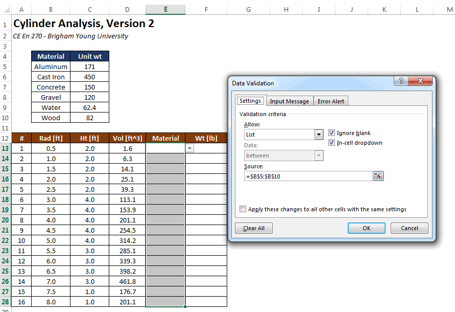
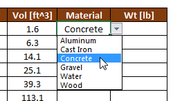
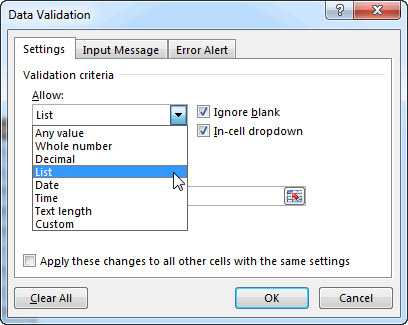
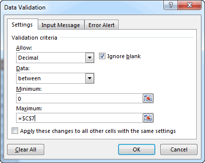

# Data Validation

In order for our formulas to work properly, it is often helpful to set limitations on what can be entered into some of our input cells. This can be easily accomplished in Excel using the data validation tools. To illustrate how this works, we will use the Cylinder Analysis example features in the [VLOOKUP](https://vbaprimer.readthedocs.io/en/latest/01_excel/02_vlookup/vlookup/) chapter. In that example, we have a table of unit weights for a set of selected materials and in the lower table we have a column of Materiasl (column E) where the user will enter a material for each of the cylinders.

In order for things to work properly, each of the entries in the Material column needs to match one of the entries in the first column of the unit weight vs. material table at the top of the sheet. We can ensure that this happen by applying data validation to the Material column in the lower table. First we need to select the cells in the Materials column (E12:E28). Then we select the **Data Validation** button in the **Data** tab. This brings up the Data Validation dialog where we enter the following:

Note that we have selected the **List** item in the **Allow** options. This means that we will allow the user to select an item from a list. Then we enter the address of the list (i.e., the first column in the unit weight table) in the Source field. This can be done by directly typing the formula as shown or simply by putting the cursor in the field and then selecting the range of cells. After clicking OK, whenever the user selects one of the cells in the column to enter a value, a pop-up menu is presented:

If one of the items in the list is not selected, an error message is given. We can now populate the entire list with materials.

It should be noted that Data Validation can be used for all types of checks on the input. The Allow options are as follows:

For example, if the Decimal option is selected, the following options are presented:

The **Data** option can be used to select "between", "greater than", "less than", etc. Thus, we can carefully control what values are allowed into each of our input cells, thereby minimizing the chance of errors.

## Exercises

You may wish to complete following exercises to gain practice with and reinforce the topics covered in this chapter:

Description

Difficulty

Start

Solution

<strong>Inventory -</strong> Validate columns of a table used to keep track of inventory of various construction items.

Easy

<a href="files/inventory.xlsx">inventory.xlsx</a>

<a href="files/inventory_key.xlsx">inventory_key.xlsx</a>

<strong>Dog Show -</strong> Use data validation to control the user inputs on a spreadsheet used for scoring at a dog show.

Medium

<a href="files/dog_show.xlsx">dog_show.xlsx</a>

<a href="files/dog_show_key.xlsx">dog_show_key.xlsx</a>

