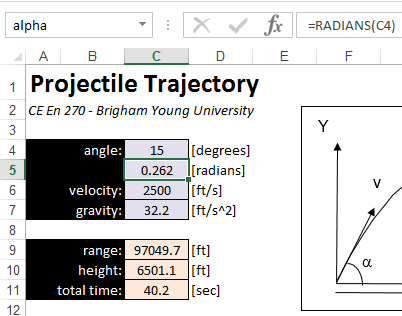

# Naming Cells

When writing formulas in Excel, the formulas will often reference several other cells in the worksheet, or even cells on another worksheet. If the formula is complex, it can be difficult keep track of all of the references and determine if the formula is properly written. In such cases, we can make our formulas much simpler and more intuitive by using named cells. To illustrate this, consider the following workbook:

The objective of the spreadsheet is to perform a set of calculations associated with a projectile fired from the coordinate origin (0,0) at an angle (α) at an initial velocity (v). A set of equations is then used to compute the range (r), the max height (h), and the total time in the air. The bottom table is used to compute a set of x,y coordinates defining the projective path. At the top of the sheet in cells C4:C7, a set of inputs are defined. The range, height, and total time are computed in cells C9:C11. Using the standard cell reference notation, the formulas in cells C9:C11 would appear as follows:

| Cell | Formula |
|------|---------|
| range   | =(C6^2*SIN(2*C5))/C7 |
| height  | =(C6^2*(SIN(C5))^2)/(2*C7) |
| time  | =(2*C6*SIN(C5))/C7 |

These formulas can be compared to the equations shown in the above figure. To make our formulas easier to enter, read, and edit, we will now create a set of cells names and rewrite the formulas. Each cell has a default name based on the column-row combination (C6, D15, etc.). However, we can create an additional name (or alias) for a cell by selecting the cell and typing in a new name in the name box in the upper left corner just above the cells and below the menu. For example, to create a new name for the angle, we select cell C5 and then click in the name box and type in a new name ("alpha") and then hit Return as follows:

We then repeat the same process for cells C5 (v) and C7 (g). Now, we can rewrite the formulas for the range, height, and time using the cell names. After doing so, they look like this:

| Cell | Formula |
|------|---------|
| range   | =(v^2*SIN(2*alpha))/g |
| height  | =(v^2*(SIN(alpha))^2)/(2*g) |
| time  | =(2*v*SIN(alpha))/g |

Compare these formulas to the first set shown above and note how they more closely resemble the native set of equations shown in the first diagram. The names make the formulas easier to enter and easier to understand. This is especially true of longer formulas and cases where cells on different sheets are referenced.

## Relative vs. Absolute

It is important to note that using a cell name in a formula represents an absolute reference. It is not possible to refer to a cell via a name as a relative reference unless you are using array formulas. This is also an advantage to named cells because you can simply type the cell name without worrying about the "$" symbols associated with an absolute reference.

## Ranges

Names can not only be applied to individual cells, but also to ranges of cells. For example, you can select the range B14:D10 and call it "xytable" or something. This is especially useful when writing formulas using the VLOOKUP function where you need to make an absolute reference to a range of cells for the vlookup_table argument.

## Naming Rules

Cell names can be any combination of letters and numbers, but you cannot use a name that would be otherwise interpreted as a native cell address ("B4", "C20", etc.). You also cannot put spaces or special characters ("#", "%", etc.) in the names. Single letter names ("a", "b", etc.) are allowed, except for "c" and "r" which are not allowed.

You can apply multiple names to the same cell or range. Any of the names can be used to reference the cell or range in a formula.

## Multiple Names

You can assign as many names as you like to the same cell or range of cells. Any of the names can then be used to reference the cell or range in your formulas. Think of it as a person answering to multiple nicknames ("Champ", "Slugger", "Cowboy", "Buckaroo").

## Name Manager

In addition to using the name box as described above, you can also name a cell using the Name Manager button located in the Fomulas ribbon:

This brings up the following dialog:

This dialog can be used to edit and/or delete names, or to create new names.

## Deleting a Name

One needs to be careful when deleting a name associated with a cell or range. You CANNOT select the cell or range and then delete the name from the name box in the upper left corner of the worksheet. This may appear to delete the name but it does not. The only way to delete a name is using the Name Manager.

## Sample Workbook

The workbook used in the examples shown above can be downloaded here:

[projectile.xlsx](files/projectile.xlsx)

## Exercises

You may wish to complete following exercises to gain practice with and reinforce the topics covered in this chapter:

| Exercise | Description                                                                                   | Difficulty | Start | Solution |
|----------|-----------------------------------------------------------------------------------------------|------------|-------|----------|
| Names | Use cell naming to find the volume and  weight of different objects.                       | Easy | [names.xlsm](files/names.xlsm) | [names_key.xlsm](files/names_key.xlsm) |
| Moment Arm | Use names as inputs to a formula to  calculate the moment arm on a lever at  different lengths. | Medium | [moment_arm.xlsm](files/moment_arm.xlsm) | [moment_arm_key.xlsm](files/moment_arm_key.xlsm) |
| Bernoulli Problem | Use names inside of formulas  to determine the solution to the  bernoulli equation.             | Hard | [bernoulli_problem.xlsm](files/bernoulli_problem.xlsm) | [bernoulli_problem_key.xlsm](files/bernoulli_problem_key.xlsm) |
