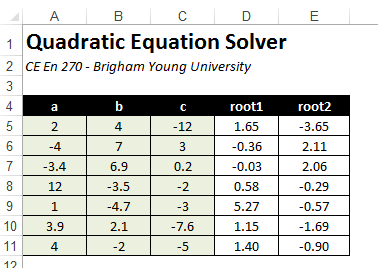

# Operators and Precedence - Writing Complex Formulas

When developing engineering applications with Excel, we often take complex equations and convert them to Excel formulas. In so doing, it is easy to compose the formula in such a way that leads to incorrect results. For example, consider the following spreadsheet:


The objective of the spreadsheet is to solve for the roots of a quadratic equation of the form:

>$ax^2 + bx + c = 0$

using the two equations shown above. Let's focus on the euqation for root 1 which would be entered in cell D5. How should one go about transforming the native equation into a formula that is properly interpreted by Excel? Consider the following potential solution:

```excel
=-B5+B5^2-4*A5*C5^0.5/2*A5
```

This results in a solution of:


The most obvious error is that we need to put parentheses around the discriminant (b2 - 4ac) part before taking the square root ( we are taking the square root by raising to a power of 0.5). Otherwise we are only taking the square root of c only. After making this correction:

```excel
=-B5+(B5^2-4*A5*C5)^0.5/2*A5
```

which gives us an answer of 6.58, which is still wrong. The correct answer is 1.65. In order to get the correct answer, we need to put parentheses around both the numerator and denominator as follows:

```excel
=(-B5+(B5^2-4*A5*C5)^0.5)/(2*A5)
```

After doing so, we finally get the correct set of answers:



So how do we determine when and where to use parentheses? Are they always required? Here is another example. Take the following formula that uses cell names:

```excel
=x+y*z^p/2*x
```

Which of the following corresponds to the equation defined by this formula?

a.&nbsp;	$x + yz^\left({\dfrac{p}{2x}}\right)$
 	 
b.&nbsp;	$\dfrac{x + yz^p}{2x}$
 	 
c.&nbsp;	$x + \dfrac{yz^p}{2x}$
 	 
d.&nbsp;	$x + \dfrac{yz^p}{2}x$

The correct answer is (d). But how do we know this? One can always very explicitly define the order of operations by using parentheses. But we can better understand how and when to use parentheses by learning the precedence and associativity rules applied to Excel formulas. The following table indicates the order in which the operators are evaluated when a formular is parsed.

| Order | Operator | Description |
|:-----:|:--------:|-------------|
| 1     | ^        | Power (exponent) |
| 2     | * /      | Multiplication and division |
| 3     | + -      | Addition and subtraction |

- Within levels 2 and 3, operations are carried out from left to right. So, let's reexamine our formula from above:

```excel
=x+y*z^p/2*x
```

The first step would be to evaluate the power operator (^):

```excel
=x+y*(z^p)/2*x
```

Next, the multiplication (*) and division (/) operators would be evaluated from left to right.

```excel
=x+(y*(z^p))/2*x
```

```excel
=x+((y*(z^p))/2)*x
```

```excel
=x+(((y*(z^p))/2)*x)
```

Finally, the addition (+) operator would be evaluated last.

```excel
=x+(((y*(z^p))/2)*x)
```

Of course, these parentheses are not all required. Once we understand the precedence rules, we can begin to build concise, but correct formulas. For example, this is how you would write a formula for each of the equations shown above:

a.		=x+y*z^(p/(2*x))
 	 	 
b.		=(x+y*z^p)/(2*x)
 	 	 
c.		=x+(y*z^p)/(2*x)
 	 	 
d.		=x+y*z^p/2*x

The worksheet associated with the exercises shown above can be downloaded here:

[quadequation.xlsm](files/quadequation.xlsm)

## Exercises

You may wish to complete following exercises to gain practice with and reinforce the topics covered in this chapter:

| Exercise | Description                                                                                               | Difficulty | Start | Solution |
|:--------:|-----------------------------------------------------------------------------------------------------------|:---------:|:-----:|:-------:|
| Headloss | Use the order of operations to <br>calculate the fluid headloss in a pipe.                                | Easy | [headloss.xlsm](files/headloss.xlsm) | [headloss_key.xlsm](files/headloss_key.xlsm) |
| Operators | Calculate the equations using <br>formulas and taking into consideration<br> the appropriate order of operations. | Medium | [operators.xlsm](files/operators.xlsm)| [operators_key.xlsm](files/operators_key.xlsm) |
| Friction Factor | Use the correct order of operations<br> to calculate the friction factor.                                     | Hard | [friction_factor.xlsm](files/friction_factor.xlsm) | [friction_factor_key.xlsm](files/friction_factor_key.xlsm) |

Description	Difficulty	Start	Solution
Headloss - Use the order of operations to calculate the fluid headloss in a pipe.	Easy	[headloss.xlsm](files/headloss.xlsm)	[headloss_key.xlsm](files/headloss_key.xlsm)
Operators - Calculate the equations using formulas and taking into consideration the appropriate order of operations.	Medium	operators.xlsm	operators_key.xlsm
Friction Factor - Use the correct order of operations to calculate the friction factor.	Hard	friction_factor.xlsm	friction_factor_key.xlsm
