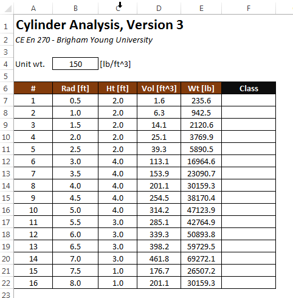
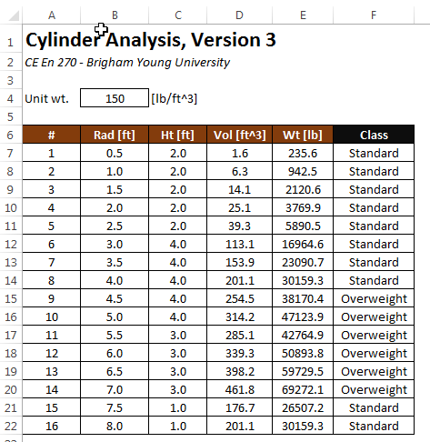

# Using the IF Function

There are many instances when using Excel where we need to write a formula that produces one of two different results, depending on some condition. For example, consider the following version of our cylinder analysis worksheet:



Suppose we wish to add a "Class" item in column F indicating whether the cylinders are standard or overweight. This can be done by entering the following formula in cell F7 and copying it down to the end of the table:

```excel
=IF(E7<35000, "Standard", "Overweight")
```

Resulting in the following:



## Syntax

The syntax of the IF function is as follows:

```excel
= IF(logical_test, value_if_true, value_if_false)
```

The **logical_test** argument needs to be a conditional expression that returns a TRUE or FALSE value. Conditional expression are typically formed with one of the following operators:

| Operator | Example | Description |
|:--------:|:------------:|---------------------------|
| = | A4=0 | Equal |
| <> | A4<>B5 | Not equal to |
| > | D7>3 | Greater than |
| >= | D4>=0 | Greater than or equal to |
| < | G3<(G4-7) | Less than |
| <= | 0<=F12 | Less than or equal to |
| AND | AND(0<=B5, B5<=5) | True if both statements are true. |
| OR | OR(A4=0, B5=0) | True if either or both statements are true. |
| NOT | NOT(A4=0) | True if the statement is false. |

If the conditional expression evaluates to true, the **value_if_true** argument is used. Otherwise, the **value_if_false** argument is used. These arguments can any type of expression, including constants, cells references, or formulas. Here are some additional example formulas that use the IF function:

```excel
=IF(A4<>0, 1/A4, "Error - Divide by Zero!")

=IF(B4<=$D$2, -2.3*G4/4, -3.9*G4/4+6)

=IF(units="Metric", "[m/sec], "[ft/sec]")
```

## Compound Conditions

Sometimes we need to utilize compound conditional expressions with the IF function. But we need to be very careful when doing so. For example, suppose we want to represent the following mathematical expression:

$0 ≤ x ≤ 5$

in an Excel formula and "x" is stored in cell B5. It would be tempting to use the following conditional expression:

```excel
0<=B5<=5
```

for the first argument in the IF function. However, this creates a useless and incorrect expression that will always return TRUE, regardless of the contents of cell B5. This is because a compound expression like this is evaluated one operator at a time from left to right. In other words, the first part of the expression:

```excel
0<=B5
```


will be evaluated first. The result of this evaluation will be True or False, depending on whether or not B5 is greater than or equal to zero. This result is then compared against the rest of the expression. In computational terms, True and False evaluate to 1 or 0, respectively. Thus, if B5 is greater than or equal to zero, the expression simplifies to:

```excel
1<=5
```

otherwise (B5>0), it simplifies to:

```excel
0<=5
```

Both of these statements will then evaluate to True, regardless of the value of B5. In other words, the original expresssion is equivalent to:

```excel
(0<=B5)<=5
```

which is fundamentally different from the mathematical expression we are trying to emulate. To solve this problem correctly, we need to use the **AND** function as follows:

```excel
AND(0<=B5, B5<=5)
```

This function returns True if both statements are true. Otherwise it returns False. Likewise, there is an **OR** function that returns True if either or both of the two expressions evaluate to True.

## Nested IF Functions

It is possible to nest multiple instances of the IF function. For example:

```excel
=IF(A4>=18,"Adult",IF(A4>12,"Teen","Child"))
```

The second IF function is only evaluated in the first condition is False. There are three possible outcomes in this case: "Adult", "Teen", and "Child".

## Sample Workbook

The workbook used in the first example shown above can be downloaded here:

[cylinders3.xlsx](files/cylinders3.xlsx)

## Exercises

You may wish to complete following exercises to gain practice with and reinforce the topics covered in this chapter:

<div class="exercise-grid" data-columns="4">
<div class="exercise-header">Description</div>
<div class="exercise-header">Difficulty</div>
<div class="exercise-header">Start</div>
<div class="exercise-header">Solution</div>
<div class="exercise-cell"><strong>Reynolds and Froude -</strong> Calculate the Reynolds' or Froude's number by inputing an IF equation into the appropriate cell.</div>
<div class="exercise-cell">Easy</div>
<div class="exercise-cell"><a href="files/reynolds_and_froude.xlsx">reynolds_and_froude.xlsx</a></div>
<div class="exercise-cell"><a href="files/reynolds_and_froude_key.xlsx.xlsm">reynolds_and_froude_key.xlsx.xlsm</a></div>
<div class="exercise-cell"><strong>Concrete Price Estimator -</strong> Use an IF equation to determine the varying prices of different concrete projects.</div>
<div class="exercise-cell">Medium</div>
<div class="exercise-cell"><a href="files/concrete_price_estimator.xlsx">concrete_price_estimator.xlsx</a></div>
<div class="exercise-cell"><a href="files/concrete_price_estimator_key.xlsx">concrete_price_estimator_key.xlsx</a></div>
<div class="exercise-cell"><strong>Parking -</strong> Determine which types and how many vehicles you can park along side a given curb.</div>
<div class="exercise-cell">Medium</div>
<div class="exercise-cell"><a href="files/parking.xlsx">parking.xlsx</a></div>
<div class="exercise-cell"><a href="files/parking_key.xlsx">parking_key.xlsx</a></div>
<div class="exercise-cell"><strong>Years Left of School -</strong> Use IF statements and user inputs/selections to determine how many years that the user has left to finish school.</div>
<div class="exercise-cell">Hard</div>
<div class="exercise-cell"><a href="files/years_left_of_school.xlsx">years_left_of_school.xlsx</a></div>
<div class="exercise-cell"><a href="files/years_left_of_school_key.xlsx">years_left_of_school_key.xlsx</a></div>
</div>