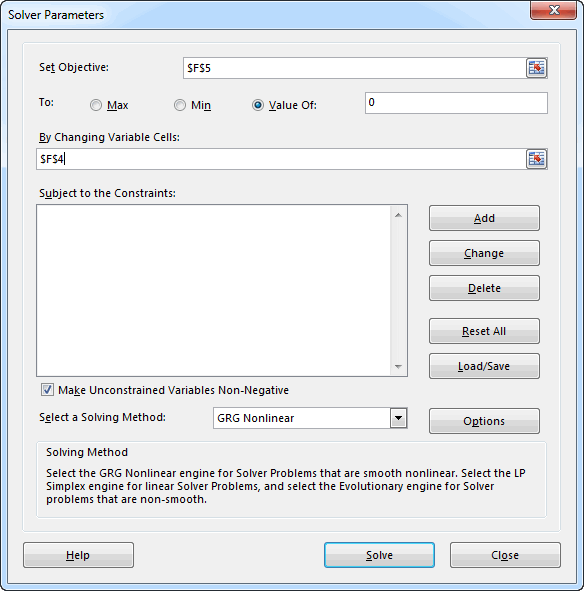

# Using the Goal Seek and Solver Tools

There are many cases when performing computations in Excel where we need to solve an equation that is either difficult or impossible to solve directly. Therefore, we need to solve it using some sort of iterative process. The **Goal Seek** and **Solver** tools are perfectly suited for these cases. For example, consider the following workbook:


The workbook is designed to solve a quadratic equation of the form:

$y = ax^2 + bx + c$

The user enters the coefficients a, b, & c in cells C4:C6. For the case shown above, we are solving:

$y = x^2 - 3x + 1$

The chart at the bottom is used to graph the parabola corresponding to the equation over a specified range. The solution to the equation is the two points where the parabola intercepts the y axis. These are called the "roots" and represent the solution to:

$ax^2 + bx + c = 0$

As can be seen on the chart, the roots are approximately 0.4 and 2.6.

We can find the roots using cells F4 and F5. We enter a value for x in cell F4. The corresponding value of y is computed in cell F5 as:

```excel
=C4*F4^2+C5*F4+C6
```

To find a root, we can enter a guess (0.4 for starters) into F4 and iteratively tweak that number until the value computed for y in F5 is roughly equal to zero. While this works, it can be time consuming and tedious.

## Goal Seek

A more efficient way to solve for the roots is to let Excel perform the iterative calculations using the Goal Seek tool. This tool is located in the **Data** ribbon under the **What-If Analysis** menu. It has three inputs. For the case shown above, the inputs should be like this:


This tells the Goal Seek tool to repeatedly change cell F4 (x) until the value in cell F5 (y) is equal to zero. After clicking the OK button, the following message appears:


Note that the solution is not always found exactly due to roundoff error. After running the tool, the following values are displayed:


To find other root, we need to repeat the process, but we must first enter a value for x that is close to the second root. If we enter an x value of 2.5 and repeat the process, we can quickly find the other root:


## Solver

There is another tool in Excel for performing iterative calculations called the Solver that is even more powerful. The Solver is an Add-In so before using it, there are a few steps we need to take.

1. Select the **File|Open** command, and then select **Options**.
2. Click **Add-Ins**, and then in the **Manage** box, select **Excel Add-ins**.
3. Click **Go**.
4. In the **Add-Ins available** box, select the **Solver Add-in** check box, and then click **OK**.
5. If **Solver Add-in** is not listed in the **Add-Ins available** box, click **Browse** to locate the add-in
6. If you get prompted that the **Solver Add-in** is not currently installed on your computer, click **Yes** to install it.

After you load the Solver Add-in, the **Solver** command is available in the **Analysis** group on the **Data** tab. These steps only need to be completed once.

After launching the Solver, the following window appears:



In general, the Solver is like Goal Seek in that it iteratively changes one (or more) input cell(s) until some condition is met. But in this case there are three possible conditions (max, min, value of) and a set of constraints can be defined. When we use the **Value Of** option, it is essentially the same as Goal Seek. Using the options shown above, we can solve for one of the roots of the parabola by clicking the **Solve** button. Doing so brings up the following message:


Generally you want to select the OK option to keep the solver solution. The solution found by the solver is:


which is the same as above (the starting value was near the second root), but a little more accurate.

The real power of the solver is to perform optimization using the **Max** and **Min** options. This is something that cannot be done with Goal Seek. For example, suppose we wanted to find the x location corresponding the lowest point on the parabola. We could simply enter a guess for the x value and run the Solver with the following options:


This results in the following solution:


Which is precisely the correct result.

While not applicable in this case, we can enter a series of constraints such as "B4>=0". As the Solver iterates, a variety of input values are tested. Such constraints can ensure that the Solver algorithm stays stable and will be more likely to converge on a solution.

## Sample Workbook

The workbook used in the examples shown above can be downloaded here:

[parabola.xlsx](files/parabola.xlsx)

## Exercises

You may wish to complete following exercises to gain practice with and reinforce the topics covered in this chapter:

<div class="exercise-grid" data-columns="4">
<div class="exercise-header">Description</div>
<div class="exercise-header">Difficulty</div>
<div class="exercise-header">Start</div>
<div class="exercise-header">Solution</div>
<div class="exercise-cell"><strong>Going Fishing -</strong> Use goalseek on a parabolic function to find where the fish strikes the fly.</div>
<div class="exercise-cell">Easy</div>
<div class="exercise-cell"><a href="files/going_fishing.xlsm">going_fishing.xlsm</a></div>
<div class="exercise-cell"><a href="files/going_fishing_key.xlsm">going_fishing_key.xlsm</a></div>
<div class="exercise-cell"><strong>Polynomials -</strong> Use goalseek to find the zeros of a polynomial function.</div>
<div class="exercise-cell">Medium</div>
<div class="exercise-cell"><a href="files/polynomials.xlsm">polynomials.xlsm</a></div>
<div class="exercise-cell"><a href="files/polynomials_key.xlsm">polynomials_key.xlsm</a></div>
<div class="exercise-cell"><strong>Topo Solver -</strong> Use goalseek and solver to identify key points on a topographic map.</div>
<div class="exercise-cell">Medium</div>
<div class="exercise-cell"><a href="files/topo_solver.xlsm">topo_solver.xlsm</a></div>
<div class="exercise-cell"><a href="files/topo_solver_key.xlsm">topo_solver_key.xlsm</a></div>
<div class="exercise-cell"><strong>Missile Trajectory -</strong> A asteroid is headed for earth. You need to determine if the rajectory of a "asteroid-stopping" defense missile will clear the nearby buildings and destroy the asteroid before it impacts with earth.</div>
<div class="exercise-cell">Hard</div>
<div class="exercise-cell"><a href="files/missile_trajectory.xlsm">missile_trajectory.xlsm</a></div>
<div class="exercise-cell"><a href="files/missile_trajectory_key.xlsm">missile_trajectory_key.xlsm</a></div>
</div>