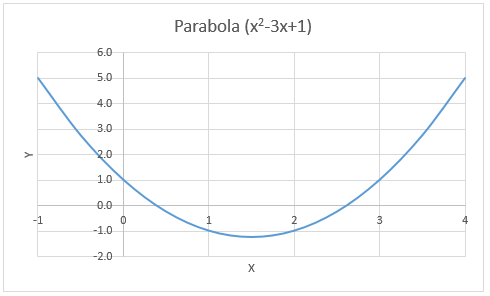

# Creating Charts

One of the most fundamental features of Excel is the Charts tool. Charts are used to generate a graphical representation of a set of data. Charts can be incredibly powerful in illustrating trends and characteristics of a data set. In this chapter, we will cover a brief overview of the chart tools with a special emphasis on the types of charts most commonly used in engineering and scientific applications. It is not intended to be an comprehensive overiew of all of the chart options. Such an overview would be beyond the scope of this Primer.

## Chart Types

The first step in creating a chart is selecting the type of chart to use. This will depend primarily on the type of data that you wish to graph with the chart. The following table lists the more commonly-used charts and the suggested applications:

| Type | Name | Description |
|------|------|----------------------------------------------------------------------------------------------------------------------|
|  |Column | Use this chart to visually compare values across a few categories. |
|  |Bar | Use this chart to visually compare values across a few categories when the chart shows duration or the category text is long. |
|  |Line | Use this chart to show trends over time (years, months, and days) or categories. |
|  |Area | Use this chart to show trends over time (years, months, and days) or categories. Use it to hightlight the magnitude of change over time. |
|  |Pie | Use this chart to show proportions of a whole. Use it when the total of your numbers is 100%. |
|  |Scatter (X,Y) | Use this chart type to show the relationship between sets of values. |

For scientific and engineering applications, the most common type of chart is the **Scatter (X,Y)** chart, which is sometimes called an **XY Scatter** chart. As the "XY" part of the name implies, this chart is used to represent one set of data (Y) which is dependent upon, or related to another set of data (X), both of which are numeric values. In other words:

$y = f(x)$

or y is some function of x. This can be an explicit numerical function ($y = x^2-3x+1$) or it could be an implicit relationship, such as measured strength of some specimens as a function of applied load.

## Creating a Chart

The steps to creating a new chart are as follows:

1. Select the data in the sheet that will be associated with the chart.
2. Select the **Insert** tab.
3. In the **Charts** section, click on one of the chart type icons and then select the specific type of chart you wish to create.

To illustrate the process, consider the following example worksheet. This is a variation of the parabola worksheet described in the [Goal Seek and Solver](https://vbaprimer.readthedocs.io/en/latest/01_excel/07_goalseek/goalseek/) chapter.

Our objective is to create an XY Scatter chart of the XY values shown in the tables. These values represent a solution of the equation:

$y = x^2 - 3x + 1$

for a range of x values varying from -1 to 4. To create the chart, we select the cells in the range **B12:B22** and follow the steps outlined above as follows:

Note that the chart type selected was **Scatter with Smooth Lines**. The "Smooth Lines" part means that a smooth curve is fit the to XY points that interpolates the points and provides a natural curvature between the points using some type of spline function. This is typically the best option to select. By contrast, this is what the "Straight Lines" option looks like:

Markers can also be combined with the smooth or straight lines. A marker is a dot at the location of each XY coordinate pair. Here is the **Markers with Smooth Lines** option:

And the **Markers Only** option:

As a matter of style, markers should only be used when there is a some kind of significance to each of the XY pairs. For example, perhaps the XY pairs represent data collected in the field or lab and each point corresponds to a sample or measurement. In many cases, however, the XY values represent some underlying function (such as the case shown above) and the points are arbitrarily selected. In this case, **markers should not be used** as they simply detract from the display of the function.

## Formatting a Chart

Once the chart is created, we can edit the chart options to modify the formatting. If you click on a chart, a set of three buttons will appear just to the right of the chart. The "+" button can be used to add or remove chart elements such as axis labels, the chart title, and a legend.

After editing the chart title and axis labels, the chart looks like this:

Note that the range on the x- and y-axes are automatically determined. Suppose for this case that we wish to limit the range of the x-axis to vary from -1 to 4. To do this we double-click on the x-axis or right-click on the axis and select Format Axis. This brings up the Format Axis options on the right side:

To remove the "Auto" option for the max and min bounds, we simply type in new values and hit the Enter key. After doing so, the **Axis Options** display as follows:

Clicking the **Reset** button would revert back to the automatic setting. After manually editing the x-axis bounds, the chart looks like this:

## Changing the Data Source

In some cases, after creating the chart we wish to change the set of cells associated with the chart (i.e., the "data source"). For example, perhaps we have deleted some of our XY pairs or we have extended the table to add additional pairs. When we do so, the chart is not automatically updated to reflect the change; we must manually make the correction. To change the data source, you can do the following:

1. Click on the curve in the chart to select it. This will display the range of cells associated with the chart.
2. Using the handles at the corners of the highlighted ranges, drag the corners to resize the selection to the desired range.

Another option for changing the source is:

1. Right-click on the curve and select the **Select Data** option. This brings up the **Select Data Source** dialog.
2. Edit the **Chart data range** field to correspond to the desired range.

## Sample Workbook

The workbook used in the examples shown above can be downloaded here:

[parabola2.xlsx](files/parabola2.xlsx)

## Exercises

You may wish to complete following exercises to gain practice with and reinforce the topics covered in this chapter:

Description

Difficulty

Start

Solution

<strong>Excess Pore Pressure -</strong> Create a chart of the excess pore pressure vs distance from given test data.

Easy

<a href="files/excess_pore_pressure.xlsx">excess_pore_pressure.xlsx</a>

<a href="files/excess_pore_pressure_key.xlsx">excess_pore_pressure_key.xlsx</a>

<strong>Material Price Trends -</strong> Create a chart of the prices for different engineering materials over a specified date range and identify a trend.

Medium

<a href="files/material_price_trends.xlsx">material_price_trends.xlsx</a>

<a href="files/material_price_trends_key.xlsx">material_price_trends_key.xlsx</a>

<strong>Crater Settlement -</strong> Plot the settlement vs distance of different points due to underground blasting. Analyze the crater formed.

Hard

<a href="files/crater_settlement.xlsx">crater_settlement.xlsx</a>

<a href="files/crater_settlement_key.xlsx">crater_settlement_key.xlsx</a>

