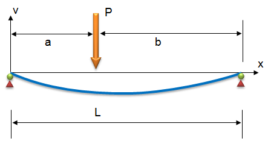
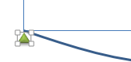
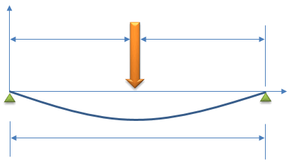
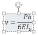

# Annotation - Drawings and Equations

When developing worksheets as a tool for solving engineering problems that we frequently encounter in practice, it is helpful to make the worksheets as clear and easy to use as possible. One of the ways this can be accomplished is to add graphics to the worksheet illustrating the problem being solved. In some cases, showing the equations in native form is also helpful. For example, suppose we are just starting to develop a worksheet for solving the deflection of a simply-supported beam subjected to a point load.

The equations associated with the problem are as follows:

Before entering the formulas, it would be very helpful to future users of the workbook if we could add some annotation to the workbook including a diagram and set of equations similar to those shown above. In this chapter, we will use this example to review the basic tools provided in Excel for making simple drawings and for composing graphical equations.

(Note: You may want to open the sample workbook at the bottom of this chapter and follow along.)

## Drawing Tools

The drawing tools in Excel are the same set of tools utilized in other Microsoft Office products, including Word and Powerpoint. Drawings are created using a set of objects called **shapes**. You begin creating a drawing in Excel by inserting a shape. To insert a shape, click on the **Insert** tab, and then click on the **Shapes** menu in the **Illustrations** section.

To create our drawing, we will first create the lines corresponding to the x and y axes. Since the have an arrow at the ends, we will use the line shape with an arrow on one end (). To create the x-axis, start on the left and click and drag to the right. If you hold the shift key down while dragging, the line will stay perfectly flat. After creating the line, you will shift into drawing mode and the drawing tools will be displayed:

If you click anywhere on the worksheet so that no shapes are selected, the drawing tool ribbon will go away. To get it back, you can simply click on one of your shapes or insert another shape using the process described above.

Now we need to create the y-axis. Reselect the line/arrow tool from the shape pallette on the left side of the drawing tools ribbon. Then start at the left side of the axis (the origin) and repeat the process dragging straight up, again holding down the shift key while dragging. At this point, the drawing should look like this:

Next, we will create the deflected beam shape. The best way to do this is with the curve shape (). Select the curve shape. Curves are created by clicking on a set of pivot points defining the curve and then double-clicking at the end. To create the beam, we will click on three points: one on the left side of the beam to start, one at the middle of the beam, then we will double-click on the right side to end. Star creating your beam by clicking on the coordinate origin. Then click at the midpoint of the beam as follows:

Then double-click on the right side of the beam:

Note that you have created a nice smooth curve based on these three points. If you want to fine-tune the shape of the curve, select the curve and then select the **Edit Shape|Edit Points** command from the **Insert Shapes** section of the **Drawing Tools** ribbon.

At this point, the three points defining the curve will appear. If click on one of the points, a set of handles will appear:

Repositioning the point in the center or dragging the handles will reshape the curve. Experimenting for a few minutes will give you a good sense of how this works. When you are done try to restore the curve to the shape shown above as best you can (or delete and recreate the curve).

Next we will create the support points. In the drawing shown above, the supports are shown with a triangle and circle. To keep things simple we will use a triangle only. Select the triangle shape () and drag a triangle at the left end of the beam. You may need to create the shape and the drag it into position. You may also need to use the handles at the corners of the shape to resize it. If you want to give the shape a professional look, you can apply one of the "3D" shape styles:

At this point, the support should look like this:

To create a support on the other end, we can either repeat the entire process, or we can create a duplicate of the shape by pressing Ctrl-D and reposition it to the right end as follows:

Next we will create the shape representing the load. To do this we will use the block arrow tool corresponding to a down arrow (). Click and draw in a long vertical shape to create the load arrow. Apply one of the 3D styles and the reposition the arrow as follows:

Now we are ready to apply the lines associated with the dimensioning. Using a combination of the line tools (  ) and the techniques described above, create the following lines:

As you create the lines, you may want to simply duplicate the existing lines. Also, if you need to align some of the shapes, select multiple shapes using the shift key and then select the **Align** menu in the **Arrange** section of the **Drawing Tools** ribbon.

The last step is to add the text labels to the drawing. We will start with the "P" by the load arrow. To add the label, select the text box shape () and drag a box by the load arrow. Then type "P" and click on the box containing the label to reposition it if necessary. To get right of the line around the text box, select the label and then select the **Shape Outline** menu in the **Shape Styles** section of the ribbon and select **No Outline**. To change the font attributes (size, font, bold, alignment, etc.) you will need to click on the **Home** ribbon and use the tools in the **Font** section while the textbox shape is selected.

To create the remaining labels, duplicate (Ctrl-D) the current label and then change the text. Reposition and re-format as needed. When you are finished, our drawing is complete!

## The Equation Editor

Next we will use the **Excel Equation Editor** to create a graphical representation of the equations describing the deflection of a simply supported beam. To make things interesting, we will start with the second equation shown here:

To insert a new equation, select a cell somewhere in the vicinity of where you would like to put the equation and then click on the Insert tab. Over on the far right end of the tab, you will see a **Symbols** section. Click on the **Equation** menu.

If you click on the down arrow, the menu lists some frequently-used equations for cases where you want to start with something and then modify. But we need to start from scratch, so we need to click on top part of the **Equation** button. This inserts a new equation and opends up the **Equation Tools** ribbon.

The ribbon is divided into two main sections: **Symbols** and **Structures**. The structures represent basic components of equations that define positional relationships. In general, you form an equation by inserting a structure and then filling in the elements of the structure by typing standard characters (x, y, p, t, etc.) or by selecting symbols. We will start our equation by typing "v=". Then we select the **Fraction** menu and select the first (upper left) option ("stacked fraction"). This creates an empty fraction with a placeholder for the numerator and the denominator:

Click on the numerator box to and type "-Pb". Then click on the denominator box and type "6E". At this point, we need to enter "Iu" with the "u" part as a subscript. To do so, we click on the **Script** menu in the **Structures** section and select the second item on the top row. This creates a place holder for the main part and the subscript. Click on the main part and type "I" and then click on the subscript and type "u". (Note that you rather than clicking on the placeholders, you can use the arrow keys on your keyboard to navigate between the different placeholders.) At this point, the equation should look like this:

At this point, we are finished with the fraction and need to enter the remainder of the equation. Before doing so, we need to move the cursor out of the denominator, otherwise whatever we type will be in the denominator. To do so, we simply hit the right-arrow key on the keyboard a couple of times until the cursor is to right of and even with the main part of the equation:

Next we need to create a set of square brackets for the right side of the equation. We could simply type the "[" and "]" characters on the keyboard, but we need the brackets to automatically resize themselves based on the content in the brackets, so we need to use a structure. Click on the **Brackets** menu and select the square brackets option (second item in the top row).

Click on the placeholder in the middle of the brackets and insert another fraction structure. Enter "L" for the numerator and "b" for the denominator.

Then hit the right arrow key once to exit the denominator.

Next, we need to enter (x-a)3. To do this, we will need two structures: a superscript and a bracket. First insert the superscript structure, then click on the main part of the superscript structure and enter a bracket "()" structure. Then enter "x-a" in the main part of the bracket structure and click on the superscript and type "3".

Hit the right arrow key to exit the superscript and finish the rest of the equation using the procedures described above. When you are finished, the equation should look like this:

After creating the equation, you can move it around to reposition it. To edit it, simply click on it and the **Equation Tools** ribbon will appear again.

You can now continue and try creating the other equations shown above if you wish.

## Selecting Objects

After creating a set of shapes and equations, it is sometimes necessary to select them as a group by dragging a box around them. For example, this is necessary if you wish to reposition all of them at once. If you just drag a box around the objects, they are not selected. To do this, you need to activate the "Select Objects" mode. This is accomplished by clicking on the **Home** tab and then selecting the **Select Objects** item in the **Find and Select** menu on the far right end of the ribbon.

## Grouping

When dealing with large sets of shapes and equations as described in the previous section, it is sometimes helpful to organize the objects into groups. This allows you to select and move them as a single item. To group a set of objects, select them and then select the **Group** item in **Arrange** section in the **Drawing Tools** ribbon. Select the **Group** option from the menu.

The ungroup command can be used to undo the process of grouping a set of objects.

## Display Order

When working with shapes that are filled, sometimes one objects can obscure another. You can directly control the order in which the objects are displayed using the options in the **Bring Forward** and **Send Backward** menus in the **Arrange** section of the **Drawing Tools** ribbon.

## Sample Workbooks

The workbook used in the examples shown above can be downloaded here:

[simplebeam.xlsx](files/simplebeam.xlsx)<-- Without annotation. Start here if you want to try creating the drawings and equations [simplebeam-key.xlsx](files/simplebeam-key.xlsx)	<-- With completed annotation.

## Exercises

You may wish to complete following exercises to gain practice with and reinforce the topics covered in this chapter:

Description

Difficulty

Start

Solution

<strong>Drag Equation -</strong> Create an annotated figure of drag force on a baseball and compute the drag force that the ball experiences.

Easy

<a href="files/drag_equation.xlsx">drag_equation.xlsx</a>

<a href="files/drag_equation_key.xlsx">drag_equation_key.xlsx</a>

<strong>Unit Weight -</strong> Create an annotated soil profile and write an equation to compute the unit weight of the two soil layers.

Medium

<a href="files/unit_weight.xlsx">unit_weight.xlsx</a>

<a href="files/unit_weight_key.xlsx">unit_weight_key.xlsx</a>

<strong>Headloss -</strong> Annotate a figure of a pipe with the necessary equations to calculate headloss. Then calculate the headloss with the given values and equations.

Hard

<a href="files/headloss.xlsx">headloss.xlsx</a>

<a href="files/headloss_key.xlsx">headloss_key.xlsx</a>

