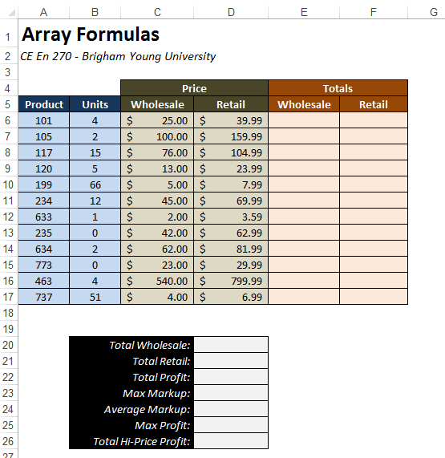
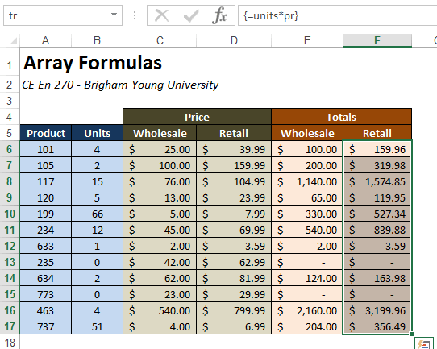
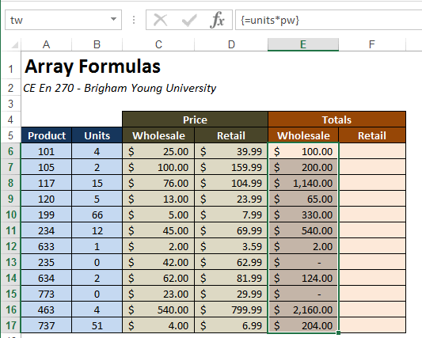
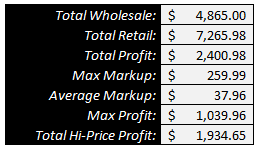

# Array Formulas

In Excel terminology, an array is a group of cells in a row (horizonal array), column (vertical array), or multiple rows and columns (2D array). In this chapter we discuss a special type of Excel formula called an "array formula" that operates on arrays. Array formulas can be a powerful tool for condensing a complex set of calculations in a simple, concise formula.

To illustrate the power of array formulas, we will use the following workbook as an example:



The workbook is designed to perform calculations associated with the sale of a set of products. Each column represents a sale. The product ID is in column A, the number units sold in the sale is in column B, and the wholesale and retail prices are in columns C and D. We will calculate the total sale amount in terms of wholesale and retail in columns E and F and then perform some summary computations in the section at the bottom.

When dealing with array formulas, it is sometimes useful to use named ranges. This is not a requirement but it makes the formulas much easier to understand. For the purpose of this example, we will name the following set of ranges:

| Range       | Column           |   Name    |
|---------:|------------------|:---------:|
| B6:B17     | Units            |   units   |
| C6:C17     | Price-Wholesale  | pw    |
| D6:D17     | Price-Retail     | pr    |
| E6:E17     | Totals-Wholesale | tw    |
| F6:F17     | Totals-Retail    | tr    |

These names will be used in each of the formula examples shown below.

## Simple Array Calculations

To begin, we will use an array formula to calcute the wholesale total in column E. Normally, we will do  this by entering the following formula cell E6:

```excel
=B6*C6
```

and then copying the formula to the rest of the cells in column E. To do this with an array formula, we first select the the entire Total|Wholesale column (E6:E17) and then type the following in the formula bar:

```excel
=units*pw
```

and then rather than simply hitting the Enter key, we hit _Ctrl-Shift-Enter_. We must always use this key sequence when entering an array formula. Otherwise we get either an error message or the wrong answer, depending on what is selected. After entering the array formula, the entire column is populated as follows:



Note the resulting format of the formula:

```excel
{=units*pw}
```

The curly braces indicate that is an array formula. If we wish to edit the formula, we can click on the formula bar and make changes, but we must always hit _Ctrl-Shift-Enter_ when we are done.

!!! Note
    If you are using excel through a Microsoft 365 subscription, you may not need to hit _Ctrl-Shift-Enter_ to create an array formula. However, it is good to know how to so that if you are ever on a different version of Excel that requires the _Ctrl-Shift-Enter_ method, you will still be able to use array formulas.

An array formula is similar to performing vector algebra. The formula essentially multiplies the units column by the wholesale price column. The result of multiplying these two vertical arrays is a vertical array of same dimension (12 items) where each item is equal to the number of units times the price for that particular entry (row in this case). The equation applies to the entire column in the **Totals|Wholesale** part of the table. One advantage of using an array formula in a case like this is that the resulting formula is simple and intuitive.

Next, we will do the same thing for the **Totals|Retail** column. We will select the column and enter the following formula in the formula bar:

```excel
=units*pr
```

and finish with _Ctrl-Shift-Enter_. At this point, the table is complete:



## Using Arrays with Functions

Now we will focus on the bottom section where we will perform some summary calculations based on our sales totals using functions. There are many Excel functions such as **Sum()** or **Average()** that take an array as input and return a single number as output. We will use these formulas in combination with array algebra to create some interesting results.

First of all, we calculate the wholesale total by calculating the sum of the number of units times the wholesale price. We could do that by calculating the sum of the **Totats|Wholesale** column, but with an array formula, we can perform the calculation without using this column. This is one of the advantages of array formulas is that we do not need any intermediate columns in order to some calculations involving multi-cell ranges. We will enter the following array formula in cell **D20**:

```excel
=SUM(units*pw)
```

and we get value of $4,865.00. Similarly, we can use the formula:

```excel
=SUM(units*pr)
```

to calculate the retail total (). Once again, after typing the formulas, we finish with Ctrl-Shift-Enter and the formulas are displayed with curly braces.

```excel
{=SUM(units*pw)}

{=SUM(units*pr)}
```

Next we will calculate the total profit as the sum of the retail totals minus the sum of the wholesale totals in cell D22 using the following formula.

```excel
=SUM(tr-tw)
```

Note that we use the wholesale totals and retail totals columns in this calculation. But we could have performed the calculations directly from the units column and the prices columns as follows:

```excel
=SUM(units*pr-units*pw)
```

In cell D23, we will calculate the maximum markup (difference between retail and wholesale prices) as follows:

```excel
=MAX(pr-pw)
```

And the average markup as:

```excel
=AVERAGE(pr-pw)
```

The maximum profit (difference between retail and wholesale totals) can be computed as:

```excel
=MAX(tr-tw)
```

Finally, in cell **D26** we wish to compute the total high-price profit. The high-price profit is defined as the profit on items were the retail price is greater than \$50. In order to calculate this correctly we need to compute a sum of only those items where the prices greater than \$50. In order to do this we need to combine both the **IF()** funciton and the **SUM()** function as follows:

```excel
=SUM(IF(pr>50,tr-tw,0))
```

This example is a nice illustration of the power of array formulas. Doing this type of calculation within a normal formula would've been much more difficult than it was in this case.

At this point, our sales summary is complete:



## Logical Functions

One caveat associated with using array formulas in Excel is that you have to be very careful when using logical functions such as **OR()** and **AND()**. For some reason, they don't behave the way you would normally expect, and can lead to logical errors in your formula results. However, there is a way you can reformulate your array formulas to work around this limitation. This issue and the associated workarounds are explained in the following article:

[http://dailydoseofexcel.com/archives/2004/12/04/logical-operations-in-array-formulas/](http://dailydoseofexcel.com/archives/2004/12/04/logical-operations-in-array-formulas/)

The workarounds rely on the fact that the value of True is equal to the numerical value of 1 and a value of False is equal to the numerical value of 0.

## Sample Workbook

The workbook used in the examples shown above can be downloaded here:

[arrayform.xlsx](files/arrayform.xlsx)

## Exercises

You may wish to complete following exercises to gain practice with and reinforce the topics covered in this chapter:

| Exercise	| Description	                                                                                                                                          | Difficulty	| Start	| Solution	|
|:---------|:------------------------------------------------------------------------------------------------------------------------------------------------------|:-----------|:-------|:----------|
| Financial Arrays	| Conduct a simple financial analysis <br>on a list of items using arrays. This <br>worksheet will help explain/show<br> the benefits of using arrays.	 | Easy	| [financial_arrays.xlsx](files/financial_arrays.xlsx)	| [financial_arrays_key.xlsx](files/financial_arrays_key.xlsx)	|
| New Car Expense Calculator	| Calculate a range of expenses for <br>buying a new car.	                                                                                              | Medium	| [new_car_expense_calculator.xlsx](files/new_car_expense_calculator.xlsx)	| [new_car_expense_calculator_key.xlsx](files/new_car_expense_calculator_key.xlsx)	|
| Force Analysis	| Use arrays to find different <br>statistics of force from test data.	                                                                                 | Hard	| [force_analysis.xlsx](files/force_analysis.xlsx)	| [force_analysis_key.xlsx](files/force_analysis_key.xlsx)	|

