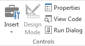
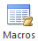
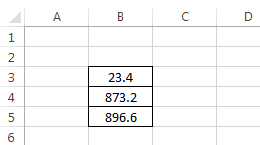
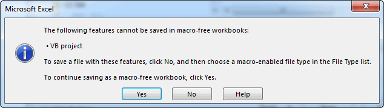
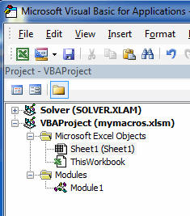

# Recording Macros

A **VB Macro** is essentially a VB subroutine that executes a series of VB statements. To generate a macro, you must first turn on the [Developer tab](../01_gettingstarted/gettingstarted.md#the-developer-tab). Macros are then created and managed using the tools in the Code Group on the left side of the tab:



You can automate a series of steps in Excel by recording a macro. As you record a macro, Excel converts each of your steps into lines of VB code that are part of a script that can be replayed at a latter point in time to automatically replicate the steps recorded into the script.

The options are as follows:

| Button | Description |
|--------|-------------|
|  | Click on this button to start recording your macro. You will then be prompted for the name of the macro. Once you start recording the macro, the button will change to Stop Recording. |
|  | Click here when you are finished with the steps you wish to include in the macro. |
|  | This is a toggle button. When it is turned on, the steps in the macro are recorded in a relative fashion. I.e., the cells affected by the macro will be based on the position of the cell(s) selected when the macro is executed. This can be used to make a macro that can be applied to any section of the spreadsheet. When using this option, be sure to select an appropriate part of the sheet prior to recording the macro. |
|  | This option is used to establish the security settings for the VB code. VB macros can be used to write computer viruses. The security settings are used to minimize danger from such viruses. |
|  | This button brings up a window listing all of the macros associated with a project. You can select a macro and click on the **Run** button to execute the macro. You can also delete macros. |
|  | This tool displays the [Visual Basic Editor](../01_gettingstarted/gettingstarted.md#the-visual-basic-editor). This is where you write the Visual Basic code. It also allows you to look at the code associated with your macros. The macros are stored in the **Modules** section of the Project Explorer. |

Macros are extremely useful when you are first learning how to write VBA code in Excel. If you want to do something in code such as change the background color of a cell, but you don't know to do it, simply run a macro, change the color manually, and then look at the macro. You can learn how to do just about anything simply by running macros.

## Recording a Macro

To illustrate the macro recording process, open up a blank workbook, click on the Developer tab, and click on the Record Macro button. You will then be prompted for the name of the macro. Enter "my_macro". Note that you should not use spaces in your macro names.


Select any cell other than cell B3. Then, do the following:

1. Select cell **B3**.
2. Enter a value of **23.4** in cell **B3**.
3. Enter a value of **873.2** in cell **B4**.
4. Enter a formula in cell **B5** to compute the sum of the previous two values ("=Sum(B3:B4)").
5. Click on the **Home** tab and select the range **B3:B4** and click on the center align button in the **Alignment** section.
6. Use to borders tool in the **Font** section to apply a solid border to the cells.

At this point, you workbook should look like this:



Go back to the **Developer** tab and click on the **Stop Recording** button. This completes the recording of the macro.

## Saving a Macro-Enabled Workbook

Before looking at the source code recorded by our macro, we need to save the changes that we have made into the workbook thus far. Click on the File|Save As... command and pick a location to save your workbook. Note that the filename and filter will look something like this by default:


Note that the default extension is "*.xlsx". If you click the Save button, you will get the following error message:



If we save the file in this format, our macro code will be lost and it will not function the next time we open it. To save a workbook containing VB code, you must change the extension as follows:


## Running a Macro

Next we will test the macro that we just recorded. Before running the macro, we need to delete our changes to the sheet, including the formatting. The easiest way to do this is to select the entire column **B** and then select the **Delete Sheet Columns** command in the **Cells** section on the right side of the ribbon in the **Home** tab. After the deletion, there should be nothing on the sheet. Select any cell on the sheet.

To run the macro, go to the **Developer** tab and click on the **Macros** button. This will bring up a list of the macros (we only have one at this point). Sure our macro is highlighted and then click on the **Run** button. This should execute our macro and reproduce all of the edits and changes we made to the worksheet when we were recording the macro.

## Viewing the Macro Code

Next, we will examine the code associated with our macro. When you record a macro in Excel, everything you do is recorded as a set of Visual Basic code. To view the code, click on **Visual Basic** button in the **Developer** tab. This will launch the Visual Basic Editor window. On the left side of the window in the VBA Project Explorer you will see a folder called "Modules". Click on the plus sign ("+") to the left of this folder to expand its contents and you will an item called **Module1**. When a macro is recorded, the code associated with the macro is always inserted into a module. If you already have one or more modules, a new module will be created.



If you double click on the item labeled **Module1**, a window will open and the code associated with the macro you just recorded will appear. The code should look something like this:

```vb
Sub my_macro()
'
' my_macro Macro
'

'
    Range("B3").Select
    ActiveCell.FormulaR1C1 = "23.4"
    Range("B4").Select
    ActiveCell.FormulaR1C1 = "873.2"
    Range("B5").Select
    ActiveCell.FormulaR1C1 = "=SUM(R[-2]C:R[-1]C)"
    Range("B3:B5").Select
    With Selection
        .HorizontalAlignment = xlCenter
        .VerticalAlignment = xlBottom
        .WrapText = False
        .Orientation = 0
        .AddIndent = False
        .IndentLevel = 0
        .ShrinkToFit = False
        .ReadingOrder = xlContext
        .MergeCells = False
    End With
    Selection.Borders(xlDiagonalDown).LineStyle = xlNone
    Selection.Borders(xlDiagonalUp).LineStyle = xlNone
    With Selection.Borders(xlEdgeLeft)
        .LineStyle = xlContinuous
        .ColorIndex = 0
        .TintAndShade = 0
        .Weight = xlThin
    End With
    With Selection.Borders(xlEdgeTop)
        .LineStyle = xlContinuous
        .ColorIndex = 0
        .TintAndShade = 0
        .Weight = xlThin
    End With
    With Selection.Borders(xlEdgeBottom)
        .LineStyle = xlContinuous
        .ColorIndex = 0
        .TintAndShade = 0
        .Weight = xlThin
    End With
    With Selection.Borders(xlEdgeRight)
        .LineStyle = xlContinuous
        .ColorIndex = 0
        .TintAndShade = 0
        .Weight = xlThin
    End With
    With Selection.Borders(xlInsideVertical)
        .LineStyle = xlContinuous
        .ColorIndex = 0
        .TintAndShade = 0
        .Weight = xlThin
    End With
    With Selection.Borders(xlInsideHorizontal)
        .LineStyle = xlContinuous
        .ColorIndex = 0
        .TintAndShade = 0
        .Weight = xlThin
    End With
End Sub
```

The first few lines of code are associated with entering the two values and the formula. The next section centers the selection and the last six blocks of code apply the border style to the selection. You can modify the code here if you wish and re-run the macro.

## Applications and Use Cases

Macros have a number of useful applications. For example, you can record a macro associated with some set of steps that you find yourself doing frequently. The macro then automates those steps. You can also use a macro to figure out how to write VB code to perform some action. For example, suppose I want to embed an execution of the [Goal Seek](../../01_excel/07_goalseek/goalseek.md) feature as part of my code, but I am not sure how to call Goal Seek from VB. I can simply record a macro that involves running the Goal Seek tool and then examine the code.

In many applications, the VB code associated with our macro may not be as useful as we like because it only applies to a very specific case at a very specific location on our workbook. In these cases, we can often modify the macro code to make it more general purpose. For example, we can generalize the code and then put it in a loop to solve some kind of problem in an iterative fashion. In this sense, macros can be a very powerful way to quickly generate code.

## Exercises

You may wish to complete following exercises to gain practice with and reinforce the topics covered in this chapter:

<div class="exercise-grid" data-columns="4">
<div class="exercise-header">Description</div>
<div class="exercise-header">Difficulty</div>
<div class="exercise-header">Start</div>
<div class="exercise-header">Solution</div>
<div class="exercise-cell"><strong>Parabolic Zero -</strong> Record a macro performing a goal seek to find the zero(s) of a parabolic equation.</div>
<div class="exercise-cell">Easy</div>
<div class="exercise-cell"><a href="files/parabolic_zero.xlsm">parabolic_zero.xlsm</a></div>
<div class="exercise-cell"><a href="files/parabolic_zero_key.xlsm">parabolic_zero_key.xlsm</a></div>
<div class="exercise-cell"><strong>Table Format -</strong> Record a relative macro that formats the appropriate range of cells found within any given table of the same size.</div>
<div class="exercise-cell">Medium</div>
<div class="exercise-cell"><a href="files/table_format.xlsm">table_format.xlsm</a></div>
<div class="exercise-cell"><a href="files/table_format_key.xlsm">table_format_key.xlsm</a></div>
<div class="exercise-cell"><strong>Microstrain -</strong> Record a macro that conducts an analysis on microstrain data that quickly identifies the maximum values of the selected column.</div>
<div class="exercise-cell">Hard</div>
<div class="exercise-cell"><a href="files/microstrain.xlsm">microstrain.xlsm</a></div>
<div class="exercise-cell"><a href="files/microstrain_key.xlsm">microstrain_key.xlsm</a></div>
</div>