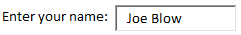

# Adding Controls to a Spreadsheet

Controls are buttons, combo boxes, option buttons, etc. that can be added to a worksheet. You can associate VB code with controls that is executed each time the user clicks on the control.

## The Controls Group

To add a control to a spreadsheet, you should first turn on the [Developer tab](../01_gettingstarted/gettingstarted.md#the-developer-tab). You then create new controls and edit the code associated with controls using the Control group.


The options in the group are as follows:

| Tool | Description |
|------|-------------|
|  | This tool is used to insert new controls (see below). |
|  | This toggle button is used to switch in and out of design mode (see below) |
|  | This button brings up the Properties window that is used to edit the properties associated with a selected control. |
|  | This tool displays the [Visual Basic Editor](../01_gettingstarted/gettingstarted.md#the-visual-basic-editor). This is where you write the Visual Basic code. |
|  | This is used to run any custom user forms you may have associated with the project. |

## Creating Controls

To add a new control, click on the Insert button and then select one of the control types in the **ActiveX Controls** portion of the tool palette:


Then drag a box on your worksheet where you want to place the control. While the control is still selected, you can use the **Properties** window to edit the properties associated with the control (the control name, the caption, etc.).

To edit the code associated with a control, simply double click on the control. This switches you over the VB Editor and puts the cursor in the subprocedure associated with the **Click** event for the control. Any code you enter here is automatically executed when the control is clicked.

## Design Mode

When you are writing VB code and adding controls to a spreadsheet, there are two basic modes: **Design mode** and **Run mode**. In design mode, when you click on a button or a control, you can edit the properties of the control in the [VB Editor](../01_gettingstarted/gettingstarted.md#the-visual-basic-editor). If you double click on a control, you can edit the code associated with the control. If you are in Run mode, when you click on the control, the code associated with the control is executed. When developing your spreadsheet, you will be moving in and out of Design mode.

## Types of Controls

In this section we will describe each of the controls in the ActiveX Controls menu.

### Buttons 

Buttons are also called **Command Buttons**. They are typically used as a simple mechanism to execute some VBA code, such as a macro you my have recorded.


After creating the button, you double-click the button in design mode and then write the code that is executed when the button is clicked. If your button brings up a custom user form, you should also put a set of elipses after the button caption (...).

### Combo Boxes 

Combo boxes are sometimes called "pop-up menus". They allow you to select a choice from a set of options.


The choices presented to the user come from a range of cells somewhere on your spreadsheet. You assign the set of choices to the combobox by setting the **ListFillRange** property of the combo box. The range is referenced like you would in a spreadsheet (J2:J5, Sheet2!G4:G6, etc.). The **LinkedCell** property allows the user to output a value from their selection to a specific cell. LinkedCell outputs this value from a column in the ListFillRange and this column is denoted by the **BoundColumn** property.

The "combo" part of a combo box comes from the fact that rather than selecting an item from the list, you can type something in the box. If you want to restrict the user to only select something from the list (typical usage), you need to set the **MatchRequired** property to True.

### Check Boxes 

Checkboxes are used when you have an option or set of options that are true/false or yes/no and the options are independent. For example,


The text displayed corresponds to the **Caption** property. The **Value** property is a boolean (true/false) indicating the status of the control. This control is typically utilized with some kind of **If** statement. You typically don't do anything when the user selects the control, but when the user selects a button or something, you check the status of the control. For example,

```vb
If chkCoseSlaw Then
	price = price + 2.6
End If
```

If your options are dependent (you can only select one from the group), you should use either the list box, combo box, or option control instead.

### List Boxes 

A list box is used when you have a large number of options and you need the user to select one option from the list. Example:


The contents of the list come from a range of cells somewhere on your spreadsheet. The range is indicated by the **ListFillRange** property. To determine what item is selected, you can check the **Value** property. For the example shown above, the Value property would = "Brigham Young". In many cases, what you really want to know is what item is selected by order in the list. You can do this using the **ListIndex** property. The index numbering starts at 0, so for the case shown above, the ListIndex property = **2**.

Note that if the list box is not big enough to show the entire list, a scroll bar is automatically added to the list to allow the user to scroll through the entire list.

### Text Boxes 

A text box is used to allow the user to enter a text string as some type of input. For example,



The text in the control is stored in the **Value** property. Text boxes are rarely used in Excel because it is usually simpler and more efficient to have the user enter the text into one of the spreadsheet cells.

### Scroll Bars 

A scroll bar allows the user to select a value from a predefined range of values.


The rectangle in the middle is called the "thumb". As the user moves the thumb, the value of the scroll bar changes and the value is stored in the **Value** property. You can link a scroll bar to a cell using the **LinkedCell** property. Then the current value of the scroll is echoed to a cell as shown above. You set the range of values on the scroll bar using the **Min** and **Max** properties. Scroll bars are fun, but are rarely used on spreadsheets.

### Spin Buttons 

A spin button allows the user to increment an integer value up or down by clicking on the button arrows. A spin button should always be linked to a cell using the **LinkedCell** property.


You can set a limit on the values by changing the **Min** and **Max** properties. You can also use the **SmallChange** property to increment by 2, 5, 10, etc (default = 1).

### Option Buttons 

Option buttons are used when you want the user to make a single selection from a set of options. These are sometimes called "radio" controls, because the mimic the buttons on your car radio for selecting a pre-set station.


Each control has a **Value** property which is a boolean representing the state of the control (true/false). The text displayed is from the **Caption** property.

### Labels 

A label is simply a text string where you can change the value of the text string using VB code. These are sometimes useful in custom user forms, but are rarely used in spreadsheets because you can simply put a label in a cell and change the value of the cell.

### Images 

An image control allows you to associate an image from a file with a control. The control is shown as a gray rectangle until you attach an image to the control using the **Picture** property. You select a file and the image in the file is then copied to the image control. You can use the **Visible** property to turn the image on or off and you can use the **Top** and **Left** properties to control the location of the image on your spreadsheet. You should only use this control on a spreadsheet if you intend to turn the image on or off or move it. Otherwise, just use the **Insert|Pictures** command in Excel.

### Toggle Buttons 

A toggle button is similar to a checkbox, but it uses a button that is in a normal or depressed state:


The button status is stored in the **Value** property as a boolean (true/false). The text on the button is from the **Caption** property.

### More Controls 

Clicking on the more controls button brings up a list of advanced controls. The contents of the list will depend on what is installed on your computer.


## Control Names

When working with controls, you will need to reference your controls in your code using the control names which are defined by the Name property when you create the controls. When dealing with large numbers of controls, it is very important to assign meaningful names that describe the function of the control. Furthermore, to distinguish between different types of controls, you should use a three character prefix on the control names to indicate the type. For example, if I had a set of checkboxes for BBQ sides as shown above, I would name them:

- chkColeSlaw
- chkPotatoSalad
- chkBakeBeans
- chkMacNCheese

And for my option controls I would name them:

- optRed
- optGreen
- optBlue

Here is a complete list of suggested three character prefixes for each control type.

| Type | Icon | Prefix |
|------|------|--------|
| Command Button |  | cmd |
| Combo Box |  | cbo |
| Check Box |  | chk |
| List Box |  | lst |
| Text Box |  | txt |
| Scroll Bar |  | scr |
| Spin Button |  | spn |
| Option Button |  | opt |
| Label |  | lbl |
| Image |  | img |
| Toggle Button |  | tog |

## Exercises

You may wish to complete following exercises to gain practice with and reinforce the topics covered in this chapter:

<div class="exercise-grid" data-columns="4">
<div class="exercise-header">Description</div>
<div class="exercise-header">Difficulty</div>
<div class="exercise-header">Start</div>
<div class="exercise-header">Solution</div>
<div class="exercise-cell"><strong>Christmas Tree -</strong> Use shapes, controls, and macros in this fun visually basic controlled workbook to decorate a Christmas Tree.</div>
<div class="exercise-cell">Easy</div>
<div class="exercise-cell"><a href="files/christmas_tree.xlsm">christmas_tree.xlsm</a></div>
<div class="exercise-cell"><a href="files/christmas_tree_key.xlsm">christmas_tree_key.xlsm</a></div>
<div class="exercise-cell"><strong>Control Exercises -</strong> Learn how to use all of the basic Excel controls with these short and simple exercises.</div>
<div class="exercise-cell">Medium</div>
<div class="exercise-cell"><a href="files/control_exercises.xlsm">control_exercises.xlsm</a></div>
<div class="exercise-cell"><a href="files/control_exercises_key.xlsm">control_exercises_key.xlsm</a></div>
<div class="exercise-cell"><strong>Madlib Controls -</strong> Use controls to create a madlib generator for you and your friends.</div>
<div class="exercise-cell">Hard</div>
<div class="exercise-cell"><a href="files/madlib_controls.xlsm">madlib_controls.xlsm</a></div>
<div class="exercise-cell"><a href="files/madlib_controls_key.xlsm">madlib_controls_key.xlsm</a></div>
</div>