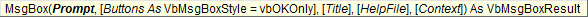
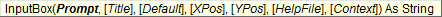

# MsgBox and InputBox

There are many occasions when programming where it is convenient to show a prompt to display a message to the user, and in some cases ask a simple question or ask for some simple feedback. In VBA, this can be accomplished with the MsgBox and InputBox tools.

## MsgBox

MsgBox is used to display a simple message to the user. Here is the syntax:



The last two arguments (HelpFile, Context) are rarely used. The other arguments are described below.

### Prompt

Note that the only argument that is required is the Prompt. Here is a simple example. The code:

```vb
MsgBox "Hello World"
```

Brings up the following window:


### Buttons

The second argument can be used to control what buttons are displayed. For example, the code:

```vb
MsgBox "Hello World", vbOKCancel
```

Brings up the following window:


The buttons argument is what is called an enumerated type, meaning you can only pick from a pre-defined set of options. The options are defined as VB constants, hence the "vb" prefix. Here are the more commonly used options:

- vbOKOnly
- vbOKCancel
- vbRetryCancel
- vbYesNo
- vbYesNoCancel

To determine which button is selected, you need to apply MsgBox as a function rather than as a sub. For example:

```vb
Dim mybutton As Variant
mybutton = MsgBox("This will delete your sheet. Continue?", vbOKCancel)
If mybutton = vbOK Then
    'PUT THE CODE HERE TO DELETE THE SHEET
Else
    Exit Sub
End If
```

In other words, when used as a function, MsgBox returns a code indicating the button that was selected. Once again, the button codes are defined as a set of VB constants:

- vbOK
- vbCancel
- vbYes
- vbNo
- vbRetry

### Style

You can also choose to add an icon to the MsgBox by adding another constant to the button argument. For example, the code:

```vb
MsgBox "This sheet brought to you by Norm Jones", vbInformation + vbOKOnly
```

Brings up the following window:


Note that the style constants can be added to the button constants. The style constants are as follows:

| Icon | Constant |
|------|----------|
|  | vbInformation |
|  | vbExclamation |
|  | vbCritical |

### Title

For each of the examples show above, note that the text shown in the title bar is "Microsoft Excel". You can change the title by using the third argument as follows:

```vb
MsgBox "Hello World", vbOKOnly, "Greetings"
```

This code brings up:


## InputBox

InputBox is very similar to MsgBox, but it is used when you need to prompt the user to input some text (or a number or a date) before you execute some code. The syntax is as follows:



### Prompt

Once again, the prompt is the message that is displayed and it is the only required argument. For example, the code:

```vb
name = inputbox("Please enter your name")
```

brings up:


Note that InputBox is always used as a function. The value returned by the function is the text string entered by the user. If the user selects the Cancel button, InputBox returns an empty string. Therefore, to determine what button was selected, you simply test the value of the return string as follows:

```vb
result = inputbox("Please enter your name")
If result <> "" Then
    'DO SOMETHING WITH NAME HERE
End If
```

### Title

The **Title** argument is used to specify a text string to go in the title bar, similar to MsgBox.

### Default

The Default argument is used to provide a default text string in the input box when it first comes up. For example:

```vb
result = inputbox("Please enter your name", "Greetings", "Joe Blow")
If result <> "" Then
    'DO SOMETHING WITH NAME HERE
End If
```

brings up:


## Exercises

You may wish to complete following exercises to gain practice with and reinforce the topics covered in this chapter:

<div class="exercise-grid" data-columns="4">
<div class="exercise-header">Description</div>
<div class="exercise-header">Difficulty</div>
<div class="exercise-header">Start</div>
<div class="exercise-header">Solution</div>
<div class="exercise-cell"><strong>MsgBox -</strong> Create a control button that displays a message box with a congratulatory statement.</div>
<div class="exercise-cell">Easy</div>
<div class="exercise-cell"><a href="files/msgbox.xlsm">msgbox.xlsm</a></div>
<div class="exercise-cell"><a href="files/msgbox_key.xlsm">msgbox_key.xlsm</a></div>
<div class="exercise-cell"><strong>Unit Weight -</strong> Create a message box that will only calculate the unit weight if the user clicks on "OK."</div>
<div class="exercise-cell">Medium</div>
<div class="exercise-cell"><a href="files/unit_weight.xlsm">unit_weight.xlsm</a></div>
<div class="exercise-cell"><a href="files/unit_weight_key.xlsm">unit_weight_key.xlsm</a></div>
<div class="exercise-cell"><strong>Scholarship Letter -</strong> Create an input box that asks for the recipient's name and adds it to the scholarship award letter template.</div>
<div class="exercise-cell">Hard</div>
<div class="exercise-cell"><a href="files/scholarship_letter.xlsm">scholarship_letter.xlsm</a></div>
<div class="exercise-cell"><a href="files/scholarship_letter_key.xlsm">scholarship_letter_key.xlsm</a></div>
</div>