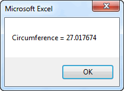

# Declaring and Using Variables

Variables are a fundamental part of any programming language. A variable is a placeholder for a piece of information corresponding to a number, date, text string, etc. You can store information in a variable and then retrieve the information from the variable later as you use the variable as part of an expression or as part of an assignment statement that passes the information somewhere else.

## Simple Method

The simplest way to use variables is to just reference them in your code. For example, consider the following code:

```vb
Private Sub cmdCalculateArea_Click()
Radius = 4.3
Pi = 3.14159
Area = Pi * Radius ^ 2
Circ = 2 * Pi * Radius
MsgBox "Area = " & Area
MsgBox "Circumference = " & Circ
End Sub
```

This code computes the area and circumference of a circle with radius of 4.3. We first assign values to the **Radius** and **Pi** variables and then use those variables to calculate the area and circumference and store these two values in the **Area** and **Circ** variables. The values stored in the Area and Circ variables are then displayed using the MsgBox calls. This code brings up the following two messages:

 

As you can see, variables provide a simple and convenient way to perform calculations.

## Declaring Variables

While the approach shown above is simple, it can be dangerous. For example, consider the following code:

```vb
Private Sub cmdCalculateArea_Click()
Radias = 4.3
Pi = 3.14159
Area = Pi * Radius ^ 2
Circ = 2 * Pi * Radius
MsgBox "Area = " & Area
MsgBox "Circumference = " & Circ
End Sub
```

Note the difference on the very first line of code ("Radias = ..."). The word "Radius" has been misspelled, but it is spelled correctly in the rest of the code. This is what the code produces:

 

which is clearly wrong! What happened? Whenever the VB compiler encounters a variable name it does not recognize, it creates a new variable with that name and initializes the value to zero. So there is a variable called "Radias" with a value of 4.3, but when the lines for calculating the area and circumference were encountered, the compiler created a new variable called "Radius" with a default value of zero and used that variable in the calculations. That is why the area and circumference ended up with a value of zero. This is a logic error and can be extremely difficult to track down and fix in some cases.

It is easy to make spelling mistakes, so this can lead to lots of bugs in your code. Fortunately, there is a simple way to ensure that this never happens. First of all, you should put the following line at the top of each of your code modules:

```vb
Option Explicit
```

This line forces you to declare all variables before you use them. You declare variables using a **Dim** statement as follows:

```vb
Dim radius, pi, area, circ
```

This statement defines the variables you intend to use and the compiler immediately creates the variables in the list when this statement is encountered. Then if you ever encounter a misspelled variable, the code stops with a run-time error and you get a message like this:


It is then a simple matter to correct the spelling and fix the bug. Therefore, you should ALWAYS remember to include the Option Explicit statement when using variables. It will prevent a huge amount of nasty bugs.

## Variable Types

When we create variables to use in our code, we typically have a specific objective in mind and we plan to store a specific type of data in each variable. We can change our Dim statement to more explicitly define what type of variable we are declaring as follows:

```vb
Dim n As Integer, name As String, birthday As Date
```

The advantage of explicitly declaring types is that if you ever try to store something of one type in a variable of another type, you will get an error message. Here are the most commonly-used variable types in VBA:

| Type | Mem | Range |
|------|-----|-------|
| Boolean | 1B | True/False |
| Currency | 8B | -922,337,203,685,477.5808 to 922,337,203,685,477.5807 |
| Date | 8B | January 1, 100 to December 31, 9999 |
| Single (single precision floating point numbers) | 4B | +/-1e-45 to +/-1e+38 |
| Double (double precision floating point numbers) | 8B | +/-1e-324 to +/-1e+308 |
| Integer (single precision whole numbers) | 2B | -32,768 to 32,767 |
| Long (double precision whole numbers) | 4B | -2,147,483,648 to 2,147,483,647 |
| String | Varies | 0 to ~2 billion characters |
| Variant | Varies | All of the above |

*Source: [MSDN - Visual Basic for Applications Reference, Data Type Summary](http://msdn.microsoft.com/en-us/library/aa263420(v=vs.60).aspx)*

Singles and doubles both work well for floating point numbers (numbers with both a whole and decimal part, Ex. -207.393). However, a single only preserves about 7 digits of accuracy while a double preserves about 15 digits. Therefore we typically use doubles just to be safe.

The Variant type is a special case and is somewhat unique to VB. A variant can hold any type of information. When you store something in a Variant, part of the Variant memory is used to mark the type of data currently stored in the variable. When you access the data in the variable, the data type information is used to process it properly. Therefore, a Variant is kind of a general purpose type. You can explicitly declare something to be a Variant as follows:

```vb
Dim x As Variant, y As Variant, z As Variant
```

Or you can simply do this:

```vb
Dim x, y, z
```

and you get the same result. In other words, if you don't explicitly declare the type for a variable, it defaults to Variant. You need to be careful with this method. For example, many people assume that this statement:

```vb
Dim x, y, z As Double
```

declares all three variables as Doubles. However, that is not true. The only variable that ends up as a Double is **z**. Since no type was defined for **x** and **y**, they default to Variants. In other words, it is the same as doing the following:

```vb
Dim x As Variant, y As Variant, z As Double
```

## Default Values

When you declare a numeric variable, the default value of the variable is always zero. For example, consider the following code:

```vb
Dim n As Integer

Range("B4") = n
n = n + 1
Range("B5") = n
```

After this code is executed, there is a value of **0** in cell **B4** and a value of **1** in cell **B5**. If you reference a variable after it is declared but before assigning a value to it, it contains the default value of zero.

Likewise, the default value for a string variable = "" (empty string). And the default value for a boolean variable = False.

If you are ever in doubt, there is no harm in assigning a value to a variable before using it.

## Variable Names

When coming up with names for your variables, a few simple rules must be followed:

1. You can only use the characters a-z, A-Z, 0-9, and the underscore character ("_").
2. You cannot use reserved VB words such as "If", "Dim", etc.

You should also try to make your variable names reflective of the variable usage when possible. For example, use "last_name", "first_name" rather than "x1", "x2" if you are going to store names in your variables.

## Assignment Statements

When working with variables, it is important to understand how assignment statements work. To store a value in a variable, you would do something like this:

```vb
x = 283.922
```

As a mathematical expression, this statement would be interpreted as "x is equal to 283.922". However, that is not the best way to interpret this statement in programming logic. When used as a stand-alone statement, it literally means "take the value of 283.922 and store it in the variable called x". This is why we call this an assignment statement. Here is another example:

```vb
x = 2
y = 8
x = y
```

As a sequence of mathematical expressions this does not make sense because 2 does not equal 8. But as an assignment statement, the last line means "Take the current value of y (which is 8) and store it in x." After the assignment statement is completed, both x and y have a value of 8. In some cases, the thing on the right side is an expression:

```vb
x = (7 * y) / 3
```

In this case we evaluate the expression on the right using the current value of y and then store the result in x. It should be noted that when writing an assignment statement, the item on the left side must be a variable or object that can store the result of the expression on the right. In other words, this would not make sense:

```vb
(y * y) / 3 = x '<-- WRONG!
```

Here is another example. In this case we are going read the value from cell A4 and store it in x.

```vb
x = Range("A4")
```

Once again, the order is critical. If what you really wanted to do was take the value of x and store it in cell A4, you would reverse the statement as follows:

```vb
Range("A4") = x
```

This illustrates that cells are similar to variables. You can store values in cells and then retrieve those values later.

In summary, the best way to think of an assignment statement is **"Take the value of the expression on the right, and store it in the variable/object on the left."**

## Constants

In some cases it is useful to declare a variable that never changes. Such a variable is called a constant. Here is a commonly used constant:

```vb
Const pi As Double = 3.14159
```

After making this declaration, you can use pi anywhere in your code as an alias for 3.14159. For example:

```vb
area = pi * radius ^ 2
circumf = 2 * pi * r
```

You could do the same thing by declaring pi as a variable (see code at the top of this page). The advantage of using a constant is that it ensures that you don't accidentally change the value of the constant. If you attempt to do so, you will get an error message.

## Scope

When dealing with variables, we often need to consider something called "scope". A variable's scope defines in which part of the code the variable can be utilized. In most cases, we define a variable inside of a sub or function as follows:

```vb
Sub mysub()
Dim x As Double, y As Double, sum As Double
x = Range("A4")
y = Range("B4")
sum = x + y
Range("C4") = sum
End Sub
```

In this case, the scope of the variables x, y, and sum is within mysub. If you were to use a variable with the same name(s) in another sub as follows:

```vb
Sub mysub()
Dim x As Double, y As Double, sum As Double
x = Range("A4")
y = Range("B4")
sum = x + y
Range("C4") = sum
End Sub

Sub anothersub()
Dim x As Double, y As Double, sum As Double
x = 5
y = 12
Range("C4") = y * x
End Sub
```

each of the two subs would be referencing two different sets of variables. However, if you declare the variables outside the subs like this:

```vb
Dim x As Double, y As Double, sum As Double

Sub mysub()
x = Range("A4")
y = Range("B4")
sum = x + y
Range("C4") = sum
End Sub

Sub anothersub()
x = 5
y = 12
Range("C4") = y * x
End Sub
```

then the scope of the variables is defined as the entire module and both subs would be referencing the same variables. If you want a variable to be shared by every sheet, form, or module in the entire project, you can declare it as a global variable as follows:

```vb
Global x As Double, y As Double, sum As Double
```

Globals can only be defined inside a module (you can't do this in a sheet or form).

While it may be tempting to declare variables outside of subs or as globals, this is generally viewed as poor programming practice. In the vast majority of cases, it is cleaner and less confusing if you declare your variables inside each sub or function where they are used. If you need to pass information from one sub to another, do it via input arguments.

## Exercises

You may wish to complete following exercises to gain practice with and reinforce the topics covered in this chapter:

<div class="exercise-grid" data-columns="4">
<div class="exercise-header">Description</div>
<div class="exercise-header">Difficulty</div>
<div class="exercise-header">Start</div>
<div class="exercise-header">Solution</div>
<div class="exercise-cell"><strong>Total Head -</strong> Pass cell values into variables and use the variables to calculate the total fluid head.</div>
<div class="exercise-cell">Easy</div>
<div class="exercise-cell"><a href="files/total_head.xlsm">total_head.xlsm</a></div>
<div class="exercise-cell"><a href="files/total_head_key.xlsm">total_head_key.xlsm</a></div>
<div class="exercise-cell"><strong>Lengths, Dot Product -</strong> Use variables to store vectors and calculate their lengths and dot product.</div>
<div class="exercise-cell">Medium</div>
<div class="exercise-cell"><a href="files/lengths_dot_product.xlsm">lengths_dot_product.xlsm</a></div>
<div class="exercise-cell"><a href="files/lengths_dot_product_key.xlsm">lengths_dot_product_key.xlsm</a></div>
<div class="exercise-cell"><strong>Citation Generator -</strong> Store the values/words of a resource as variables to use in the string generator that displays the correct citation.</div>
<div class="exercise-cell">Hard</div>
<div class="exercise-cell"><a href="files/citation_generator.xlsm">citation_generator.xlsm</a></div>
<div class="exercise-cell"><a href="files/citation_generator_key.xlsm">citation_generator_key.xlsm</a></div>
</div>