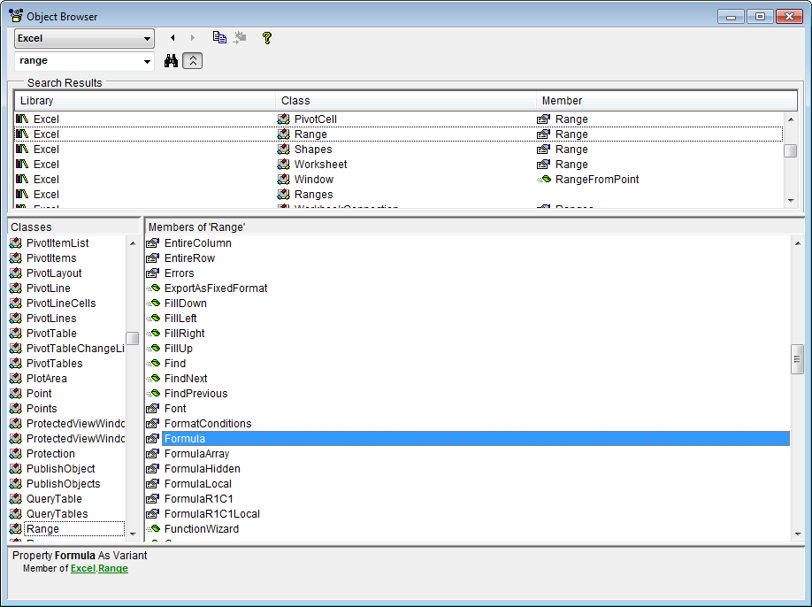
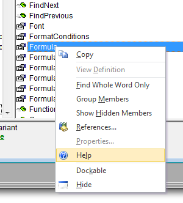
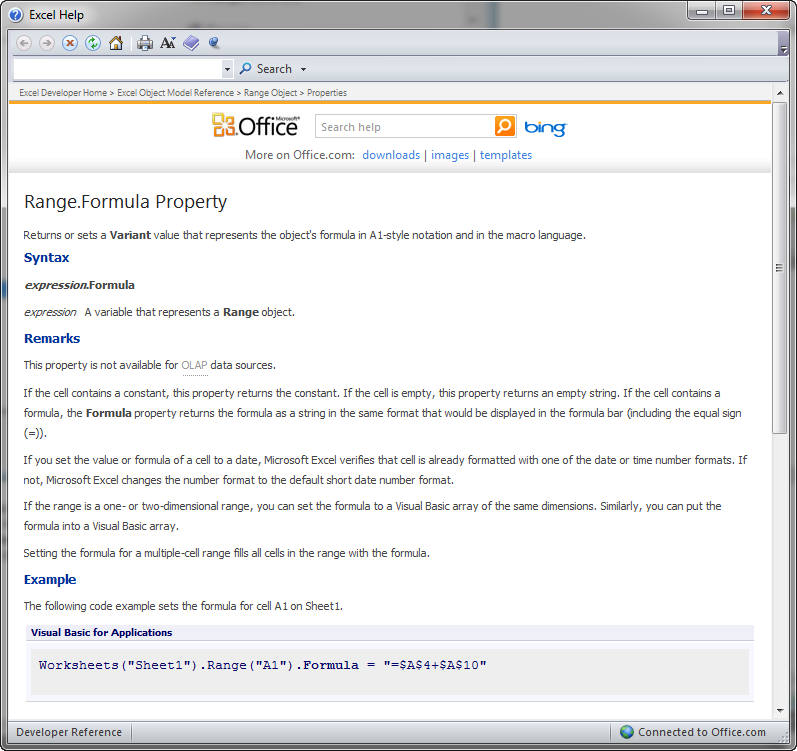

# Working with Objects

VBA is an object-oriented language. Controls, cells, ranges, shapes, worksheets, and workbooks are all different types of objects that can be manipulated using VBA in Excel. Objects have three types of features: properties, methods, and events.

## Properties

Properties are attributes associated with an object. For example, a command button has properties for the control name, the caption, the size, the font, and the colors. You can change properties using the Properties window or in code using an assignment statement:

```vb
Range("B5").Formula = "=A5/12 + B15"
```

Properties can be thought of as a collection of variables associated with an object. Each property has a type (integer, double, string) and some properties are other objects. For example, the following line of code shows how to modify a property associated with an embedded object.

```vb
Range("B5").Interior.Color = 65535
```

## Methods

Methods are actions that can be performed by an object. For example, a range object has a Select method that selects the cells in the range.

```vb
Range("B4:D12").Select
```

The following Method clears the data in a set of cells while keeping the formatting intact:

```vb
Range("B5").ClearContents
```

Not all objects include methods.

## Events

An event is something that happens to an object. We write code in response to events. Events are described in more detail on the [Working with Events](../17_events/events.md) section.

## Collections

A collection is a special type of object that is a set of objects. For example, the Sheets collection contains all of the Sheet objects in a workbook. For each sheet, there is a collection of Shape objects called Shapes. There is also a collection of Comment objects called Comments. All collection objects contain a Count property that tracks the number of objects in the collection. To reference the objects in a collection, you can use the index of the object:

```vb
Sheets(2).Activate
```

Or if you know the name of the object, you can reference it by name:

```vb
Sheets("Sheet2").Activate
```

To traverse a collection, we use the **For Each** type of loop. For example, to delete all of the shapes on a page, we could do the following:

```vb
Dim myshape As Shape
For Each myshape In Shapes
    myshape.Delete
Next myshape
```

The For Each loop is explained in more detail in the [Loops](../10_loops/loops.md) chapter.

## Object Browser

When we work with objects in Excel, we are using the **Microsoft Excel Object Model**. The model can be explored in the Visual Basic Editor using the **Object Browser**. To access the browser, you click on the Object Browser icon . This brings up the Object Browser window:



The Object Browser is a great way to explore objects and learn what members (properties, methods) are available with the object. The top left item lets us pick which object model to browse. You typically want to change this to "Excel" (as shown) to focus on the Excel objects rather than browsing all objects in MS Office. You can then use the search field (to the left of the binocular icon) to search for a particular object type. You then pick the object of interest in the search results and the members of the object (properties and methods) are listed in the main part of the window. You can click on each member and get a summary at the bottom of the window. You can also right-click on a member to bring up context sensitive help on that member. For example, doing this:



brings up this:



Of course, you can also look up information on objects directly using the search feature in the Visual Basic Help utility.

## Exercises

You may wish to complete following exercises to gain practice with and reinforce the topics covered in this chapter:

<div class="exercise-grid" data-columns="4">
<div class="exercise-header">Description</div>
<div class="exercise-header">Difficulty</div>
<div class="exercise-header">Start</div>
<div class="exercise-header">Solution</div>
<div class="exercise-cell"><strong>Project Management -</strong> Use a variety of objects and change their appearance and/or values through methods and properties to update the project management table.</div>
<div class="exercise-cell">Easy</div>
<div class="exercise-cell"><a href="files/project_management.xlsm">project_management.xlsm</a></div>
<div class="exercise-cell"><a href="files/project_management_key.xlsm">project_management_key.xlsm</a></div>
<div class="exercise-cell"><strong>Objects -</strong> Run through a few object.method basics to obtain specific results and get rid of an Excel Bug :)</div>
<div class="exercise-cell">Medium</div>
<div class="exercise-cell"><a href="files/objects.xlsm">objects.xlsm</a></div>
<div class="exercise-cell"><a href="files/objects_key.xlsm">objects_key.xlsm</a></div>
<div class="exercise-cell"><strong>Pop the Balloon -</strong> Use shape objects and use methods and properties to create an animation that pumps up a balloon until it pops!</div>
<div class="exercise-cell">Hard</div>
<div class="exercise-cell"><a href="files/pop_the_balloon.xlsm">pop_the_balloon.xlsm</a></div>
<div class="exercise-cell"><a href="files/pop_the_balloon_key.xlsm">pop_the_balloon_key.xlsm</a></div>
</div>