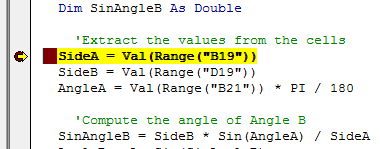
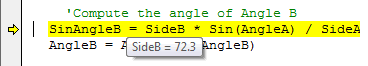
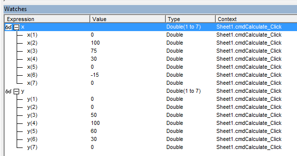

# Debugging - Finding and Fixing Errors

One of the more frustrating parts of programming can be finding and fixing errors. This process is called "debugging" and errors in computer code are called "bugs". Debugging your code is much easier if you utilize the built-in debugging tools provided with the Visual Basic Editor.

## Types of Bugs

Before discussing the debugging tools, it is helpful to review the three basic types of bugs: syntax errors, run-time errors, and logic errors.

### Syntax Errors

All programming languages have a set of rules that must be followed when writing the code. These rules are called the code syntax. When you write code, a utility called the compiler parses through your code and converts it to low-level machine language. If you do not use proper syntax, the compiler cannot understand what it is you are trying to do. For example, a common syntax error would be forgetting to include the "Then" part of an If statement. If you hit the return key before typing "Then", you get a message like this:


Another common error would be misspelling a keyword ("Iff"). Most syntax errors are caught immediately by the VB Editor when you hit the return key. You can also check for syntax errors by selecting the **Compile VBA Project** command in the **Debug** menu.

Syntax errors are the easiest to find and fix.

### Run-Time Errors

Run-Time errors occur when your code has correct syntax, but the logic of the code is such that it generates an error when you execute the code. For example, the code:

```vb
x = 0
y = 1 / x
```

Has legal syntax but generates a "Divide By Zero" error when you run the code. When this happens you get an error message and the Visual Basic Editor pops to the front and the line with the offending code is highlighted. Sometimes it is obvious what is causing the run-time error, but in some cases you will need to use the debugging tools to figure it out.

### Logic Errors

A logic error is when your code has correct syntax and does not produce a run-time error but your code produces incorrect results (generates the wrong numbers, for example). Logic errors are the most difficult kind of bug to find and fix. You can spend hours trying to fix your logic errors, but the debugging tools described below can greatly simplify the process.

## Debugging Tools

The debugging tools are located in the Debug menu in the VB Editor. These tools can be used to trace the execution of your code in a line-by-line fashion and examine the value of variables to determine what is causing your run-time or logic errors.

### Breakpoints

The first thing you should do when debugging is create one or more breakpoints. A breakpoint is a location in the code where you want execution to halt so that you can examine the state of your variables and objects and/or begin to trace execution line-by-line. To set a breakpoint, you simply click in the gray column on the left side of the editor and a red dot will appear:


When you run the code, the execution will then stop at the breakpoint and the line will be highlighted in yellow.



The yellow highlight means that the yellow line has NOT been executed yet, but it is the next line to execute.

You can also set a breakpoint by putting the cursor on a line and selecting the **Debug|Toggle Breakpoint** command or by pressing **F9**. You can clear a breakpoint by clicking on it. You can get rid of all of your breakpoints by selecting the **Debug|Clear All Breakpoints** command.

### Step Options

Once you have halted execution using a breakpoint, you can then trace the execution of your code one line at a time using the Step options. In most cases, the easiest thing to do is press the **F8** key to execute the **Step Into** command. This executes the current line and then highlights the next line in yellow. However, if the current line contains a custom sub or function (i.e., one that you wrote as opposed to a built-in VB sub or function), then you need to be a little more careful. There are actually three different Step commands and each behaves a little differently based on how you want to trace your code.

| Command | Shortcut | Result                                                                                                                                                                                                                                                                                                                                                                                                                                                                                   |
|---------|----------|------------------------------------------------------------------------------------------------------------------------------------------------------------------------------------------------------------------------------------------------------------------------------------------------------------------------------------------------------------------------------------------------------------------------------------------------------------------------------------------|
| **Step Into** | F8 | Executes the current line of code and if the code contains a call to a custom sub or function, the code execution<br> jumps to the first line in the sub or function and then pauses. This gives you the chance to trace the execution<br> of the sub or function.                                                                                                                                                                                                                       |
| **Step Over** | Shift+F8 | Executes the current line of code and if the code contains a call to a custom sub or function, the sub or function<br> is executed but that execution is not traced. After executing the line (including referenced subs and/or functions)<br> the next line of code in the current module is highlighted and the execution pauses. You should<br> use this option when you are confident that your subs or functions do not contain errors and you don't need to trace<br> their execution. |
| **Step Out** | Ctrl+Shift+F8 | This command should be used when you are in the middle of tracing the execution of your code inside a custom<br> sub or function and you are satisfied that the sub or function does not contain the error you are looking for.<br> This completes the execution of the sub or function and returns you to the next line following the line where<br> the sub or function was called.                                                                                                    |
| **Run to Cursor** | Ctrl+F8 | This command executes all code between the current yellow-highlighted line and the line containing the cursor.<br> The line containing the cursor is then highlighted and the execution pauses.                                                                                                                                                                                                                                                                                          |

It is important to note that none of these four options "skips" code in the sense that portions of your code are not executed. All of the code is executed, but in some cases you may not see the step-by-step execution. If for some reason you want to actually skip one or more lines of code, you should set the cursor in the first line following the code you want to skip and then select the **Debug|Set Next Statement** command.

### Run Commands

After stopping at a breakpoint and examining some code, you may wish to quickly finish all of your remaining lines of code, or execute all lines of code between the current line and the next breakpoint. You can do this using the Run command. There is a set of Run-Pause-Stop commands in the VB Editor menu.

| Command | Symbol | Action                                                                                                                                                                                                  |
|---------|--------|---------------------------------------------------------------------------------------------------------------------------------------------------------------------------------------------------------|
| **Run** |  | Execute the code from the current position to the next breakpoint or until the code is completed.                                                                                                       |
| **Pause** |  | Pause the execution. This button can be used when your code appears to be stuck in an infinite loop.<br> It causes the code execution to pause and the next line of code to be executed is highlighted. |
| **Stop** |  | This command can be used either when the code is running or when it is paused. It causes the execution<br> to stop and everything is reset to the non-running state.                                    |

The Run command can also be used as a shortcut to run a specific sub by putting the cursor in the sub and then selecting the Run button in the VB Editor. For example, this could be used to execute the code associated with a button without actually having to click the button.

### Examining Variables and Expressions

When the code execution is paused, it is extremely helpful to examine the status of your variables, expressions, and objects. To examine the value of a variable, simply hover the cursor over the variable and the current value is displayed:



You can also select part or all of an expression to see the value of the highlighted part:


If you find yourself checking the value of a particular variable or expression repeatedly, you can select the variable or expression and then select the **Debug|Add Watch...** command. This opens the Watch window at the bottom of the VB Editor and displays the value of the variable or expression in the window.


These values are constantly updated as the code is executed.

If you add an array or object to the watch window, you can click the plus button to expand the object and view the values of object/array members. In this example, x and y are two arrays of doubles:



## Exercises

You may wish to complete following exercises to gain practice with and reinforce the topics covered in this chapter:

<div class="exercise-grid" data-columns="4">
<div class="exercise-header">Description</div>
<div class="exercise-header">Difficulty</div>
<div class="exercise-header">Start</div>
<div class="exercise-header">Solution</div>
<div class="exercise-cell"><strong>Total Head Debug -</strong> Find a run-time error, logic error and syntax error for the code solving for the total head in the bernoulli equation.</div>
<div class="exercise-cell">Easy</div>
<div class="exercise-cell"><a href="files/total_head_debug.xlsm">total_head_debug.xlsm</a></div>
<div class="exercise-cell"><a href="files/total_head_debug_key.xlsm">total_head_debug_key.xlsm</a></div>
<div class="exercise-cell"><strong>Citation Machine -</strong> Debug the code so that a message box with the correct citation displays when the user clicks "Create Citation."</div>
<div class="exercise-cell">Medium</div>
<div class="exercise-cell"><a href="files/citation_machine.xlsm">citation_machine.xlsm</a></div>
<div class="exercise-cell"><a href="files/citation_machine_key.xlsm">citation_machine_key.xlsm</a></div>
<div class="exercise-cell"><strong>Debugging -</strong> Debug the code that calculates three equations.</div>
<div class="exercise-cell">Hard</div>
<div class="exercise-cell"><a href="files/debugging.xlsm">debugging.xlsm</a></div>
<div class="exercise-cell"><a href="files/debugging_key.xlsm">debugging_key.xlsm</a></div>
</div>