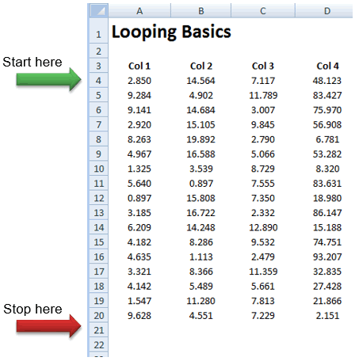

# Loops - Writing Iterative Code

There are many cases in programming where we need to perform some type of iteration. For example, maybe we need to loop through a column of cells until we find a blank cell. Or perhaps we need to iterate through a set of numbers in order to perform some kind of numerical calculation that can't be performed with a built-in Excel function. In this section we will review the various options available in VBA for writing loops and examine several example applications.

## Types of Loops

There are three basic types of loops in VB:

1. For Each...
2. For i=...
3. Do While|Until...

Each type of loop has certain advantages and is best used in certain circumstances. However, in many cases multiple types will work and the choice of which loop to apply becomes a matter of personal preference. Each type is examined below.

## For Each...

For each loops are used to loop through a collection of objects. This could include the cells in a range, the sheets in a workbook, or the shape objects associated with a particular sheet. The syntax is as follows:

```vb
Dim myitem As vartype
For Each myitem In mycollection
    statement(s)
Next myitem
```

In this case, mycollection refers to the collection of objects that we wish to loop through. **myitem** is a looping variable and vartype is the type corresponding to the individual objects in the collection. If you are ever in doubt as to what type to use, go ahead and use the **Variant** type. This works fine in most cases. The way the loop works is that the statement(s) are executed once for each object in the collection. During each loop iteration, myitem becomes an alias for the current object being referenced, so typically you do something with myitem in the statement(s). **Next myitem** marks the end of the loop and it increments the myitem alias to reference the next object in the collection. Once all the objects are visited, code execution moves to the next line of code following myitem.

Here is a sample **For Each...** loop. The objective of the loop is to count how many negative numbers there are in the range **B4:D20**. This code assumes that we have already declared an integer variable named **numneg**.

```vb
Dim mycell As Range
For Each mycell In Range("B4:D20")
    If mycell.Value < 0 Then
        numneg = numneg + 1
    End If
Next mycell
```

Here is another example. In this case, we wish to loop through all of the Shape objects associated with the current sheet (from the Shapes collection) and change the shape color to red.

```vb
Dim sh As Shape
For Each sh In Shapes
    sh.Fill.ForeColor.RGB = vbRed
Next sh
```

## For i=...

The **For i=...** loop is used when the iteration is based on a set of numbers. Specifically, you need to loop through a set of integers, starting with one number and ending at another. Here is the syntax:

```vb
Dim i As Integer
For i = Start To End [Step inc]
    statement(s)
Next i
```

The **Step inc** part is optional and will be explained below. The variable **i** is the looping variable and should always be declared as an **Integer** or **Long** type variable. **Start** and **End** represent the beginning and ending values of i. The first time through the loop, i is equal to Start and at the end of the loop, i is incremented to the next value. Eventually i is equal to End and that is the last iteration of the loop.

Here is a simple example. This code writes the phrase "Hello World" to every cell in the range **B3:B17**.

```vb
Dim myrow As Integer
For myrow = 3 To 17
    Cells(myrow, 2) = "Hello World"
Next myrow
```

The first time through the loop, myrow = 3 and when the code execution encounters the Next myrow line, myrow is incremented to 4. This continues until myrow = 17. Once myrow is incremented to 18, the loop stops and code execution continues to the next line following the loop.

By default, the **Next i** line will increment by one. However, you can change how the looping variable changes using the optional **Step** argument. For example, the following loop does the same thing as the loop above, but it starts at row 17 and goes backwards to row 3.

```vb
Dim myrow As Integer
For myrow = 17 To 3 Step -1
    Cells(myrow, 2) = "Hello World"
Next myrow
```

The loops can be entirely independent of spreadsheet cells. The following loop computes the sum of all integers between 1 and 100.

```vb
Dim i As Integer
Dim sum As Integer
For i = 1 To 100
    sum = sum + i
Next i
```

Finally, it is possible to exit a For i=... loop at any time using the Exit For statement. This kicks you out of the loop and it moves the execution to the next statement immediately following the loop. For example, the following loop iterates through cells B3:B17 and writes "Hello World". However, if it encounters a non-empty cell in that range, it halts the loop.

```vb
Dim myrow As Integer
For myrow = 3 To 17
    If Cells(myrow, 2) = "" Then
        Cells(myrow, 2) = "Hello World"
    Else
        Exit For
    End If
Next myrow
```

## Do While|Until...

The **Do While|Until...** loops are often referred to as simple "do loops". Do loops are extremely flexible and are generally used when you do not know beforehand how many iterations will be required. Therefore, the loop continues until some kind of condition is met. There are many ways in which a do loop can be formulated, but the general syntax is as follows:

```vb
Do While|Until condition
    statement(s)
Loop
```

Or the condition part can be put at the end of the loop as follows:

```vb
Do 
    statement(s)
Loop While|Until condition
```

In other words, the statement(s) are executed repeatedly until some condition is met. If the condition starts out as true, the While option should be used. If the condition starts out as false, the Until option should be used.

The following set of examples are based on this spreadsheet. The objective of the examples is to start at row 4, and loop through each of the cells in column A until an empty row is found. This type of loop is fairly common when you want to append something to the end of a table.



We will now illustrate four different ways to solve this problem with a do loop.

### Method 1: Do While...

In the first case, we will use the **While** option and test the condition at the top of the loop.

```vb
Dim myrow As Integer
myrow = 4
Do While Cells(myrow, 1) <> ""
    myrow = myrow + 1
Loop
```

The objective of the loop is to look at each cell in column A starting at row 4. Each time through the loop, the **myrow** variable indicates the row number of the current row being examined. The row counter (myrow) is incremented in the body of the loop. The condition being tested is whether the current cell is NOT empty. The loop continues as long as this condition is true, hence the "While" statement. After the loop is completed, myrow will have a value of 21, indicating the row number of the first empty row following the table.

### Method 2: Do Until...

The next example is very similar, but the condition is different.

```vb
Dim myrow As Integer
myrow = 4
Do Until Cells(myrow, 1) = ""
    myrow = myrow + 1
Loop
```

In this case, we test to see if the current cell is empty, and we iterate until that condition is met. Once again, when the loop is finished, myrow will contain a value of 21.

### Method 3: Do ... Loop While

In this case, we use the While option again, but we don't perform the test until the end of the loop.

```vb
Dim myrow As Integer
myrow = 3  '<--- Note the difference here
Do 
    myrow = myrow + 1
Loop While Cells(myrow, 1) <> ""
```

This loop will result in the exact same result as Method 1, the only difference being that in this case, the loop is always executed at least once. With Method 1, it is possible that the condition would fail on the first test (an empty table for example) and the statement(s) inside the loop would never be executed. There are some cases where it is necessary to have the loop executed at least once. Note that since the counter is incremented once before we even begin to check it, we need to start the loop counter at 3 rather than 4.

### Method 4: Do ... Loop Until

Finally, we can use the Until option at the end of the loop.

```vb
Dim myrow As Integer
myrow = 3
Do 
    myrow = myrow + 1
Loop Until Cells(myrow, 1) = ""
```

Please note that all four of these examples do essentially the same thing. Which approach you use in cases like this is entirely a matter of preference.

### Infinite Loops

With do loops, one must be extremely careful in designing the exit conditions for the loop. If the conditional statement is wrong, or if you forget to do something in the body of the loop that would eventually lead to the exit condition being met, then you will encounter something called an "infinite loop". Here is an example:

```vb
Dim myrow As Integer
myrow = 4
Do While Cells(myrow, 1) <> ""
    MsgBox "Hello World"
Loop
```

This is similar to one of the loops above, but we have removed the **myrow = myrow + 1** part. The condition is based on Cells(myrow, 1) eventually being empty, but it will never happen because myrow is never incremented. So it will keep checking cell A4 and displaying a message for all eternity (or until you kill Excel).

If you accidentally write an infinite loop, Excel will appear to freeze when you run your code. In some cases, you can bring up the VB Editor window and select the pause button or press the Esc key to pause execution and then stop execution using the Stop button. Unfortunately, this does not always work so you need to kill Excel using the **Task Manager** (Ctrl-Alt-Delete).

Whenever you are writing loops, you should always save your changes prior to running your code in case you end up with an infinite loop and have to kill Excel. If you don't save your changes, you may end up losing some code you have written.

### Exit Do Statement

In some cases it is useful to exit a do loop in the middle of the loop. This can be accomplished using the **Exit Do** statement. For example:

```vb
Dim myrow As Integer
myrow = 4
Do Until myrow = 32768
    If Cells(myrow, 1) = "" Then
        Exit Do
    Else
        myrow = myrow + 1
    End If
Loop
```

In this case, the loop achieves the same result as the loops above. When an Exit Do statement is encountered, the code execution goes to the first line following the end of the loop.

## Exercises

You may wish to complete following exercises to gain practice with and reinforce the topics covered in this chapter:

<div class="exercise-grid" data-columns="4">
<div class="exercise-header">Description</div>
<div class="exercise-header">Difficulty</div>
<div class="exercise-header">Start</div>
<div class="exercise-header">Solution</div>
<div class="exercise-cell"><strong>Loops -</strong> A simple exercise running through each of the basic loops.</div>
<div class="exercise-cell">Easy</div>
<div class="exercise-cell"><a href="files/loops.xlsm">loops.xlsm</a></div>
<div class="exercise-cell"><a href="files/loops_key.xlsm">loops_key.xlsm</a></div>
<div class="exercise-cell"><strong>Counting Odds and Evens -</strong> Create a loop that counts the number of odd and even numbers in a column.</div>
<div class="exercise-cell">Medium</div>
<div class="exercise-cell"><a href="files/counting_odds_and_evens.xlsm">counting_odds_and_evens.xlsm</a></div>
<div class="exercise-cell"><a href="files/counting_odds_and_evens_key.xlsm">counting_odds_and_evens_key.xlsm</a></div>
<div class="exercise-cell"><strong>Digital Storage -</strong> Use loops to aid in converting code to and from base ten data storage.</div>
<div class="exercise-cell">Hard</div>
<div class="exercise-cell"><a href="files/digital_storage.xlsm">digital_storage.xlsm</a></div>
<div class="exercise-cell"><a href="files/digital_storage_key.xlsm">digital_storage_key.xlsm</a></div>
</div>