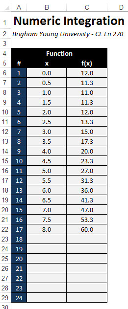

# Using Arrays to Store Sets of Data

In many applications (especially in engineering), it is necessary to work with variables containing a set of related data. For example, one may have a list (vector) or matrix of numbers that need to be stored and used as part of some type of linear algebra calculations. Suppose you have a vector called "x" with ten double values. One solution would be to declare your variables like this:

```vb
Dim x1 As Double
Dim x2 As Double
Dim x3 As Double
Dim x4 As Double
Dim x5 As Double
Dim x6 As Double
Dim x7 As Double
Dim x8 As Double
Dim x9 As Double
Dim x10 As Double
```

Then in your code, you would reference the variables independently:

```vb
x1 = Cells(4,1)
x2 = Cells(4,2)
...
x8 = x7 * Sin(x6) + 2
```

This works, but it is not an efficient approach, especially for cases where you have hundreds or thousands of items in the vector.

## One-Dimensional Arrays

A more efficient way to handle the problem described above is to declare a one-dimensional array variable as follows:

```vb
Dim x(1 To 10) As Double
```

Then the elements of the array can be referenced like this:

```vb
x(1) = Cells(4,1)
x(2) = Cells(4,2)
...
x(8) = x(7) * Sin(x(6)) + 2
```

One of the benefits of using arrays is that they can be easily traversed using the **For i = ...** style of loop. For example, the following code declares an array of 1000 doubles and initializes the value of each item in the array to = 1.5.

```vb
Dim v(1 To 1000) As Double
Dim i As Integer
  
For i = 1 To 1000
    v(i) = 1.5
Next i
```

When declaring arrays, we can define the lower and upper bounds of the array indices. For example:

```vb
Dim p(5 To 15) As Integer
p(5) = 1
p(6) = 2
...
p(14) = 12
p(15) = p(14) * p(12)
```

It is also possible to omit the first part of the array bounds:

```vb
Dim x(100) As Double
```

But if you do so, this declares an array of 101 items! The array bounds are from 0 to 100.

## Multi-Dimensional Arrays

In some cases, it is useful to declare multi-dimensional arrays. For example, if we want to declare a variable to store a matrix with 20 rows and 15 columns, we could do the following:

```vb
Dim m(1 To 20, 1 To 15) As Double
```

And the individual elements of the arrays are referenced like this:

```vb
m(1, 1) = 0.5
m(13, 5) = m(2, 12) * 2
```

To traverse the elements of the array, we can use a nested set of **For i = ...** loops.

```vb
Dim i As Integer, j As Integer

For i = 1 To 20
    For j = 1 To 15
        m(i, j) = 1 / m(i, j)
    Next j
Next i
```

Arrays are not limited to two dimensions. You can use three, four, or more dimensions if you like.

```vb
Dim q(1 To 2, 1 To 100, 1 To 50) As Double
q(1, 40, 25) = 4.5
```

The maximum number of dimensions you can use is 32.

## Dynamic Arrays - The ReDim Statement

When you declare an array using the Dim statement, the dimension bounds must be constants. However, there are cases when it is necessary to declare the bounds (especially the upper bound) using a variable. In other words, you may not know until you run your code how big the array needs to be. In this case, you should use the ReDim statement:

```vb
Dim n As Integer

n = ...  '<--- Do something to determine how big the array needs to be

ReDim x(1 To n) As Double
For i = 1 To n
    x(i) = ...
Next i
```

A classic example involving spreadsheets is when we want to read a column of values into an array, but there may be any number of items in the column. We can either just guess what the maximum size could possibly be and declare a really big array, or we could write a short loop to count the number of items in the array and then declare an array just big enough to read the values. For example, consider the following range of cells in a worksheet:



Suppose we wanted to read these two columns of numbers into two arrays, **x** and **f**, in order to perform some numerical calculations. We could declare the arrays to be 24 items long using the Dim statement and just allow for some empty space. Or we could loop through the cells first in order to find out exactly how many items are in the list and then declare two arrays to the exact size needed and then load the values from the cells into the array as shown here:

```vb
Dim n As Integer
Dim myrow As Integer

'Find out how many items are in the column
myrow = 6
Do While Cells(myrow, 2) <> ""
    myrow = myrow + 1
Loop
n = myrow - 5

ReDim x(1 To n) As Double
ReDim f(1 To n) As Double

'Copy the values into the arrays
Dim i As Integer
For i = 1 To n
    x(i) = Cells(i + 5, 2)
    f(i) = Cells(i + 5, 3)
Next i
```

At this point, the two arrays could be used directly in formulas and could be indexed from 1 to n.

Another case where the ReDim statement can be used is when you need to resize an array (make it larger or smaller) during run-time. For example:

```vb
n = 1000
ReDim x(1 To n) As Double
...
n = n + 100
    
ReDim x(1 To n) As Double
```

After the last line, the array would contain 1100 items. If your array contains information that you do not want to lose, you should use the Preserve keyword.

```vb
n = 1000
ReDim x(1 To n) As Double
...
n = n + 100 
ReDim Preserve x(1 To n) As Double
```

This ensures that the items stored in the array are not lost when the array is resized.

## Arrays vs. Ranges

You may have noticed that a 2D array is very similar to a range: both have rows and columns. In fact, when we use the Cells object to reference a set of cells using row and column indices like this:

```vb
Cells(4, 5) = "Hello"
```

or

```vb
For myrow = 6 To 20
    Cells(myrow, 2) = ""
Next myrow
```

We are essentially using the Cells object as a 2D array.

So the question arises, if you already have your data in a range of cells, why not just reference them directly using the Cells object as opposed to loading the values into a 1D or 2D array? In some cases, it is just a matter of personal preference. In other cases, the code can be much cleaner and easier to follow when you first load the values into arrays. For example, consider the Numeric Integration example in the previous section above. After loading the two columns into the x and f arrays, the calculations performed to numerically integrate the function defined by the numbers mimics the corresponding mathematical formula because the arrays are indexed from 1 to n. If one were to do the same calculations using the Cells object, it would be necessary to offset the row and column indices to match the location where the cells are stored on the worksheet. This makes the code much more difficult to write and debug.

## Exercises

You may wish to complete following exercises to gain practice with and reinforce the topics covered in this chapter:

<div class="exercise-grid" data-columns="4">
<div class="exercise-header">Description</div>
<div class="exercise-header">Difficulty</div>
<div class="exercise-header">Start</div>
<div class="exercise-header">Solution</div>
<div class="exercise-cell"><strong>Point Identifier -</strong> Use an array to select the correct point from the list of coordinates.</div>
<div class="exercise-cell">Easy</div>
<div class="exercise-cell"><a href="files/point_identifier.xlsm">point_identifier.xlsm</a></div>
<div class="exercise-cell"><a href="files/point_identifier_key.xlsm">point_identifier_key.xlsm</a></div>
<div class="exercise-cell"><strong>Dot Product -</strong> Store the columns of a matrix into vector arrays and compute the dot product.</div>
<div class="exercise-cell">Medium</div>
<div class="exercise-cell"><a href="files/dot_product.xlsm">dot_product.xlsm</a></div>
<div class="exercise-cell"><a href="files/dot_product_key.xlsm">dot_product_key.xlsm</a></div>
<div class="exercise-cell"><strong>Transposition -</strong> Store the values of a matrix into an array and pass the arrayed values into a loop to return the transpose of the initial matrix.</div>
<div class="exercise-cell">Hard</div>
<div class="exercise-cell"><a href="files/transposition.xlsm">transposition.xlsm</a></div>
<div class="exercise-cell"><a href="files/transposition_key.xlsm">transposition_key.xlsm</a></div>
</div>