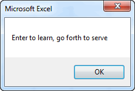
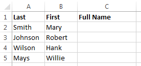
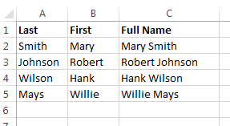
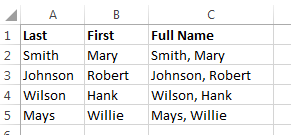

# Using String Functions

A string is a sequence of one or more text characters. A string constant is a sequence of characters in code delimited by double quotes ("Hello world"). A string variable is a variable used to store text. String variables are dynamically allocated to accommodate the amount of text you store in each string. They can hold up to two billion characters!

## Concatenation

Recall that we can combine (concatenate) two or more strings using the **&** operator. For example, the code:

```vb
Dim str1 As String, str2 As String
str1 = "Enter to learn"
str2 = "go forth to serve"
MsgBox str1 & ", " & str2
```

Would produce:



Note that this example involves both string variables (str1, str2) and string constants (", ").

## String Functions

In many cases, we need to manipulate string constants and variables. VB provides a rich suite of functions for manipulating strings. Some of the more widely used string functions are as follows:

| Function                                                                    | Description                                                                                                                                                                                                                                      | Example                                                                                                                                                                                                                                    |                                    Result                                     |
|:----------------------------------------------------------------------------|:-------------------------------------------------------------------------------------------------------------------------------------------------------------------------------------------------------------------------------------------------|:-------------------------------------------------------------------------------------------------------------------------------------------------------------------------------------------------------------------------------------------|:-----------------------------------------------------------------------------:|
| **Left(str, numchar)**                                                      | Extracts the specified number of characters from the left<br> side of the string **str**.                                                                                                                                                        | mystr = Left("Hello World", 5)                                                                                                                                                                                                             |                                    "Hello"                                    |
| **Right(str, numchar)**                                                     | Extracts the specified number of characters from the right<br> side of the string **str**.                                                                                                                                                       | mystr = Right("Hello World", 5)                                                                                                                                                                                                            |                                    "World"                                    |
| **Mid(str, startchar,<br> [numchar])**                                      | Extracts a string of length **numchar** from the middle of **str**,<br> starting at **startchar**. If numchar is omitted, the entire<br> right-hand portion of the string, beginning at startchar, is<br> extracted.                             | mystr = Mid("Hello World", 7, 1)<br>mystr = Mid("Hello World", 7)                                                                                                                                                                          |                                "W"<br>"World"                                 |
| **Len(str)**                                                                | Returns the length of **str**.                                                                                                                                                                                                                   | n = Len("Hello World")                                                                                                                                                                                                                     |                                      11                                       |
| **UCase(str)**                                                              | Converts the string to all uppercase characters.                                                                                                                                                                                                 | mystr = UCase("Hello World")                                                                                                                                                                                                               |                                 "HELLO WORLD"                                 |
| **LCase(str)**                                                              | Converts the string to all lowercase characters.                                                                                                                                                                                                 | mystr = LCase("Hello World")                                                                                                                                                                                                               |                                 "hello world"                                 |
| **LTrim(str)**                                                              | Returns a copy of the string without leading spaces                                                                                                                                                                                              | mystr = LTrim("  Hello  ")                                                                                                                                                                                                                 |                                   "Hello  "                                   |
| **RTrim(str)**                                                              | Returns a copy of the string without trailing spaces                                                                                                                                                                                             | mystr = RTrim("  Hello  ")                                                                                                                                                                                                                 |                                   "  Hello"                                   |
| **Trim(str)**                                                               | Returns a copy of the string without leading or trailing<br> spaces                                                                                                                                                                              | mystr = Trim("  Hello  ")                                                                                                                                                                                                                  |                                    "Hello"                                    |
| **StrReverse(str)**                                                         | Returns a copy of the string in reverse order                                                                                                                                                                                                    | mystr = StrReverse("Hello World")                                                                                                                                                                                                          |                                 "dlroW olleH"                                 |
| **Replace(expression, find,<br> replace, [start], [count],<br> [compare])** | Replaces each instance of "**find**" with "**replace**" in<br> "**expression**".                                                                                                                                                                 | mystr = Replace("Hello World", "Hello", "Goodbye")<br>mystr = Replace("Hello World", "l", "")<br>mystr = Replace("Hello World", "o", "", 1, 1)<br>mystr = Replace("Hello World", "o", "", 1)<br>mystr = Replace("Hello World", "l", "", 6) | "Goodbye World"<br>"Heo Word"<br>"Hell World"<br>"Hell Wrld"<br>"Hello Word"  |
| **InStr([start], string1,<br> string2, [compare])**                         | Returns an integer representing the position of **string2**<br> inside **string1**. **Start** is an optional starting location (if<br> omitted, search starts at position 1). If string2 is not<br> found in string1, the function returns zero. | n = InStr(1, "Hello World", "W")<br>n = InStr(1, "Hello World", "N")                                                                                                                                                                       |                                    7<br>0                                     |
| **StrConv(string,<br> conversion, [LCID])**                                 | Returns a copy of **string** after modifying the string based<br> on the conversion argument. The **conversion** argument<br> should be a vb constant with options including<br> vbUpperCase, vbLowerCase, vbProperCase.                         | mystr = StrConv("Hello World", vbUpperCase)<br>mystr = StrConv("Hello World", vbLowerCase)<br>mystr = StrConv("hello world", vbProperCase)                                                                                                 |                   HELLO WORLD<br>hello world<br>Hello World                   |

<div class="exercise-grid" data-columns="4">
<div class="exercise-header">Function</div>
<div class="exercise-header">Description</div>
<div class="exercise-header">Example</div>
<div class="exercise-header">Result</div>
<div class="exercise-cell"><strong>Left(str, numchar)</strong></div>
<div class="exercise-cell">Extracts the specified number of characters from the left side of the string <strong>str</strong>.</div>
<div class="exercise-cell">mystr = Left("Hello World", 5)</div>
<div class="exercise-cell">"Hello"</div>
<div class="exercise-cell"><strong>Right(str, numchar)</strong></div>
<div class="exercise-cell">Extracts the specified number of characters from the right side of the string <strong>str</strong>.</div>
<div class="exercise-cell">mystr = Right("Hello World", 5)</div>
<div class="exercise-cell">"World"</div>
<div class="exercise-cell"><strong>Mid(str, startchar, [numchar])</strong></div>
<div class="exercise-cell">Extracts a string of length <strong>numchar</strong> from the middle of <strong>str</strong>, starting at <strong>startchar</strong>. If numchar is omitted, the entire right-hand portion of the string, beginning at startchar, is extracted.</div>
<div class="exercise-cell">mystr = Mid("Hello World", 7, 1)<br>mystr = Mid("Hello World", 7)</div>
<div class="exercise-cell">"W"<br>"World"</div>
<div class="exercise-cell"><strong>Len(str)</strong></div>
<div class="exercise-cell">Returns the length of <strong>str</strong>.</div>
<div class="exercise-cell">n = Len("Hello World")</div>
<div class="exercise-cell">11</div>
<div class="exercise-cell"><strong>UCase(str)</strong></div>
<div class="exercise-cell">Converts the string to all uppercase characters.</div>
<div class="exercise-cell">mystr = UCase("Hello World")</div>
<div class="exercise-cell">"HELLO WORLD"</div>
<div class="exercise-cell"><strong>LCase(str)</strong></div>
<div class="exercise-cell">Converts the string to all lowercase characters.</div>
<div class="exercise-cell">mystr = LCase("Hello World")</div>
<div class="exercise-cell">"hello world"</div>
<div class="exercise-cell"><strong>LTrim(str)</strong></div>
<div class="exercise-cell">Returns a copy of the string without leading spaces</div>
<div class="exercise-cell">mystr = LTrim("  Hello  ")</div>
<div class="exercise-cell">"Hello  "</div>
<div class="exercise-cell"><strong>RTrim(str)</strong></div>
<div class="exercise-cell">Returns a copy of the string without trailing spaces</div>
<div class="exercise-cell">mystr = RTrim("  Hello  ")</div>
<div class="exercise-cell">"  Hello"</div>
<div class="exercise-cell"><strong>Trim(str)</strong></div>
<div class="exercise-cell">Returns a copy of the string without leading or trailing spaces</div>
<div class="exercise-cell">mystr = Trim("  Hello  ")</div>
<div class="exercise-cell">"Hello"</div>
<div class="exercise-cell"><strong>StrReverse(str)</strong></div>
<div class="exercise-cell">Returns a copy of the string in reverse order</div>
<div class="exercise-cell">mystr = StrReverse("Hello World")</div>
<div class="exercise-cell">"dlroW olleH"</div>
<div class="exercise-cell"><strong>Replace(expression, find, replace, [start], [count], [compare])</strong></div>
<div class="exercise-cell">Replaces each instance of "<strong>find</strong>" with "<strong>replace</strong>" in "<strong>expression</strong>".</div>
<div class="exercise-cell">mystr = Replace("Hello World", "Hello", "Goodbye")<br>mystr = Replace("Hello World", "l", "")<br>mystr = Replace("Hello World", "o", "", 1, 1)<br>mystr = Replace("Hello World", "o", "", 1)<br>mystr = Replace("Hello World", "l", "", 6)</div>
<div class="exercise-cell">"Goodbye World"<br>"Heo Word"<br>"Hell World"<br>"Hell Wrld"<br>"Hello Word"</div>
<div class="exercise-cell"><strong>InStr([start], string1, string2, [compare])</strong></div>
<div class="exercise-cell">Returns an integer representing the position of <strong>string2</strong> inside <strong>string1</strong>. <strong>Start</strong> is an optional starting location (if omitted, search starts at position 1). If string2 is not found in string1, the function returns zero.</div>
<div class="exercise-cell">n = InStr(1, "Hello World", "W")<br>n = InStr(1, "Hello World", "N")</div>
<div class="exercise-cell">7<br>0</div>
<div class="exercise-cell"><strong>StrConv(string, conversion, [LCID])</strong></div>
<div class="exercise-cell">Returns a copy of <strong>string</strong> after modifying the string based on the conversion argument. The <strong>conversion</strong> argument should be a vb constant with options including vbUpperCase, vbLowerCase, vbProperCase.</div>
<div class="exercise-cell">mystr = StrConv("Hello World", vbUpperCase)<br>mystr = StrConv("Hello World", vbLowerCase)<br>mystr = StrConv("hello world", vbProperCase)</div>
<div class="exercise-cell">HELLO WORLD<br>hello world<br>Hello World</div>
</div>

These functions can be combined in creative ways to achieve a variety of results. For example, consider the following table:



Suppose we wanted to populate the third column with full names. We could do that with the following code:

```vb
Dim first As String
Dim last As String
Dim full As String
For myrow = 2 To 5
    first = Cells(myrow, 2)
    last = Cells(myrow, 1)
    full = first & " " & last
    Cells(myrow, 3) = full
Next myrow
```

Resulting in:



If we wanted the full name to be "last, first" format, we could restructure our code as follows:

```vb
For myrow = 2 To 5
    first = Cells(myrow, 2)
    last = Cells(myrow, 1)
    full = last & ", " & first
    Cells(myrow, 3) = full
Next myrow
```

Resulting in:



Now suppose we wanted the full name to be in all caps and we want to ensure that all leading and trailing spaces (if any) are removed. We could add references to string functions as follows:

```vb
For myrow = 2 To 5
    first = Cells(myrow, 2)
    last = Cells(myrow, 1)
    full = UCase(Trim(last) & ", " & Trim(first))
    Cells(myrow, 3) = full
Next myrow
```

Resulting in:


## Sample Code

The workbook associated with the examples on this page can be downloaded here:

[sample code.xlsm](files/sample code.xlsm)

## Exercises

You may wish to complete following exercises to gain practice with and reinforce the topics covered in this chapter:

<div class="exercise-grid" data-columns="4">
<div class="exercise-header">Description</div>
<div class="exercise-header">Difficulty</div>
<div class="exercise-header">Start</div>
<div class="exercise-header">Solution</div>
<div class="exercise-cell"><strong>Citation -</strong> From a range of values, create a citation as a string and display the result as a message box.</div>
<div class="exercise-cell">Easy</div>
<div class="exercise-cell"><a href="files/citation.xlsm">citation.xlsm</a></div>
<div class="exercise-cell"><a href="files/citation_key.xlsm">citation_key.xlsm</a></div>
<div class="exercise-cell"><strong>Concatenation -</strong> By using concatenation, create a madlib generator.</div>
<div class="exercise-cell">Easy</div>
<div class="exercise-cell"><a href="files/concatenation.xlsm">concatenation.xlsm</a></div>
<div class="exercise-cell"><a href="files/concatenation_key.xlsm">concatenation_key.xlsm</a></div>
<div class="exercise-cell"><strong>Secret Code -</strong> Use string functions to create a secret code that only you will know how to decipher.</div>
<div class="exercise-cell">Medium</div>
<div class="exercise-cell"><a href="files/secret_code.xlsm">secret_code.xlsm</a></div>
<div class="exercise-cell"><a href="files/secret_code_key.xlsm">secret_code_key.xlsm</a></div>
<div class="exercise-cell"><strong>URL Deconstruct -</strong> Use a variety of string functions to deconstruct website URL addresses into their respective parts.</div>
<div class="exercise-cell">Hard</div>
<div class="exercise-cell"><a href="files/url_deconstruct.xlsm">url_deconstruct.xlsm</a></div>
<div class="exercise-cell"><a href="files/url_deconstruct_key.xlsm">url_deconstruct_key.xlsm</a></div>
</div>