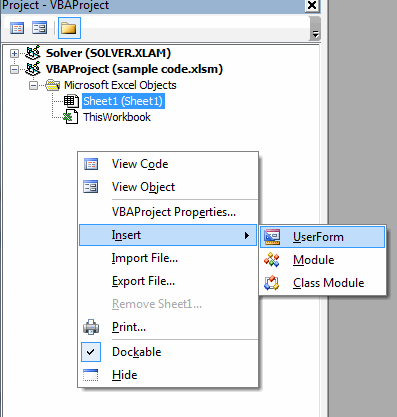
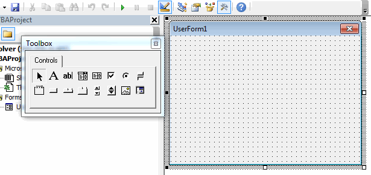

# Creating Custom User Forms

Occasionally it is useful to prompt the user with a user form and wait for the user to enter some information to the user form before proceeding to execute some code. In many cases, this can be accomplished with [MsgBox/InputBox](../05_msgbox/msgbox.md), but there are other cases where we need more detailed information and it is not convenient to pull that information from the cells on a sheet. In such cases, it is possible to create a custom user form containing a set of controls.

To illustrate the process of using a custom user form, assume that we have a workbook where we need to routinely add new sheets to the workbook, but rather than adding blank sheets, we want the sheets to be copied from one of three pre-defined templates (stored as hidden sheets). You can download a copy of the spreadsheet used in this example by clicking [here](files/sample code.xlsm).

## Creating the Form

The first step is to create the user form. To do this, go to the VB Editor and right-click in the empty space in the project explorer window and select Insert|UserForm.



This will create a new empty user form and launch the control toolbox:



Next, we will change the name of the user form and change the user form title (default = "UserForm1"). We do this by clicking on the Properties button  in the VB Editor menu. This will dock the Properties window just below the project explorer window. Change the name to "frmAddSheet". The prefix "frm" identifies the object in code as a user form and the "AddSheet" part makes the name descriptive of the user form's objective. Next, change the Caption property to "New Sheet Options" (or something similarly descriptive). Note that the caption appears in the form title bar.

Now we are ready to add controls to the sheet. Fortunately, this process is identical to the manner in which [controls are added to sheets](../03_controls/controls.md). Add a set of controls to create a layout as follows. Note that you can use the handles on the sides and corners of the user form to resize the form.


The text strings ("Sheet title", "Template:") are created with label-type controls. Note that the value property of the checkbox has been set to true because we want this option to be on by default.

At any time while editing the sheet, you can test to see how the sheet behaves by pressing the **Run** button  in the VB Editor menu. To close the form, click on the red X in the upper right corner.

## Launching the Form

The next thing we need to do is create some way to launch our form. In this case, we will add a button somewhere on the main sheet of our workbook as follows:


Note the use of the ellipsis on the button title (...). This should be added to a button caption whenever the button is used to bring up a user form. This is standard user interface protocol. To make the button launch the form, double-click on the button in design mode and type the code for the click event as follows:

```vb
Private Sub cmdAddSheet_Click()
frmAddSheet.Show
End Sub
```

We are calling the **.Show** method which launches the sheet. Exit design mode and test your button.

## Writing the User Form Code

Finally, we will write the code associated with the user form. While it is possible to write code associated with the click event for each control, we don't need to do anything while the user is interacting with the controls on the main part of the form. The only controls that need code are the OK and Cancel buttons. For the Cancel button, we will simply write code to make the form go away. For the OK button, we will write code that makes the form go away and then it will use the selections in the form to guide the creation of a new sheet from a template.

For the Cancel button, go to the VB Editor and double-click on the Cancel button. This will bring up the code window for the form. Type the following:

```vb
Private Sub cmdCancel_Click()
frmAddSheet.Hide
End Sub
```

This executes the **.Hide** method to make the form go away.

Now we need to return to the form editor window. To make it appear again, click on the second icon  at the top of the Project Explorer. You can switch back to the code window by clicking on the first icon . You can also make the control view appear by double-clicking on the form in the Project Explorer.

To write the code associated with the OK button, double-click on the OK button and write the following. Note how the control names are used when the sheet is copied. (Note: this assumes that you have three extra sheets named "Template-CI", "Template-CO", and "Template-WL" and that the "Add Sheet..." button is on a sheet named "Main").

```vb
Private Sub cmdOK_Click()

Dim template As String

'Hide the sheet
frmAddSheet.Hide

'Determine which template was selected.
If optCustomerInvoice Then
    template = "Template-CI"
ElseIf optChangeOrder Then
    template = "Template-CO"
Else 'Work log
    template = "Template-WL"
End If

'Copy the template to create a new sheet.
Sheets(template).Select
Sheets(template).Copy After:=Sheets(Sheets.Count)

'Make the sheet visible in case the template is hidden
ActiveSheet.Visible = xlSheetVisible

'Rename the sheet
ActiveSheet.Name = txtSheetTitle

'Bring main sheet back to front if necessary
If chkBringToFront = False Then
    Sheets("Main").Select
End If

End Sub
```

That's it! Creating custom user forms is easy and fun.

## Exercises

You may wish to complete following exercises to gain practice with and reinforce the topics covered in this chapter:

<div class="exercise-grid" data-columns="4">
<div class="exercise-header">Description</div>
<div class="exercise-header">Difficulty</div>
<div class="exercise-header">Start</div>
<div class="exercise-header">Solution</div>
<div class="exercise-cell"><strong>Battleship -</strong> By creating a user form, the user will be able to begin playing Battleship vs the computer.</div>
<div class="exercise-cell">Easy</div>
<div class="exercise-cell"><a href="files/battleship.xlsm">battleship.xlsm</a></div>
<div class="exercise-cell"><a href="files/battleship_key.xlsm">battleship_key.xlsm</a></div>
<div class="exercise-cell"><strong>Rainfall Log -</strong> Create a user form to log recent rainfall and compute the total rainfall to date.</div>
<div class="exercise-cell">Medium</div>
<div class="exercise-cell"><a href="files/rainfall_log.xlsm">rainfall_log.xlsm</a></div>
<div class="exercise-cell"><a href="files/rainfall_log_key.xlsm">rainfall_log_key.xlsm</a></div>
<div class="exercise-cell"><strong>Recruiting Spreadsheet -</strong> Create a user form that allows the user to insert prospective employees into a recruiting table.</div>
<div class="exercise-cell">Medium</div>
<div class="exercise-cell"><a href="files/recruiting_spreadsheet.xlsm">recruiting_spreadsheet.xlsm</a></div>
<div class="exercise-cell"><a href="files/recruiting_spreadsheet_key.xlsm">recruiting_spreadsheet_key.xlsm</a></div>
<div class="exercise-cell"><strong>Advanced Recruiting -</strong> Create a user form that inserts prospective employees into the recruiting table and highlights those who meet criteria chosen from an additional user form.</div>
<div class="exercise-cell">Hard</div>
<div class="exercise-cell"><a href="files/advanced_recruiting.xlsm">advanced_recruiting.xlsm</a></div>
<div class="exercise-cell"><a href="files/advanced_recruiting_key.xlsm">advanced_recruiting_key.xlsm</a></div>
</div>