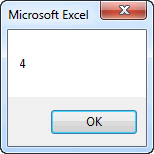

# Custom Functions

One of the easiest ways to take advantage of VBA in Excel is to write custom functions. Excel has a large number of built-in functions that you can use in spreadsheet formulas. Examples include:

| Function | Description |
|----------|-------------|
| =Average("A4:A20") | *Returns the average value in a range of cells* |
| =Sum("A4:A20") | *Returns the sum of a range of cells* |
| =Cos(0.34) | *Returns the cosine of a number* |

In general, a function takes one or more objects (values, ranges, etc.) as input and returns a single object (typically a value). The things that are sent to a function as input are called **arguments** and the thing that is returned by a function is often called the **return value**.

In some cases, we may encounter situations where we need a function to do something but the function is not provided by Excel. We can easily fix this problem by creating a custom function in VBA.

## Syntax

The basic syntax for a custom function is as follows:

```vb
[Public] Function function_name(args) As Type
...
function_name = ...
...
End Function
```

The **Public** statement is optional. This means that the function can be called by VB code outside the module where the function is declared and from Excel formulas in cells. If you omit the **Public** statement, the function is public by default (as opposed to **Private**).

The **function_name** is the name you provide to the function. This can be any name you want, as long as you follow the same rules we use for defining VB variable names.

The **args** are the arguments to the function. You can have any number of arguments. The arguments are listed in the same way you declare variables, except that you omit the **Dim** part. The **args** list serves two purposes: 1) it defines how many arguments are used, and 2) it defines the type for each argument. The following are some sample argument lists:

```vb
(x As Double, n As Double)

(r As Range)

(str1 As String, str2 As String, num As Integer)
```

The **Type** part defines the type of object returned by the function. Typical examples are Double, Integer, String, and Boolean.

Somewhere in the code, you must have line where you set the **function name** equal to a value. You should think of the function name as a variable. You must store the value returned by the function in the variable at some point before you hit the **End Function** statement.

There is one more important point, whenever you create a function that you want to use in an Excel formula, it should always be placed in a module under the **Modules** folder in the VBE.

## Examples

Now let's look at some examples. The following function takes two numbers as arguments and returns the minimum of the two numbers. This basically duplicates the Min function provided by Excel, but it serves as a useful example:

```vb
Function my_min(a As Double, b As Double) As Double

If a < b Then
   my_min = a
Else
   my_min = b
End If

End Function
```

Once this function is created, you can then use it in one of your Excel formulas as follows:

```vb
=my_min(A5, B7)
=my_min(Sum(C3:C10), 0)
```

If you want to be lazy and not worry about declaring your types, you can simplify the first line of your function declaration as follows:

```vb
Function my_min(a, b)

If a < b Then
   my_min = a
Else
   my_min = b
End If

End Function
```

Compare to the same function shown above. In this case, the input arguments and the return type are set to **Variant** by default. Both of these methods will work, but the advantage of declaring the types is that if you pass something to the function that is of the wrong type, you will get an error message.

Now let's look at something a little more complicated. In many cases, we want our function to use a cell range as one of the arguments. The following function returns the number of negative values in a range:

```vb
Function num_neg(r As Range) As Integer

Dim c As Variant

For Each c In r
    If c.Value < 0 Then
        num_neg = num_neg + 1
    End If
Next c

End Function
```

The function could then be called from an Excel formula as follows:

```vb
=num_neg(A5:B7)
```

The next function takes two arguments: a range and an integer n. It computes the sum of values in the range minus the lowest n values. This function takes advantage of the standard Excel functions **Sum** and **Small**. The Small function returns the n<sup>th</sup> lowest value in a range.

```vb
Function dropsum(r As Range, n As Integer) As Double

Dim i As Integer

dropsum = Application.WorksheetFunction.Sum(r)

For i = 1 To n
   dropsum = dropsum - Application.WorksheetFunction.Small(r, i)
Next i

End Function
```

This function could then be used in an Excel formula as follows:

```vb
=dropsum(A5:B7, C10)
=dropsum(A5:B7, 5)
```

## Functions in VB

Finally, it should be noted that you can call custom functions from other places in your VB code as well as from Excel formulas. For example, you could use the my_min function defined above as follows:

```vb
Dim x As Double
Dim y As Double
Dim z As Double

x = ...
y = ...
...
z = my_min(x, y)
...
```

## Arguments - ByVal vs. ByRef

If you call a VB function from someone else in your VB code, you need to be careful how you handle the arguments. In most cases, the arguments are used as input values to our computations and we don't attempt to change the values of the arguments. But if you do change the values of the arguments, you need to be understand what happens. For example, consider the following code.

```vb
Function foo(x As Double) As Double

x = x - 1
foo = 2*x

End Function

Sub mysub()

Dim p As Double
Dim r As Double

p = 5
r = foo(p)

MsgBox p

End Sub
```

Note that **p** was passed as an argument to the foo function where it was referenced as the argument **x**. In the function, **x** is decremented by 1. The value of **p** is then displayed using **MsgBox** in the sub after the function call is complete. The following is displayed:



In other words, when we change the value of **x** in the function, we are simultaneously changing the value of **p**! Or put another way, **x** becomes an alias for **p** and any change we make to **x** is made to **p**. They are two names for the same thing. This can lead to unexpected consequences. We can isolate the **x** from **p** by adding "**ByVal**" in front of the argument as follows:

```vb
Function foo(ByVal x As Double) As Double

x = x - 1
foo = 2*x

End Function
```

In this case, after running **mysub**, the following is displayed:


The **ByVal** qualifier forces the argument to be passed "by value", meaning that **x** then becomes a copy of **p** and any changes we make to **x** are not reflected in **p**. The alternate qualified is **ByRef**, which indicates that the argument is directly linked to the variable passed in when the function is called. If you omit either qualifier, VBA defaults to **ByRef**, which is why our original example behaved the way it did.

## Rules for Functions

There are a few simple rules that should be followed when writing custom functions.

1) **When the function is called, arguments can be constants, values from cells, values from mathematical expressions, etc.** It is not always from a cell, and it is most certainly not always from the same cell. For example, here are several fully legal ways to call the my_min function described above:

```vb
=my_min(A5, B4)
=my_min(-4, 20.4)
=my_min(0, -B4/(A2 + 5))
```

In other words, your VBA code should never assume that the values are from cells. The values could come from any kind of expression.

2) **Do not read directly from a cell inside a function.** All input should be from the list of arguments. For example, consider the following function code:

```vb
Function my_min2(a As Double, b As Double) As Double

a = Range("B4")
b = Range("B5")

If a < b Then
   my_min2 = a
Else
   my_min2 = b
End If

End Function
```

Note that the two arguments **a** and **b** are immediately reset using the values from cells B4 and B5. This is a very common programming error but it is **WRONG**! Functions are supposed to be general purpose in nature. You should be able to use your function in a formula in cells located anywhere on your worksheet. The problem with the code above is that no matter what you pass in as arguments, it will always use the values from **B4** and **B5**. You should never change the values of the input arguments in your code. If you want to apply the function to B4 and B5, put this in a cell formula after you write the function code:

```vb
=my_min2(B4, B5)
```

3) **Do not write directly to a cell from a function.** In some cases, this will generate a calculate event, putting your spreadsheet into an infinite loop. The function should only do one thing: return a value. For example, consider the following code:

```vb
Function my_min3(a As Double, b As Double) As Double

If a < b Then
   my_min3 = a
Else
   my_min3 = b
End If

Range("C8") = my_min3

End Function
```

Once again, this is a common error, but it is **WRONG**! If you want to use the function to put a value in cell C8, use the function in a formula in cell C8 and the let the return value from the function generate the answer. The only result of a function should be the return value. If you want to write some code that changes values of one or more cells directly from the code, use a custom sub, not a function.

## Exercises

You may wish to complete following exercises to gain practice with and reinforce the topics covered in this chapter:

<div class="exercise-grid" data-columns="4">
<div class="exercise-header">Description</div>
<div class="exercise-header">Difficulty</div>
<div class="exercise-header">Start</div>
<div class="exercise-header">Solution</div>
<div class="exercise-cell"><strong>Load Function -</strong> Create a custom function to calculate the excess load from a table of test data.</div>
<div class="exercise-cell">Easy</div>
<div class="exercise-cell"><a href="files/load_function.xlsm">load_function.xlsm</a></div>
<div class="exercise-cell"><a href="files/load_function_key.xlsm">load_function_key.xlsm</a></div>
<div class="exercise-cell"><strong>Total Stress -</strong> Use a custom function to determine the total stress vs depth of a soil profile.</div>
<div class="exercise-cell">Medium</div>
<div class="exercise-cell"><a href="files/total_stress.xlsm">total_stress.xlsm</a></div>
<div class="exercise-cell"><a href="files/total_stress_key.xlsm">total_stress_key.xlsm</a></div>
<div class="exercise-cell"><strong>Total Headloss -</strong> Create custom functions to calculate parts of the total headloss equation and then solve for total headloss.</div>
<div class="exercise-cell">Hard</div>
<div class="exercise-cell"><a href="files/total_headloss.xlsm">total_headloss.xlsm</a></div>
<div class="exercise-cell"><a href="files/total_headloss_key.xlsm">total_headloss_key.xlsm</a></div>
</div>