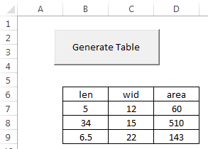
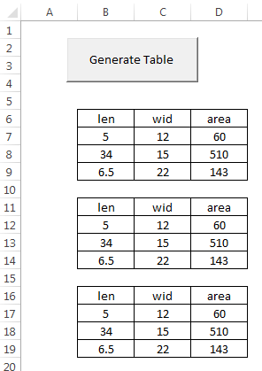

# Writing Custom Subs

When writing VBA code associated with Excel, much of the code we use is generated by recording a macro, is associated with the click event for a control, or is related to a custom function. It is also possible to write custom subs. A sub is simply a block of code that runs as a unit.

## Code Organization

To illustrate how subs can be used to organize your code, let's suppose that we have a spreadsheet with a button that launches the following code:

```vb
Private Sub cmdGenerateTable_Click()

'Format the table
Range("B6:D9").Select
Selection.Borders(xlEdgeLeft).LineStyle = xlContinuous
Selection.Borders(xlEdgeTop).LineStyle = xlContinuous
Selection.Borders(xlEdgeBottom).LineStyle = xlContinuous
Selection.Borders(xlEdgeRight).LineStyle = xlContinuous
Selection.Borders(xlInsideVertical).LineStyle = xlContinuous
Selection.Borders(xlInsideHorizontal).LineStyle = xlContinuous
Selection.HorizontalAlignment = xlCenter

'Populate the table
Range("B6").FormulaR1C1 = "len"
Range("C6").FormulaR1C1 = "wid"
Range("D6").FormulaR1C1 = "area"
Range("B7").FormulaR1C1 = "5"
Range("C7").FormulaR1C1 = "12"
Range("B8").FormulaR1C1 = "34"
Range("C8").FormulaR1C1 = "15"
Range("B9").FormulaR1C1 = "6.5"
Range("C9").FormulaR1C1 = "22"
Range("D7:D9").FormulaR1C1 = "=RC[-2]*RC[-1]"

End Sub
```

The first part of the code formats a table, and the second part of the code fills in the table with numbers and formulas. After running the range in question ("B6:D9") looks like this:



Another way to organize the code is to break the two parts of the code into two different subs as follows:

```vb
Private Sub cmdGenerateTable_Click()

format_table
populate_table

End Sub

Sub format_table()

Range("B6:D9").Select
Selection.Borders(xlEdgeLeft).LineStyle = xlContinuous
Selection.Borders(xlEdgeTop).LineStyle = xlContinuous
Selection.Borders(xlEdgeBottom).LineStyle = xlContinuous
Selection.Borders(xlEdgeRight).LineStyle = xlContinuous
Selection.Borders(xlInsideVertical).LineStyle = xlContinuous
Selection.Borders(xlInsideHorizontal).LineStyle = xlContinuous
Selection.HorizontalAlignment = xlCenter

End Sub

Sub populate_table()

Range("B6").FormulaR1C1 = "len"
Range("C6").FormulaR1C1 = "wid"
Range("D6").FormulaR1C1 = "area"
Range("B7").FormulaR1C1 = "5"
Range("C7").FormulaR1C1 = "12"
Range("B8").FormulaR1C1 = "34"
Range("C8").FormulaR1C1 = "15"
Range("B9").FormulaR1C1 = "6.5"
Range("C9").FormulaR1C1 = "22"
Range("D7:D9").FormulaR1C1 = "=RC[-2]*RC[-1]"

End Sub
```

Note that the code in the original sub is now only two lines. To call a sub, you simply type the name of the sub on a line of code. While this is a rather simple project, this process of organizing code into logical chunks and then calling those chunks as subs in the main part of your code will not only make your code simpler to understand, it makes your code easier to write because you can use a divide-and-conquer approach to building up your code logic. Furthermore, in many cases you may want to repeat a section of code many times. Rather than cutting and pasting an identical set of code, it makes much more sense to put the code into a sub and then just call that sub.

## Using Input Arguments

While the code up above is nicely organized, the custom subs would be even more useful if they were generalized to work on any range rather than always applying to B6:D9. We can make our code more general by adding input arguments. Input arguments are passed to a sub the same way they are passed to custom functions, via the parentheses following the sub name. In the following code, the subs have been changed to operate on a range specified by an input argument. You can then call the subs multiple times with a different range in each case.

```vb
Private Sub cmdGenerateTable_Click()

format_table Range("B6:D9")
populate_table Range("B6:D9")

format_table Range("B11:D14")
populate_table Range("B11:D14")

format_table Range("B16:D19")
populate_table Range("B16:D19")

End Sub

Sub format_table(myrange As Range)

myrange.Select
Selection.Borders(xlEdgeLeft).LineStyle = xlContinuous
Selection.Borders(xlEdgeTop).LineStyle = xlContinuous
Selection.Borders(xlEdgeBottom).LineStyle = xlContinuous
Selection.Borders(xlEdgeRight).LineStyle = xlContinuous
Selection.Borders(xlInsideVertical).LineStyle = xlContinuous
Selection.Borders(xlInsideHorizontal).LineStyle = xlContinuous
Selection.HorizontalAlignment = xlCenter

End Sub

Sub populate_table(myrange As Range)

myrange.Cells(1, 1).FormulaR1C1 = "len"
myrange.Cells(1, 2).FormulaR1C1 = "wid"
myrange.Cells(1, 3).FormulaR1C1 = "area"
myrange.Cells(2, 1).FormulaR1C1 = "5"
myrange.Cells(2, 2).FormulaR1C1 = "12"
myrange.Cells(3, 1).FormulaR1C1 = "34"
myrange.Cells(3, 2).FormulaR1C1 = "15"
myrange.Cells(4, 1).FormulaR1C1 = "6.5"
myrange.Cells(4, 2).FormulaR1C1 = "22"
Range(myrange.Cells(2, 3), myrange.Cells(4, 3)).FormulaR1C1 = "=RC[-2]*RC[-1]"

End Sub
```

Note how the subs are called in the click event sub. To call a sub with arguments, you simply list the arguments after the sub name, and the arguments are separated by commas (there is only one argument in this case). For subs, you should not enclose the argument(s) in parentheses when you call the sub like you do with functions. After running the code above, the sheet looks like this:



Again, the power of using custom subs is that you can repeatedly use code without rewriting it, and you can make it general purpose so that it applies to a number of situations depending on the values of the input arguments.

## Scope

The code shown above is all associated with a sheet and can only be used with the associated sheet. If you want to make your code even more general, you should put it in a module and make sure it is public, not private (if you don't explicitly put "Public" or "Private" in front of the sub name, it is public by default). This will allow you to call the code from anywhere in your project, including any of the sheets, forms, or modules.

## Modifying Recorded Macros

A great way to make custom subs is to record a macro and then modify the macro to be more general purpose by adding an input argument to the sub and modifying the code based on the input argument. For example, the following macro copies a standard table from a sheet called "Extra" to another sheet.

```vb
Sub copy_table()
'
' copy_table Macro
'
    Sheets("Extra").Select
    Range("A1:L8").Select
    Application.CutCopyMode = False
    Selection.Copy
    Sheets("Sheet1").Select
    Range("F6").Select
    ActiveSheet.Paste
End Sub
```

To make the code more useful, we can modify the code as follows so that we can designate where the table is to be copied. Compare to original code.

```vb
Sub copy_table(mysheet As String, myrange As String)
'
' copy_table Macro - MODIFIED
'
    Sheets("Extra").Select
    Range("A1:L8").Select
    Application.CutCopyMode = False
    Selection.Copy
    Sheets(mysheet).Select
    Range(myrange).Select
    ActiveSheet.Paste
End Sub
```

We can now write code to copy the table to multiple locations.

```vb
copy_table "Sheet1", "F6"
copy_table "Sheet1", "F15"
copy_table "Sheet2", "B2"
copy_table "Sheet2", "B11"
```

## Calling Subs

As shown above, you can call a sub simply by typing the name of the sub followed by the arguments separated by commas. For example, the code to call the **copy_table** sub is as follows:

```vb
copy_table "Sheet1", "F6"
copy_table "Sheet1", "F15"
copy_table "Sheet2", "B2"
copy_table "Sheet2", "B11"
```

An alternate way to call the subs is to use the **Call** method. If you use this approach, you must put the arguments in parentheses. For example:

```vb
Call copy_table("Sheet1", "F6")
Call copy_table("Sheet1", "F15")
Call copy_table("Sheet2", "B2")
Call copy_table("Sheet2", "B11")
```

Both approaches work the same way, so it is a matter of style.

## Sample Code

The worksheet associated with this chapter can be downloaded here.

[sample code.xlsm](files/sample%20code.xlsm)

## Exercises

You may wish to complete following exercises to gain practice with and reinforce the topics covered in this chapter:

<div class="exercise-grid" data-columns="4">
<div class="exercise-header">Description</div>
<div class="exercise-header">Difficulty</div>
<div class="exercise-header">Start</div>
<div class="exercise-header">Solution</div>
<div class="exercise-cell"><strong>Table Generator -</strong> Record three macros that generate 3 different kinds of tables.</div>
<div class="exercise-cell">Easy</div>
<div class="exercise-cell"><a href="files/table_generator.xlsm">table_generator.xlsm</a></div>
<div class="exercise-cell"><a href="files/table_generator_key.xlsm">table_generator_key.xlsm</a></div>
<div class="exercise-cell"><strong>Column Format -</strong> Modify a macro that formats a specific column of the given table.</div>
<div class="exercise-cell">Medium</div>
<div class="exercise-cell"><a href="files/column_format.xlsm">column_format.xlsm</a></div>
<div class="exercise-cell"><a href="files/column_format_key.xlsm">column_format_key.xlsm</a></div>
<div class="exercise-cell"><strong>Template Generator -</strong> Record and modify a macro that generates various types of homework templates for math, engineering and general homework.</div>
<div class="exercise-cell">Hard</div>
<div class="exercise-cell"><a href="files/template_generator.xlsm">template_generator.xlsm</a></div>
<div class="exercise-cell"><a href="files/template_generator_key.xlsm">template_generator_key.xlsm</a></div>
</div>