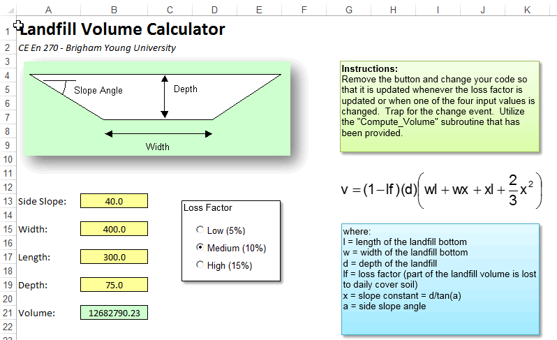

# Trapping for Worksheet Events

When writing VB code associated with a spreadsheet, it is common to add a button to the spreadsheet that the user pushes to execute the VB code when the desired changes have been made to the controls and the values have been entered in the cells. For example, the following workbook is designed to calculate the volume of waste that can be stored in a landfill. The user edits the yellow cells and selects a loss factor. When the Solve button is clicked, the values from the cells and the loss factor selection are read and the volume is calculated in VB code and written to the Volume cell (B21).


In this case, we don't need any code for the click events for the option controls. We simply need to add the following code for the "Solve" button:

```vb
Private Sub cmdSolve_Click()

Dim slope As Double
Dim width As Double
Dim length As Double
Dim depth As Double
Dim x As Double
Dim vol As Double
Dim lossfactor As Double

slope = Range("B13")
width = Range("B15")
length = Range("B17")
depth = Range("B19")

'Calculate the x term
x = depth / Tan(slope * 3.14159 / 180#)

'Get the appropriate loss factor
If optLow Then
    lossfactor = 0.05
ElseIf optMedium Then
    lossfactor = 0.1
Else
    lossfactor = 0.15
End If

'Compute the volume
vol = (1 - lossfactor) * depth * (width * length + width * x _
         + x * length + 2 / 3 * x ^ 2)

'Display the results in cell B21
Range("B21") = vol

End Sub
```

This code works fine, but why require the user to click on the button? Why not set up the spreadsheet so that anytime the user clicks on a control or changes the value of a cell, the VB code is automatically executed and the volume is updated? This can be easily accomplished using the "Change" event for the worksheet.

## Workbooks and Worksheets

Before discussing the Change event, we need to first define a couple of terms. When the VB compiler for Excel is open, you will see a list of objects in a tree on the left side of the window. At the bottom of the tree you will see the following objects:


A "Workbook" object represents the entire spreadsheet, including all of the sheets. If you double click on this object, it will bring up the source code related to the workbook as a whole. The other objects ("Sheet1", "Sheet2", & "Sheet3"). Double clicking on these objects brings up the code related to these objects.

Once you open the window related to a particular sheet, some important information related to the sheet is displayed at the top of the sheet as follows:


The combo box on the left (the one that is open) lists all of the objects associated with the sheet. Note that each of the controls on the spreadsheet are listed along with the worksheet itself. If you highlight one of the objects, you can then select an event from the combo box on the right:


Selecting one of these events creates the subroutine for the selected event. For example, if I click on the "Activate" item, the following code appears:

```vb
Private Sub Worksheet_Activate()

End Sub
```

Any code inside this sub would be executed each time the associated sheet is made active.

## The Calculate and Change Events

Note that the list of available events for the worksheet include the "Calculate" event and the "Change" event. By selecting these items, we can then fill in the code for these events. The resulting code will be executed as follows:

### Calculate Event

The Calculate event looks like this:

```vb
Private Sub Worksheet_Calculate()

End Sub
```

and is called each time the formulas in the worksheet are recalculated. Note that you must have at least one formula in your spreadsheet in order for this event to be called.

### Change Event

The change event looks like this:

```vb
Private Sub Worksheet_Change(ByVal Target As Range)

End Sub
```

and is called each time any of the cells in the spreadsheet are changed. Note that the subroutine takes one argument which is the range that has been changed. If we want the spreadsheet to be updated any time the user enters new data, this is the event we want to use. First of all, we remove the button so that the spreadsheet looks as follows:



Next, we will modify the code in the Change event to update the spreadsheet. However, this event is not called when a control is changed, it is only called when a cell is changed. Therefore, we will first create a subroutine that performs the calculations:

```vb
Private Sub Compute_Volume()

Dim slope As Double
Dim width As Double
Dim length As Double
Dim depth As Double
Dim x As Double
Dim vol As Double
Dim lossfactor As Double

slope = Range("B13")
width = Range("B15")
length = Range("B17")
depth = Range("B19")

'Calculate the x term
x = depth / Tan(slope * PI / 180#)

'Get the appropriate loss factor
If optLow Then
    lossfactor = 0.05
ElseIf optMedium Then
    lossfactor = 0.1
Else
    lossfactor = 0.15
End If

'Compute the volume
vol = (1 - lossfactor) * depth * (width * length + width * x _
         + x * length + 2 / 3 * x ^ 2)

'Display the results in cell B21
Range("B21") = vol

End Sub
```

Then we will modify the Change event so that it calls this subroutine:

```vb
Private Sub Worksheet_Change(ByVal Target As Range)

Application.EnableEvents = False

Compute_Volume

Application.EnableEvents = True

End Sub
```

Note that we have to temporarily turn off trapping for events prior to updating the results. This is because the Compute_Volume sub changes the value of one of the cells. This generates a new Change event which brings us right back to this sub. This results in an infinite loop. To be safe, you should always turn off event trapping while you make any changes in code.

Finally, to ensure that the click events for the controls cause the results to be updated, we add a call to the click event subroutines for each of the controls as follows:

```vb
Private Sub optHigh_Click()
Compute_Volume
End Sub

Private Sub optLow_Click()
Compute_Volume
End Sub

Private Sub optMedium_Click()
Compute_Volume
End Sub
```

At this point, clicking on any of the controls, or updating the value of any of the input cells triggers the VB code to update the results. You can download a copy of the completed workbook here:

[sample_nobutton.xlsm](files/sample_nobutton.xlsm)

## Checking on the Target

Note that Worksheet Change event sends an argument called Target that represents the range of cells changed. This could be a single cell or a range of cells. In some cases, it is useful to check on the range of cells that have been modified. To do this, you can check on the Target object passed as a parameter to the Change event sub. Target contains the cell or range of cells changed. Ideally, you could use a simple statement such as:

```vb
If Target = Range("B4") Then
```

or

```vb
If Target <> Range("B13") Then
```

To check the value of Target. However, this will not work because both Target and Range() are objects. As an object, when you say

```vb
If Target = Range("B4") Then
```

what you are really saying is

```vb
If Target.Value = Range("B4").Value Then
```

Or:

> "if the value of target is equal to the value of cell B4, then"

This statement would return true if Target corresponded to **ANY** cell that happened to have the same value as cell B4. A simple way to solve this problem is to check on the **Address** property as follows:

```vb
If Target.Address = Range("B4").Address Then
```

Or an even simpler approach:

```vb
If Target.Address = "$B$4" Then
```

In many cases, however, what you really want to know is whether or not Target is a portion of an entire range of cells. An efficient test for this type of case is to use the **Intersect** method associated with the **Application** object. This method returns the intersection between two ranges. The idea is to intersect the target range and the range corresponding to the input cells and see if the result is non-empty. This can be accomplished as follows:

```vb
Private Sub Worksheet_Change(ByVal Target As Range)

If Not Application.Intersect(Target, Range("B21")) Is Nothing Then
    My_Sub
End If

End Sub
```

This approach will work with input ranges spanning multiple cells. For example:

```vb
Private Sub Worksheet_Change(ByVal Target As Range)

If Not Application.Intersect(Target, Range("B4:F34")) Is Nothing Then
    My_Sub
End If

End Sub
```

## OnKey Method

The **Application.OnKey** method makes it possible to execute code when certain keys are pressed. This is especially useful for associating frequently used macros with the function keys. For example, suppose we created the following two subs:

```vb
Sub half_it()
If Selection.Count = 1 Then
    If IsNumeric(Selection.Value) Then
        Selection.Value = Selection.Value / 2
    End If
End If
End Sub

Sub double_it()
If Selection.Count = 1 Then
    If IsNumeric(Selection.Value) Then
        Selection.Value = Selection.Value * 2
    End If
End If
End Sub
```

Both subs are designed to modify the numerical contents of a selected cell. Each sub first checks to see if the selection contains a single cell and if the cell contains a numerical value. If so, the **half_it** sub divides the value by half and the **double_it** sub multiplies the value by two. We would like to associate these subs with the F1 and F2 keys. Before doing so, we must ensure that both subs are declared inside a module (not in the code for a sheet or workbook).

Next, we need to make a link between the subs and the keys using the **Application.OnKey** method. The best time to do this is when the workbook is first opened. Therefore, we will use the process described above. We will first open the code window associated with the workbook object. Then we select the Workbook item from the list on the left at the top of the window and then select the Open item from the list on the top right. This creates an empty sub for the **Workbook_Open** event as follows:

```vb
Private Sub Workbook_Open()

End Sub
```

Next we call the Application.OnKey method to link the two keys to the two subs. The OnKey method takes two arguments, both of which are strings. The first argument is the key code identifying the key. In our case, the codes are "{F1}" and "{F2}". A complete list of the key codes can be found [here](http://msdn.microsoft.com/en-us/library/office/ff197461(v=office.15).aspx). The second argument is the name of the sub. Once again, for this to work, the sub MUST be located in a module. After modifying the Workbook_Open sub, it should look like this:

```vb
Private Sub Workbook_Open()
Application.OnKey "{F1}", "half_it"
Application.OnKey "{F2}", "double_it"
End Sub
```

We then save and close the workbook and then reopen it. At this point the F1 and F2 keys should work. You can test this code by downloading the following sample workbook:

[sample_onkey.xlsm](files/sample_onkey.xlsm)

## OnTime Method

It is also possible to call a sub at a specific point in time using the **Application.OnTime** method. This can be associated with the Workbook_Open event or you can call it at any other place in your code. The method has two required arguments and the syntax is as follows:

```vb
Application.OnTime(EarliestTime, Procedure)
```

The first argument is the time at which the sub should be called and the second argument is the name of the sub. For example, suppose we are so obsessed with coding that we often forget to take a break. We could use the OnTime method to set up a reminder for us. First we would create the following code inside a module:

```vb
Sub break_reminder()
MsgBox "Take a break!", vbAttention + vbOKOnly, "Reminder"
End Sub
```

Next, we will call the OnTime method when the workbook is first opened as follows:

```vb
Private Sub Workbook_Open()
Application.OnTime Now + TimeValue("00:00:15"), "break_reminder"
End Sub
```

Note that the first argument is for a specific time. In most cases, we don't know what the time is until we run the code, so it makes sense to make it relative to some specific event. In this case, the first argument is an expression that computes a time 15 seconds into the future (we are using 15 seconds just to make the sample workbook more interesting). The MsgBox form should appear exactly 15 seconds after opening the workbook. If you want the message to be repeated every 15 seconds, you would simply need to call the OnTime method again right after showing the MsgBox as follows:

```vb
Sub break_reminder()
MsgBox "Take a break!", vbExclamation + vbOKOnly, "Reminder"
Application.OnTime Now + TimeValue("00:00:15"), "break_reminder"
End Sub
```

You can download a sample copy of this workbook here:

[sample_ontime.xlsm](files/sample_ontime.xlsm)

## Exercises

You may wish to complete following exercises to gain practice with and reinforce the topics covered in this chapter:

<div class="exercise-grid" data-columns="4">
<div class="exercise-header">Description</div>
<div class="exercise-header">Difficulty</div>
<div class="exercise-header">Start</div>
<div class="exercise-header">Solution</div>
<div class="exercise-cell"><strong>Transpose -</strong> Create an event so that anytime the user changes a value in the matrix, the transposed matrix is automatically updated.</div>
<div class="exercise-cell">Easy</div>
<div class="exercise-cell"><a href="files/transpose.xlsm">transpose.xlsm</a></div>
<div class="exercise-cell"><a href="files/transpose_key.xlsm">transpose_key.xlsm</a></div>
<div class="exercise-cell"><strong>Receipt Generator -</strong> Create an event that automatically updates the totals and discounts for a receipt generator by checking the cells changed.</div>
<div class="exercise-cell">Medium</div>
<div class="exercise-cell"><a href="files/receipt_generator.xlsm">receipt_generator.xlsm</a></div>
<div class="exercise-cell"><a href="files/receipt_generator_key.xlsm">receipt_generator_key.xlsm</a></div>
<div class="exercise-cell"><strong>Missile Defense -</strong> Use an event to run a macro that determines if a missile will destroy an asteroid before colliding with the earth.</div>
<div class="exercise-cell">Hard</div>
<div class="exercise-cell"><a href="files/missile_defense.xlsm">missile_defense.xlsm</a></div>
<div class="exercise-cell"><a href="files/missile_defense_key.xlsm">missile_defense_key.xlsm</a></div>
</div>