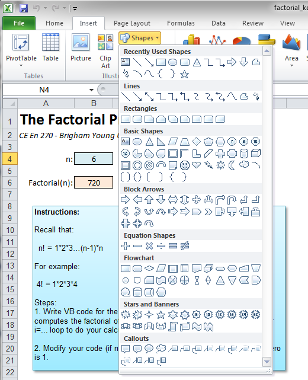
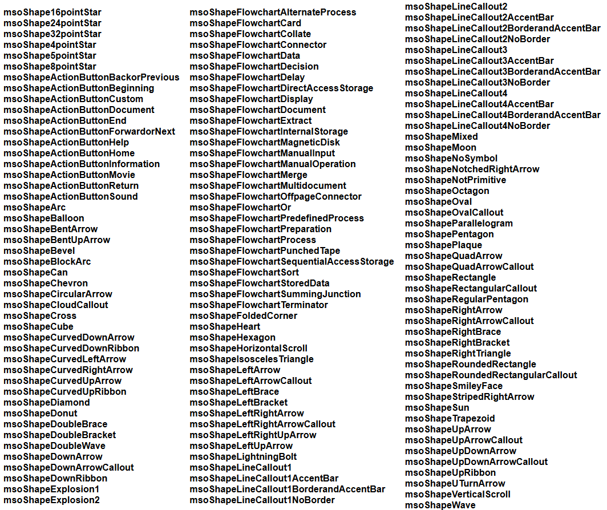
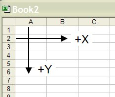

# Custom Graphics

A common task faced by programmers is how to display custom graphics using source code. It is often useful to display an object that is properly dimensioned in terms of the input parameters supplied on the user. For example, one could display the geometry of a cantilever beam or a column based on the user input. At the other end of the spectrum, it is possible to write sophisticated computer programs with 3D graphics and animation.

Standard VB (applied to a VB form) has a simple, yet powerful set of graphics options. You create a Picture object and then use a series of commands to draw lines and simple shapes in the Picture object. However, none of these tools can used for VBA in Excel. With Excel, an entirely different approach must be used. This approach involves a special type of object called a "Shape". Shapes can be created manually by the user of the spreadsheet using the standard MS Office drawing tools:



Any of the graphical objects in this menu (lines, connectors, basic shapes, etc.) are classified as shapes. Once created, they can be manipulated via VB code. Since the basic shapes include lines, rectangles, circles, and polygons, you can create just about any custom drawing that you can think of.

## The Shape Object

When dealing with shapes in VB code, we use the **Shape** object. All of the objects in the drawing layer of a worksheet, including AutoShapes, freeforms, OLE objects, or pictures, are Shape type objects.

To declare a variable as a Shape object, do the following:

```vb
Dim sh As Shape
```

The Creating Shapes section below discusses how to create Shape objects.

## The Shapes Collection

All of the Shape type objects associated with a specific sheet are organized into a set of objects called the **Shapes** collection. The Shapes collection is a special type of object that has it's own unique set of properties and methods. For example, you can traverse through all of the Shape objects in the Shapes collection using the following code.

```vb
'Check to see if there is already a polygon named "mypolygon"
'If so, we will delete it.
Dim sh As Shape
For Each sh In Shapes
    If sh.Name = "mypolygon" Then
        sh.Delete
    End If
Next sh
```

When you create a new Shape object, it is added to the Shapes collection.

## Creating Shapes

The simplest way to create new shapes is to use one of the "Addxxx" methods associated with the Shapes collection. These methods include the AddLine, AddPolyline, and AddShape methods. Each of these methods creates a new shape object that is added to the Shapes collection.

### The AddLine Method

The **AddLine** method creates a simple line defined by xy coordinates of the beginning and end of the line. The syntax for the method is:

```vb
expression.AddLine(BeginX, BeginY, EndX, EndY)
```

where *expression* is a Shapes type object. For example, the following code:

```vb
Shapes.AddLine 10, 10, 250, 250
```

creates a line that starts at the coordinates (10, 10) and ends at (250, 250) and adds it to the Shapes collection for the active worksheet. If you want to be more explicit about which sheet the shape is assigned to, you can use the following code:

```vb
Worksheets(1).Shapes.AddLine 10, 10, 250, 250
```

or

```vb
Worksheets("Sheet1").Shapes.AddLine 10, 10, 250, 250
```

### The AddPolyline Method

The **AddPolyline** method creates a sequence of line segments defined by a list of coordinates. If the first coordinate is repeated at the end of the list, the method creates a closed polygon. The syntax for the method is:

```vb
expression.AddPolyline(SafeArrayOfPoints)
```

where *expression* is a Shapes type object and *SafeArrayOfPoints* is a 2D array of Singles representing the coordinates of the polygon. For example, the following code creates a polygon representing a triangle (from the VBA Excel Help File):

```vb
Dim triArray(1 To 4, 1 To 2) As Single
triArray(1, 1) = 25    'x coordinate of vertex 1
triArray(1, 2) = 100   'y coordinate of vertex 1
triArray(2, 1) = 100
triArray(2, 2) = 150
triArray(3, 1) = 150
triArray(3, 2) = 50
triArray(4, 1) = 25    ' Last point has same coordinates as first
triArray(4, 2) = 100
Shapes.AddPolyline triArray
```

Once again, the object is added to the Shapes collection for the current sheet.

### The AddShape Method

The AddShape method can be used to create a new Shape object that is an **AutoShape**. The syntax for the method is:

```vb
expression.AddShape(Type, Left, Top, Width, Height)
```

where *expression* is a Shapes collection, *Type* is the type of AutoShape, and *Left, Top, Width*, and *Height* are singles defining the location and size of the object. For example, the following code creates a rectangle:

```vb
Shapes.AddShape msoShapeRectangle, 25, 50, 150, 200
```

The msoShapeRectangle is a VB constant defining the AutoShape type. The following are all legal AutoShape constants:



## Excel Coordinate System

When working with shapes in Excel, it's important to understand the coordinate system. Excel uses a coordinate system where:

- The origin (0,0) is at the top-left corner of the worksheet
- X increases from left to right
- Y increases from top to bottom
- Units are typically in points (1/72 inch)



## Example: Creating a Cantilever Beam

Here's an example of how to create a simple cantilever beam using VBA:

```vb
Sub CreateCantileverBeam()
    Dim beamLength As Double
    Dim beamHeight As Double
    Dim startX As Double
    Dim startY As Double
    
    ' Set parameters
    beamLength = 200
    beamHeight = 50
    startX = 100
    startY = 100
    
    ' Create the main beam (rectangle)
    Dim beam As Shape
    Set beam = Shapes.AddShape(msoShapeRectangle, startX, startY, beamLength, beamHeight)
    beam.Name = "MainBeam"
    
    ' Create support (triangle)
    Dim supportArray(1 To 4, 1 To 2) As Single
    supportArray(1, 1) = startX - 20
    supportArray(1, 2) = startY + beamHeight
    supportArray(2, 1) = startX
    supportArray(2, 2) = startY + beamHeight + 30
    supportArray(3, 1) = startX + 20
    supportArray(3, 2) = startY + beamHeight
    supportArray(4, 1) = startX - 20
    supportArray(4, 2) = startY + beamHeight
    
    Dim support As Shape
    Set support = Shapes.AddPolyline(supportArray)
    support.Name = "Support"
    
    ' Create load arrow
    Dim loadArrow As Shape
    Set loadArrow = Shapes.AddShape(msoShapeDownArrow, startX + beamLength/2, startY - 40, 20, 30)
    loadArrow.Name = "Load"
End Sub
```

## Manipulating Existing Shapes

Once you have created shapes, you can manipulate their properties:

```vb
' Change the fill color of a shape
Shapes("MainBeam").Fill.ForeColor.RGB = RGB(255, 0, 0)  ' Red

' Change the line color
Shapes("MainBeam").Line.ForeColor.RGB = RGB(0, 0, 255)  ' Blue

' Change the line weight
Shapes("MainBeam").Line.Weight = 3

' Move a shape
Shapes("MainBeam").Left = Shapes("MainBeam").Left + 50
Shapes("MainBeam").Top = Shapes("MainBeam").Top + 25

' Resize a shape
Shapes("MainBeam").Width = Shapes("MainBeam").Width * 1.5
Shapes("MainBeam").Height = Shapes("MainBeam").Height * 1.2

' Rotate a shape
Shapes("MainBeam").Rotation = 45  ' 45 degrees
```

## Advanced Graphics Techniques

### Creating Complex Geometries

For more complex shapes, you can combine multiple basic shapes or use mathematical functions to generate coordinates:

```vb
Sub CreateSineWave()
    Dim i As Integer
    Dim x As Double, y As Double
    Dim amplitude As Double, frequency As Double
    Dim points() As Single
    Dim numPoints As Integer
    
    amplitude = 30
    frequency = 0.02
    numPoints = 100
    
    ReDim points(1 To numPoints, 1 To 2)
    
    For i = 1 To numPoints
        x = (i - 1) * 5
        y = 150 + amplitude * Sin(frequency * x)
        points(i, 1) = x
        points(i, 2) = y
    Next i
    
    Dim wave As Shape
    Set wave = Shapes.AddPolyline(points)
    wave.Name = "SineWave"
End Sub
```

### Interactive Graphics

You can create interactive graphics that respond to user input:

```vb
Sub CreateInteractiveBeam()
    Dim length As Double
    Dim height As Double
    
    ' Get dimensions from user
    length = InputBox("Enter beam length:", "Beam Length", 200)
    height = InputBox("Enter beam height:", "Beam Height", 50)
    
    ' Create beam with user dimensions
    Dim beam As Shape
    Set beam = Shapes.AddShape(msoShapeRectangle, 100, 100, length, height)
    beam.Name = "InteractiveBeam"
    
    ' Add text label
    Dim label As Shape
    Set label = Shapes.AddTextbox(msoTextOrientationHorizontal, 100, 80, 100, 20)
    label.TextFrame.Characters.Text = "L=" & length & ", H=" & height
End Sub
```

## Best Practices

1. **Always name your shapes** - This makes them easier to reference later
2. **Use variables for coordinates** - Makes your code more readable and maintainable
3. **Check for existing shapes** - Delete old shapes before creating new ones to avoid clutter
4. **Use meaningful variable names** - Makes your code self-documenting
5. **Group related shapes** - Consider using shape groups for complex drawings

## Example Applications

Custom graphics in Excel VBA can be used for:

- Engineering drawings and diagrams
- Flowcharts and process maps
- Mathematical visualizations
- Interactive dashboards
- Educational materials
- Technical documentation

The power of VBA graphics lies in the ability to create dynamic, parameter-driven drawings that automatically update based on user input or calculations, making Excel a powerful tool for technical graphics and visualization.
