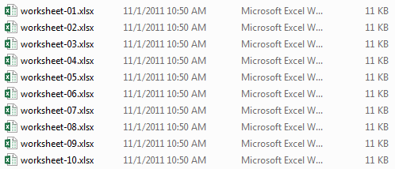
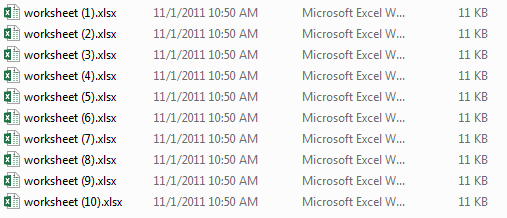
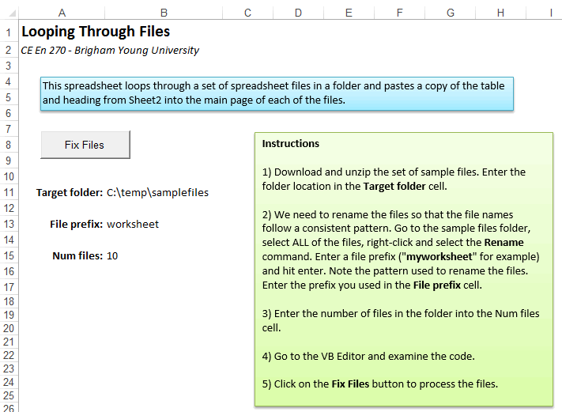

# Looping Over Files

One of the greatest benefits of using VBA with Excel is that you can automate tasks that can ordinarily be time-consuming. One form of automation that can be especially useful is to automatically open a set of files in a folder and open each of the files, make a change to the file content, and save the file. This can be accomplished quite easily with VBA in Excel, especially if the files correspond to Excel spreadsheets.

In this page, we will work through an example of modifying a set of spreadsheet files via VBA. Using this example as a guide, you can modify the code to fit your circumstances. The files associated with this exercise are in a zip archive and can be downloaded here:

- [loopingfiles.xlsm](files/loopingfiles.xlsm)
- [samplefiles.zip](files/samplefiles.zip)

If you wish to follow along, please download and unzip the files in the zip archive to a folder named "samplefiles". Then open the spreadsheet file ("loopingfiles.xlsm") in Excel.

## Renaming the Files

When you unzip the samplefiles.zip archive, you should see the following set of files:



In this case, each of these files is empty, but in other cases they may contain data. Our objective is to open each of these files and copy a table to the main sheet and then save the changes.

Whenever you loop over files, you must have some systematic way of determining the names of the files in the folder. There used to be a FileSearch object that would list all of the files in a directory, but it was deprecated (discontinued) by Microsoft because it was being used to write viruses. So the simplest thing to do now is to name the files so that we can formulate the file name in code as we iterate through a For loop from 1 to the number of files. Fortunately, it is rather easy to rename the files as shown. If you have an existing set of files to rename, you can do it as follows:

1. Select all of the files
2. Right-click on the files and select the Rename command.
3. Enter a common name ("worksheet" in the example shown above) and hit the return key.

At this point all files are renamed as follows:



This format is easier to recreate using code (see below).

## Input Options

When you open the spreadsheet file you will see the main page:



The inputs to the code are in three cells: **B11**, **B13**, and **B15**. B11 contains the path to the folder containing the files you wish to modify. B13 contains the prefix used when naming the files. Compare to file list shown above. B15 contains the number of files. Please note that cells B11, B13, and B15 have been named **folderlocation**, **prefix**, and **nfiles**, respectively. You may need to change these values before proceeding.

Before looking at the code, click on the Sheet2 tab and note the contents:


For our example problem, we will be copying this table from the loopingfiles.xlsm workbook to the first sheet in each of the files in the samplefiles folder and saving the changes.

## Code

Next we will look at the source code associated with the **Fix Files** button.

```vb
Private Sub cmdFixFiles_Click()
Dim myrow As Integer
Dim i As Integer
Dim nfiles As Integer
Dim filepath As String

'Set the default working directory
ChDir Range("folderlocation")

'Loop through each of the files in the folder
nfiles = Range("nfiles")
For i = 1 To nfiles

    'Copy the header and table on Sheet2 to the clipboard
    Sheets("Sheet2").Range("A1:E18").Copy

    'Formulate a text string identifying the full path to file i
    filepath = Range("startpath") & "\" & Range("prefix") & " (" & i & ").xlsx"
    
    'Open the file
    Workbooks.Open Filename:=filepath

    'Select the upper left cell and past the clipboard contents
    ActiveSheet.Range("A1").Select
    ActiveSheet.Paste
    
    'Fit the column widths
    ActiveSheet.Columns("B:B").EntireColumn.AutoFit
    ActiveSheet.Columns("C:C").EntireColumn.AutoFit
    ActiveSheet.Columns("D:D").EntireColumn.AutoFit
    ActiveSheet.Columns("E:E").EntireColumn.AutoFit
    
    'Select one of the cells so that the entire table is no longer selected (optional)
    ActiveSheet.Range("B4").Select
    
    'Save and close the file
    ActiveWorkbook.Save
    ActiveWorkbook.Close

    'Go to the next file
Next i

'Exit cut/copy mode (optional)
Application.CutCopyMode = False

End Sub
```

Each of the steps in the code is documented with a comment. Note how the folder location, prefix, and file number are used to generate a complete path to the file as shown on this line:

```vb
'Formulate a text string identifying the full path to file i
filepath = Range("startpath") & "\" & Range("prefix") & " (" & i & ").xlsx"
```

Also, note that once you open another workbook, you have to be very careful how you reference cells and ranges. For example, if you reference cell **A4**, to which workbook does that apply? To ensure that there is no confusion, you should add the **ActiveSheet** or **ActiveWorkbook** prefix to all references to the external workbook after you open it. If you need to refer to the current workbook (the one containing the code) while the other workbook is open, use the prefix **ThisWorkbook** before all sheet or range references.

If you are not sure how to structure the interaction between your two workbooks, you can always record a macro and perform the steps you wish to perform and then examine the macro code and adapt it to the sample shown above.

You may wish to try running the code above. You will see the screen flash once for each sample file as the code runs. After running the code, open each of the sample files to verify that the table was properly copied.

## Advanced File Operations

### Using FileSystemObject

For more advanced file operations, you can use the FileSystemObject:

```vb
Sub ProcessFilesWithFSO()
    Dim FSO As Object
    Dim folder As Object
    Dim file As Object
    Dim filePath As String
    
    ' Create FileSystemObject
    Set FSO = CreateObject("Scripting.FileSystemObject")
    
    ' Get folder object
    Set folder = FSO.GetFolder(Range("folderlocation").Value)
    
    ' Loop through each file in the folder
    For Each file In folder.Files
        ' Check if it's an Excel file
        If Right(file.Name, 4) = ".xlsx" Or Right(file.Name, 4) = ".xlsm" Then
            filePath = file.Path
            
            ' Process the file
            ProcessSingleFile filePath
        End If
    Next file
    
    Set FSO = Nothing
End Sub

Sub ProcessSingleFile(filePath As String)
    Dim wb As Workbook
    
    ' Open the workbook
    Set wb = Workbooks.Open(filePath)
    
    ' Make your changes here
    ' ...
    
    ' Save and close
    wb.Save
    wb.Close
End Sub
```

### Filtering Files by Extension

```vb
Sub ProcessSpecificFileTypes()
    Dim FSO As Object
    Dim folder As Object
    Dim file As Object
    Dim extensions() As String
    Dim i As Integer
    
    ' Define file extensions to process
    extensions = Split("xlsx,xlsm,xls", ",")
    
    Set FSO = CreateObject("Scripting.FileSystemObject")
    Set folder = FSO.GetFolder(Range("folderlocation").Value)
    
    For Each file In folder.Files
        ' Check if file has one of our target extensions
        For i = 0 To UBound(extensions)
            If LCase(Right(file.Name, Len(extensions(i)))) = LCase(extensions(i)) Then
                ProcessSingleFile file.Path
                Exit For
            End If
        Next i
    Next file
    
    Set FSO = Nothing
End Sub
```

### Error Handling

It's important to add error handling when processing multiple files:

```vb
Sub ProcessFilesWithErrorHandling()
    Dim FSO As Object
    Dim folder As Object
    Dim file As Object
    Dim errorCount As Integer
    Dim successCount As Integer
    
    errorCount = 0
    successCount = 0
    
    On Error Resume Next
    
    Set FSO = CreateObject("Scripting.FileSystemObject")
    Set folder = FSO.GetFolder(Range("folderlocation").Value)
    
    For Each file In folder.Files
        If Right(file.Name, 4) = ".xlsx" Then
            If ProcessSingleFile(file.Path) Then
                successCount = successCount + 1
            Else
                errorCount = errorCount + 1
            End If
        End If
    Next file
    
    ' Report results
    MsgBox "Processing complete!" & vbCrLf & _
            "Successful: " & successCount & vbCrLf & _
            "Errors: " & errorCount
    
    Set FSO = Nothing
End Sub

Function ProcessSingleFile(filePath As String) As Boolean
    On Error GoTo ErrorHandler
    
    Dim wb As Workbook
    Set wb = Workbooks.Open(filePath)
    
    ' Your processing code here
    ' ...
    
    wb.Save
    wb.Close
    ProcessSingleFile = True
    Exit Function
    
ErrorHandler:
    If Not wb Is Nothing Then
        wb.Close SaveChanges:=False
    End If
    ProcessSingleFile = False
End Function
```

## Best Practices

1. **Always use error handling** - Files can be locked, corrupted, or inaccessible
2. **Close workbooks properly** - Use proper workbook references and close them explicitly
3. **Use meaningful variable names** - Makes your code easier to understand and maintain
4. **Test with a small number of files first** - Verify your logic before processing hundreds of files
5. **Back up important files** - File processing can sometimes cause data loss
6. **Use progress indicators** - For long operations, show progress to the user

## Common Use Cases

- **Batch formatting** - Apply consistent formatting to multiple workbooks
- **Data consolidation** - Combine data from multiple files into one master file
- **Report generation** - Create reports from multiple data files
- **File cleanup** - Remove unnecessary sheets, format data, etc.
- **Data validation** - Check multiple files for data quality issues

This technique of looping over files is one of the most powerful automation capabilities in Excel VBA, allowing you to process hundreds or thousands of files with a single click.
