# Google Sheets and Google Apps Script

Now that you are familiar with Excel and VBA, you may wish to start exploring Google Sheets and Google Apps Script. When you create a Google account, you have free access to cloud storage on Google Drive, where you can use a free suite of productivity tools to create documents. One of these free tools is Google Sheets, a spreadsheet application. Google Sheets is very similar to Excel. Formulas are created in the same fashion and most of the same functions are supported.

Google Sheets supports a powerful scripting environment called Google Apps Script (GAS). GAS is a variant of JavaScript, the most common scripting language for web pages. GAS is an object-oriented programming language. A complete reference for the classes used in the Spreadsheet service of GAS can be found here:

> [https://developers.google.com/apps-script/reference/spreadsheet/](https://developers.google.com/apps-script/reference/spreadsheet/)

Example code is included. You can also google countless sites with sample GAS code and problem solutions.

## Google Sheets vs Excel

Here are some differences/comparisons between Google Sheets/GAS and Excel/VBA:

| Feature | Google Sheets/GAS                                                                                                                                                                                                                                                                                 | Excel/VBA                                                                                                                      |
|---------|---------------------------------------------------------------------------------------------------------------------------------------------------------------------------------------------------------------------------------------------------------------------------------------------------|--------------------------------------------------------------------------------------------------------------------------------|
| **Cost** | Free                                                                                                                                                                                                                                                                                              | Commercial product                                                                                                             |
| **Platform Support** | Multi-platform, works on all platforms exactly the same way.<br> All you need is a browser                                                                                                                                                                                                        | While the Mac version of Excel supports VBA, it is limited                                                                     |
| **Script Security** | Simply give it permission to run once by making a few clicks<br> and that is it                                                                                                                                                                                                                   | You have to mess with the Macro security settings to get<br> your VBA code to work and you have to save the file as<br> *.xlsm |
| **Sharing** | You can easily share the document with someone else and<br> each of you can edit it, even at the same time. Fantastic<br> for collaborative projects                                                                                                                                              | Limited sharing capabilities                                                                                                   |
| **Ease of Scripting** | GAS has a steeper learning curve                                                                                                                                                                                                                                                                  | Here I would give the edge to Excel/VBA                                                                                        |
| **Controls** | Google Sheets does NOT support ActiveX controls.<br> You can execute your GAS in one of four ways:<br> a) Using a menu command,<br> b) using a drawing object (you can make it look like a button),<br> c) as a custom function in a formula,<br> d) using the run button in the Script Editor window | Full support for ActiveX controls                                                                                              |
| **Recording Macros** | Both platforms allow you to record actions and turn them<br> into code                                                                                                                                                                                                                            | Both platforms allow you to record actions and turn them<br> into code                                                         |

## Learning JavaScript

Before diving into Google Sheets and GAS, I recommend you spend some time learning about JavaScript. No need to buy a textbook, there are tons of free resources on the web. I recommend the following site:

> [http://www.w3schools.com/](http://www.w3schools.com/)

Click on the JavaScript link on the left.

## Importing Excel Files

If you have an Excel file you want to try in Google Sheets, just upload it to your Google Drive and then right-click on it and select Open With|Sheets. It will create a copy of the file in Google Sheets format and open it. Your VBA code will not be preserved, but almost everything else will be.

## Opening a New Sheet

You can also create a new blank sheet. In Google Drive, click on the New button and then select Google Sheets.

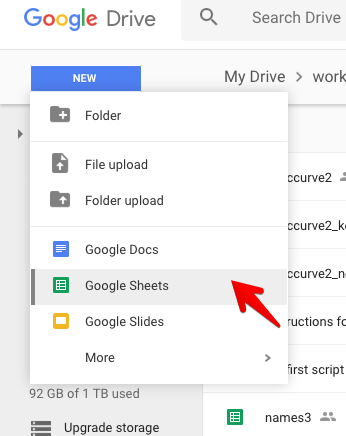

## Opening the Editor

Once you open your sheet, you can access the editor by selecting the **Tools|Script Editor...** command. This takes you to the editor with a new project, a new code file (Code.gs), and an empty function:

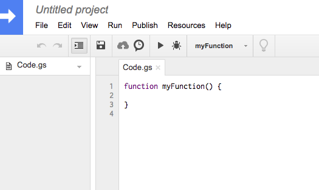

## Writing Your First Function

Lets change the function code so that it multiplies the input by 2:

```javascript
function double_it(x) {
  return x*2;
}
```

Save the changes and then go to the sheet and try the formula:


It's that easy!

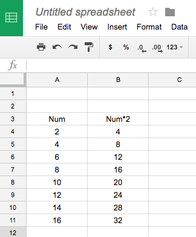

## Hello World

Let's write a function that prints "hello world". In Excel VBA, we would write a custom sub. In GAS, we write a function with no parameters and it behaves like a sub. Add the following:

```javascript
function hello_world() {
  var ss = SpreadsheetApp.getActiveSpreadsheet();
  var sheet = ss.getSheetByName("Sheet1"); 
  sheet.getRange("C3:D11").setValue("hello world");
}
```

To run the code, change the function selector in the toolbar to the editor to "hello_world". This sets the active function.

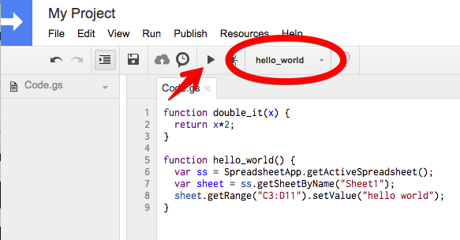

Then click on the Play button. The first time you do this you will need to give permission for the script to run. When it finishes, you should see this:

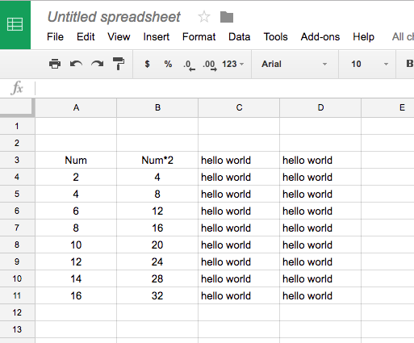

## Recording a Macro

Next, let's record a macro. This process is almost identical to Excel. We will record a simple macro that formats the range of "hello world" cells. First, select the **Macros|Record macro** command in the **Tools** menu.

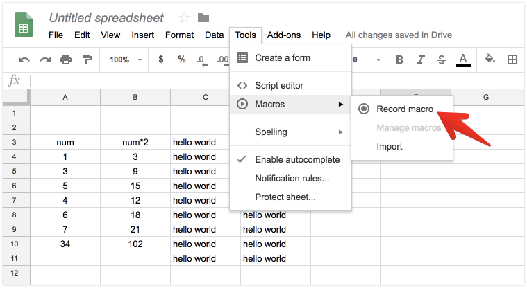

This puts you into *record* mode. You should see this window at the bottom of your screen:

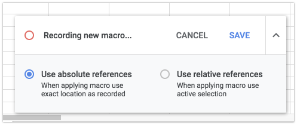

Next, apply some formatting as follows:

1. Select all of the cells that contain "hello world"
2. Change the font to italic
3. Change the cell alignment to center the text
4. Apply borders to the selected cells
5. Fill the selected cells with a color

You don't have to follow those steps exactly. Feel free to apply whatever formatting you want. When you are done it will look something like this:

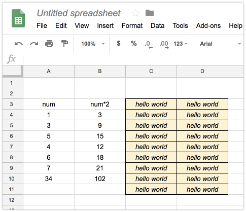

When you are done, select the **Save** command in the macro window at the bottom of your browser. That will bring up the save dialog. Enter "**my_macro**" and select **Save**.

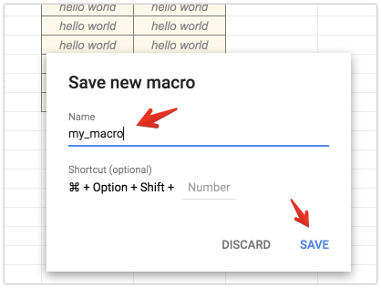

Now we are ready to try our macro out. Before doing so, select the **undo** button (repeatedly if necessary) to remove the formatting.

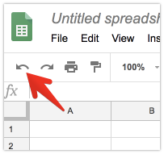

To run the macro, select the **Macros|my_macro** command.

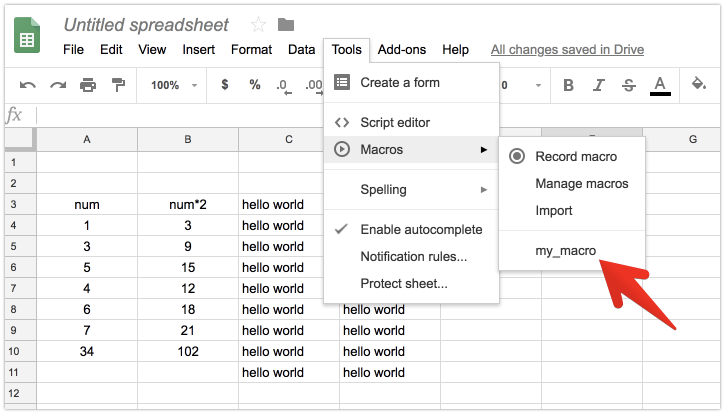

Boom! Your table should be reformatted.

To view the code, go back to the Code Editor and click on the macros.gs item on the left. Your macro code will appear. As is the case with Excel, you can now modify this code, copy-paste it to a different module, etc.


## Advanced GAS Examples

### Working with Ranges

```javascript
function workWithRanges() {
  var sheet = SpreadsheetApp.getActiveSheet();
  
  // Get a range
  var range = sheet.getRange("A1:B10");
  
  // Set values
  range.setValue("Hello");
  
  // Get values
  var values = range.getValues();
  
  // Loop through values
  for (var i = 0; i < values.length; i++) {
    for (var j = 0; j < values[i].length; j++) {
      if (values[i][j] === "") {
        values[i][j] = "Empty";
      }
    }
  }
  
  // Set the modified values back
  range.setValues(values);
}
```

### Creating Custom Functions

```javascript
function calculateArea(length, width) {
  return length * width;
}

function getCurrentDate() {
  return new Date();
}

function formatCurrency(amount) {
  return "$" + amount.toFixed(2);
}
```

### Working with Multiple Sheets

```javascript
function processAllSheets() {
  var spreadsheet = SpreadsheetApp.getActiveSpreadsheet();
  var sheets = spreadsheet.getSheets();
  
  for (var i = 0; i < sheets.length; i++) {
    var sheet = sheets[i];
    var sheetName = sheet.getName();
    
    // Skip certain sheets
    if (sheetName === "Summary" || sheetName === "Template") {
      continue;
    }
    
    // Process each sheet
    processSheet(sheet);
  }
}

function processSheet(sheet) {
  // Your sheet processing logic here
  var lastRow = sheet.getLastRow();
  var dataRange = sheet.getRange(2, 1, lastRow - 1, 5);
  
  // Example: Sum all numeric values in the first column
  var values = dataRange.getValues();
  var sum = 0;
  
  for (var i = 0; i < values.length; i++) {
    if (typeof values[i][0] === 'number') {
      sum += values[i][0];
    }
  }
  
  // Put the sum in the last row
  sheet.getRange(lastRow + 1, 1).setValue("Total:");
  sheet.getRange(lastRow + 1, 2).setValue(sum);
}
```

### Event Triggers

```javascript
function onEdit(e) {
  var range = e.range;
  var sheet = range.getSheet();
  
  // Only run on specific sheet
  if (sheet.getName() === "Data") {
    // Check if the edited cell is in a specific column
    if (range.getColumn() === 3) {
      // Auto-calculate something based on the edit
      autoCalculate(range);
    }
  }
}

function autoCalculate(range) {
  var row = range.getRow();
  var sheet = range.getSheet();
  
  // Example: Calculate total for the row
  var values = sheet.getRange(row, 1, 1, 3).getValues()[0];
  var total = values.reduce(function(sum, value) {
    return sum + (isNaN(value) ? 0 : value);
  }, 0);
  
  sheet.getRange(row, 4).setValue(total);
}
```

## Best Practices

1. **Use meaningful function names** - Make your code self-documenting
2. **Add comments** - Explain complex logic
3. **Handle errors gracefully** - Use try-catch blocks for error handling
4. **Optimize for performance** - Minimize API calls by batching operations
5. **Test thoroughly** - GAS can behave differently than local VBA code
6. **Use version control** - Consider using Git for complex projects

## Common GAS Methods

### Spreadsheet Methods
- `SpreadsheetApp.getActiveSpreadsheet()` - Get current spreadsheet
- `SpreadsheetApp.openById(id)` - Open by ID
- `SpreadsheetApp.openByUrl(url)` - Open by URL

### Sheet Methods
- `getSheetByName(name)` - Get sheet by name
- `getSheets()` - Get all sheets
- `getActiveSheet()` - Get active sheet
- `insertSheet(name)` - Insert new sheet
- `deleteSheet(sheet)` - Delete sheet

### Range Methods
- `getRange(row, column)` - Get single cell
- `getRange(row, column, numRows, numColumns)` - Get range
- `getRange(a1Notation)` - Get range by A1 notation
- `setValue(value)` - Set single value
- `setValues(values)` - Set multiple values
- `getValues()` - Get values
- `getValue()` - Get single value

## Finished!

OK, now you have enough to get started. Have fun!

Click [here](https://docs.google.com/spreadsheets/d/1YXzBVI6e-W3IXEoUfOnZfIAUzdcA6ARqIq1DFfWzg-s/copy) to get a copy of the sheet used in this page.

## Additional Resources

- [Google Apps Script Documentation](https://developers.google.com/apps-script)
- [Google Sheets API Reference](https://developers.google.com/sheets/api/reference/rest)
- [GAS Community](https://stackoverflow.com/questions/tagged/google-apps-script)
- [GAS Examples Gallery](https://developers.google.com/apps-script/samples)

Google Apps Script provides a powerful way to extend Google Sheets functionality and create web applications, making it an excellent next step for Excel VBA developers looking to explore cloud-based solutions.
